# relation algebra


<!-- @import "[TOC]" {cmd="toc" depthFrom=1 depthTo=6 orderedList=false} -->

<!-- code_chunk_output -->

- [relation algebra](#relation-algebra)
    - [概述](#概述)
      - [1.关系代数操作](#1关系代数操作)
        - [(1) 集合操作](#1-集合操作)
        - [(2) 纯关系操作](#2-纯关系操作)
      - [2.关系代数要求](#2关系代数要求)
        - [(1) 并相容性](#1-并相容性)
      - [3.连接操作](#3连接操作)
        - [(1) $\theta$-join (theta-连接)](#1-theta-join-theta-连接)
        - [(2) natural-join (自然连接)](#2-natural-join-自然连接)
        - [(3) outer-join (外连接)](#3-outer-join-外连接)
        - [(4) 举例](#4-举例)
      - [4.除操作](#4除操作)
        - [(1) 要求](#1-要求)
        - [(2) 除操作](#2-除操作)
        - [(3) 举例](#3-举例)
      - [5.关系代数和SQL对应关系](#5关系代数和sql对应关系)

<!-- /code_chunk_output -->

### 概述

#### 1.关系代数操作

##### (1) 集合操作

* union(并): $\cup$
    * 举例
    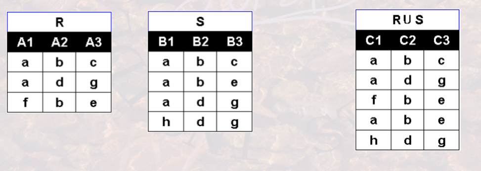
* intersection(交): $\cap$
* difference(差): $-$
    * 举例
    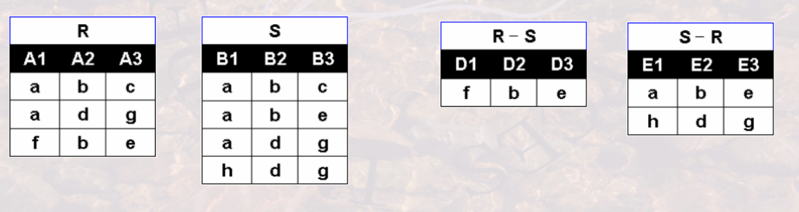
* cattesian product(笛卡尔积): $\times$
    * 举例
    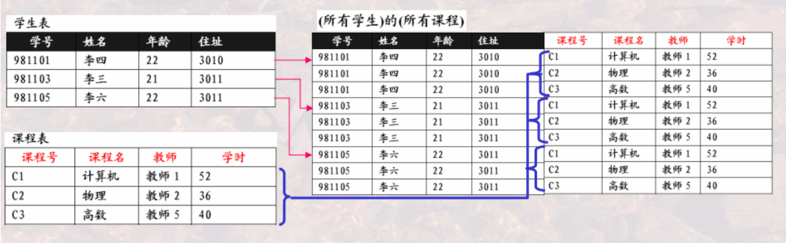

##### (2) 纯关系操作
* project(投影): $\pi$
    * 从关系中选出列 组成新的关系
    * $\pi_{A_{i1},A_{i2},...,A_{ik}}(R)=\{(t[A_{i1}],t[A_{i2}],...,t[A_{ik}]) | t\in R\}$
        * 设$R(A_1,A_2,...,A_n) 且 \{A_{i1},A_{i2},...,A_{ik}\}\subseteq \{A_1,A_2,...,A_n\}$
    * 举例
    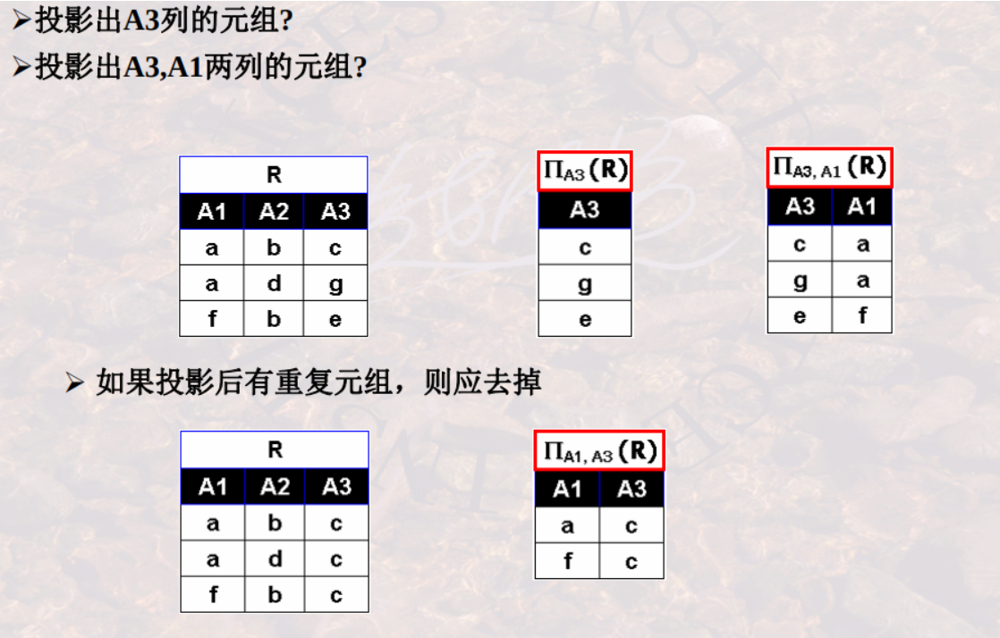
* select(选择): $\sigma$
    * 从关系中选出行 组成新的关系
    * $\sigma_{con}(R)=\{t|t\in R\cap con(t)=True\}$
    * 条件中运算符的优先级（由高到低）： 括号 > 比较符号 > $\neg$ > $\cap$ > $\cup$
    * 举例
    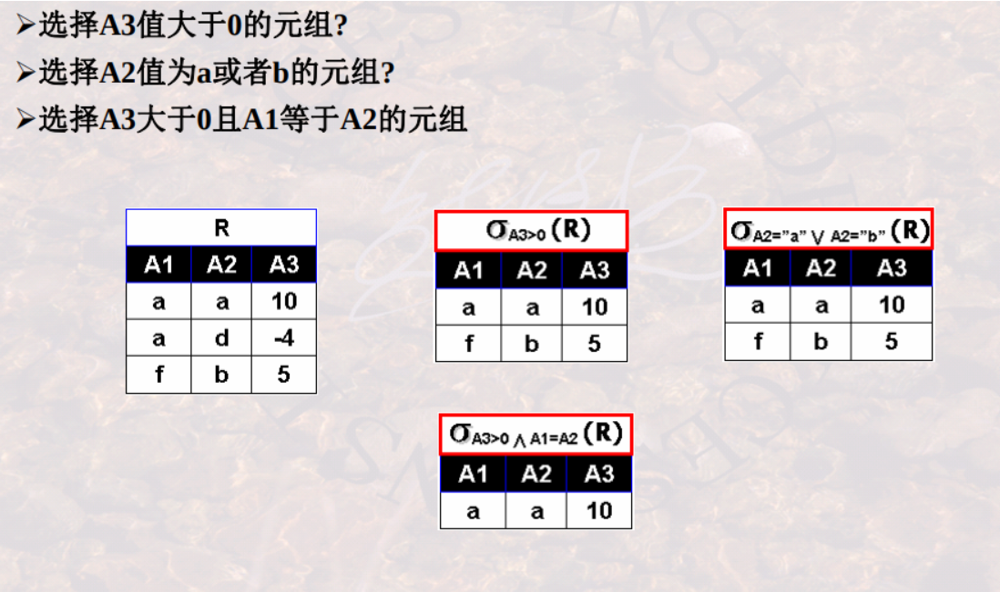
* join(连接): $\bowtie$
* division(除): $\div$
* rename(重命名): $\rho$
    * $\rho_{SC1}(SC)$
        * 将表SC更名为SC1

#### 2.关系代数要求

##### (1) 并相容性

某些关系代数操作中（如 并、差、交等），需要满足 并相容性
* 关系R和关系S存在并相容性的 充要条件：
    * 关系R和关系S的 属性数目 必须相同
    * $\forall i$ 关系R的第i个属性 和 关系S的第i个属性 的域 相同

#### 3.连接操作

##### (1) $\theta$-join (theta-连接)
$R\bowtie_{A\theta B} S=\sigma _{t[A]\theta t[B]}(R\times S)$
* $\theta$ 表示比较
* 举例
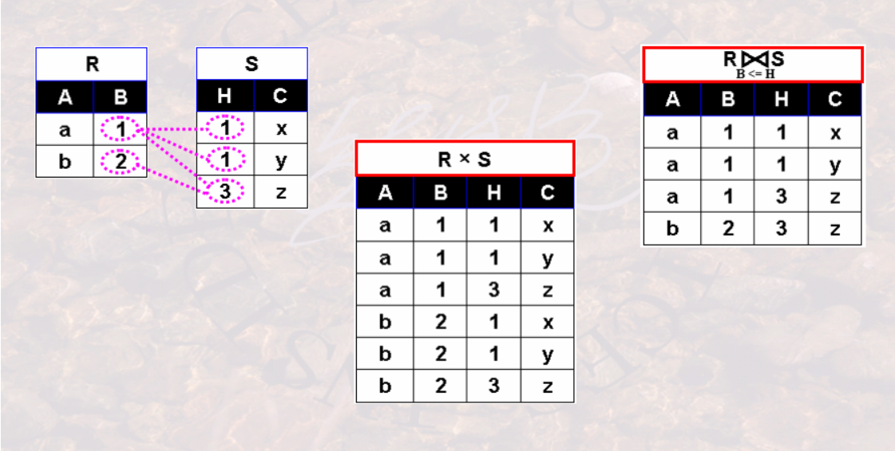

##### (2) natural-join (自然连接)
$R\bowtie S=\sigma _{t[B]=s[B]}(R\times S)$
* 要求关系S和关系R有相同的**属性组**B
    * 即当$R.B_1=S.B_1 \land R.B_2=S.B_2 \land ... \land R.B_n=S.B_n$时才能连接
* 并在结果中去掉重复的列
* 举例
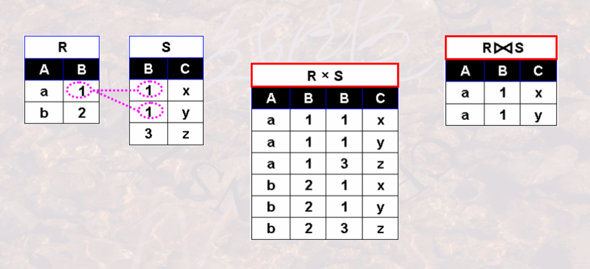

##### (3) outer-join (外连接)

* 外连接 = 自然连接 + 失配的元组
    * ⟕ (左外连接) = 自然连接 + 左侧表中失配的元组
    * ⟖ (右外连接) = 自然连接 + 右侧表中失配的元组
    * ⟗ (全外连接) = 自然连接 + 两侧表中失配的元组

* 举例
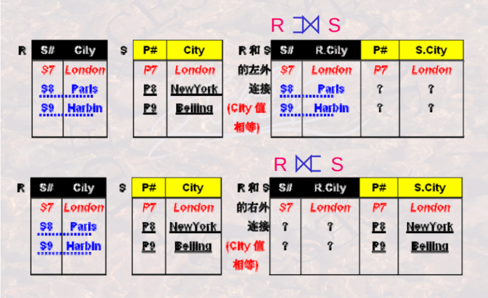
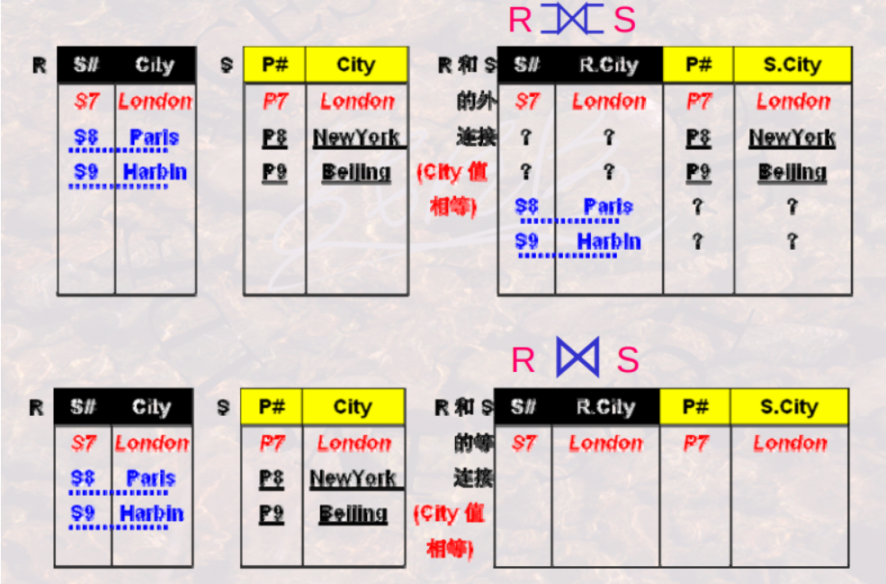

##### (4) 举例
* 表
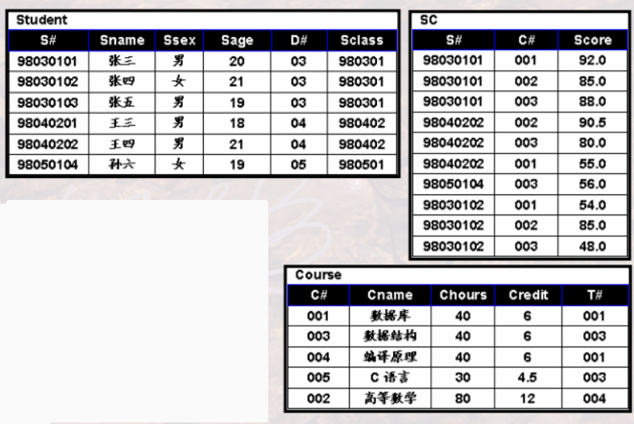

* 案例一
    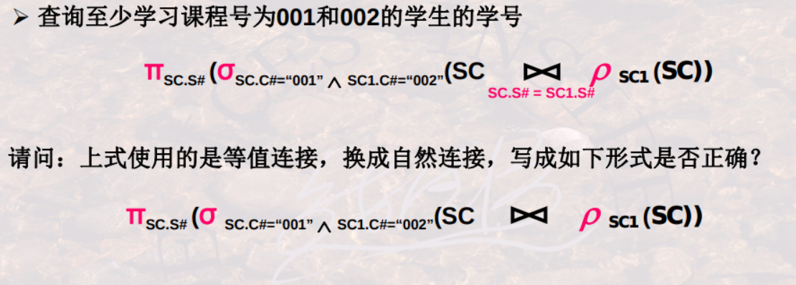
    * 第二个是空集
        * 因为自然连接中不会存在重复的列

* 案例二
    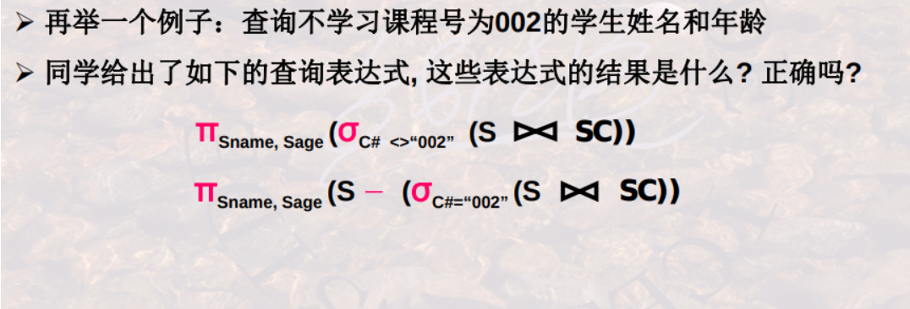
    * 第一个不对，可能查处所有学生
    * 第二个不对，不满足并相容性，因为 S和SC自然连接后 与 S的属性数不相同
    * 正确答案
    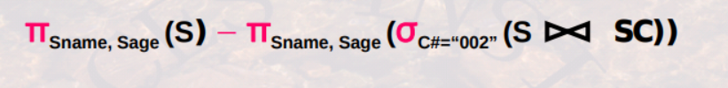

* 案例三
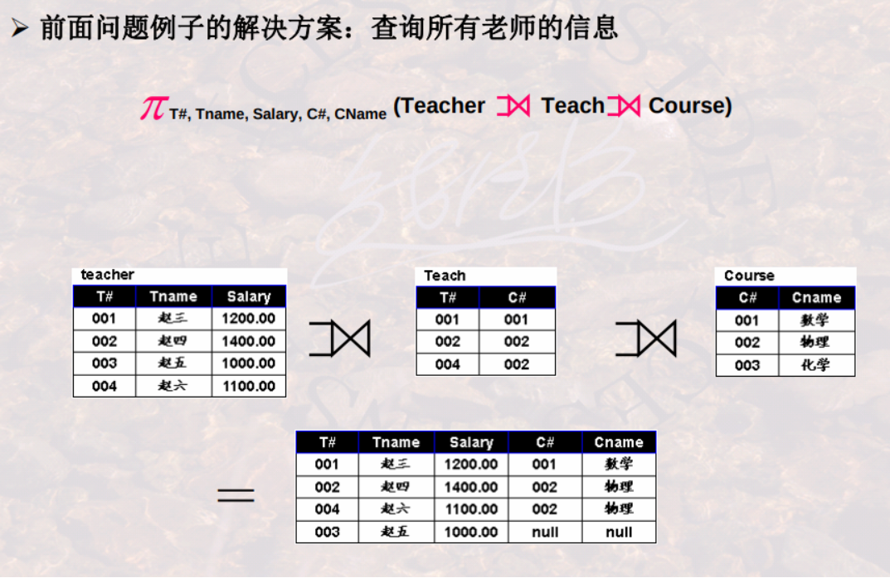
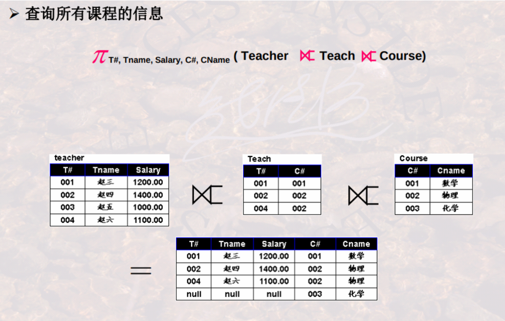
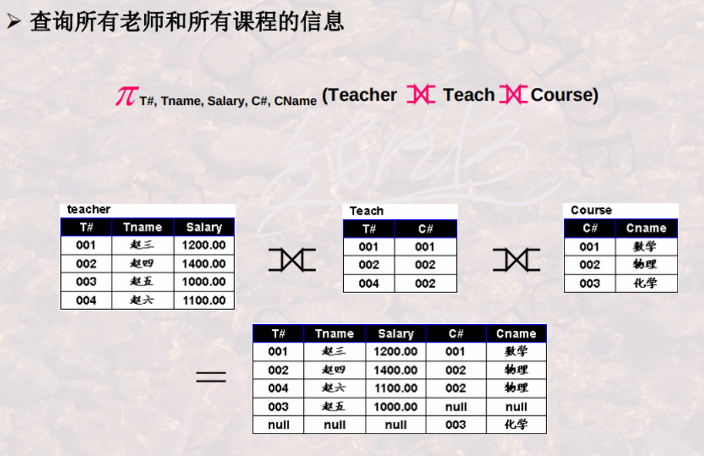

#### 4.除操作

适用于求解“查询...全部的...“

##### (1) 要求
* 关系$R(A_1,A_2,...,A_n)$为n度关系
* 关系$S(B_1,B_2,...,B_m)$为m度关系
* $R\div S$的充要条件：
    * $(B_1,B_2,...,B_m)\subseteq (A_1,A_2,...,A_n)$

##### (2) 除操作
$R\div S=\{t|t\in\pi_{R-S}(R)\land\forall u\in S(tu\in R)\}$
* 设属性集$(C_1,C_2,...,C_k)=(A_1,A_2,...,A_n)-(B_1,B_2,...,B_m)$
    * k=n-m
    * 则$R\div S$由$(C_1,C_2,...,C_k)$列组成
* $\forall u\in S(tu\in R)$表示S和$R\div S$中的元素组合必须都在R中
* 举例
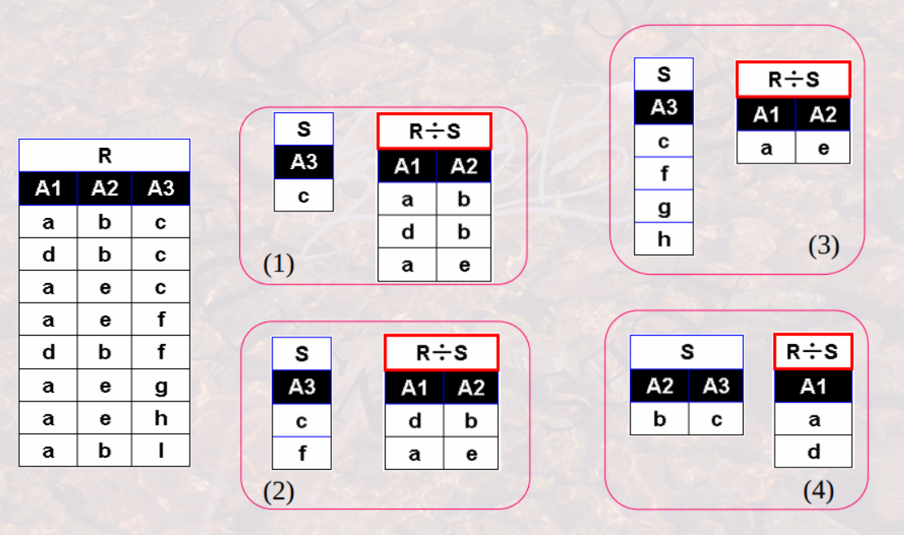


##### (3) 举例
* 查询选修了全部课程的学生的学号

* 案例二
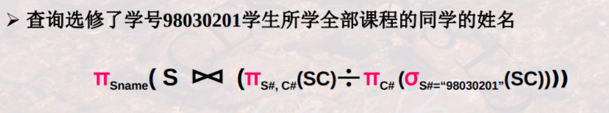

#### 5.关系代数和SQL对应关系

* 关系代数
    * $\pi_{A_{i1},A_{i2},...}(\sigma_{con}(R_1,R_2,...))$
* 对应的SQL
```SQL
SELECT A1,A2,...
FROM R1,R2,...
WHERE con
```