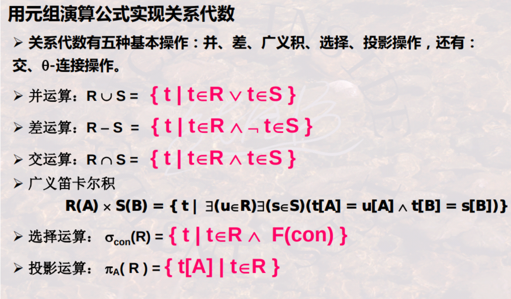
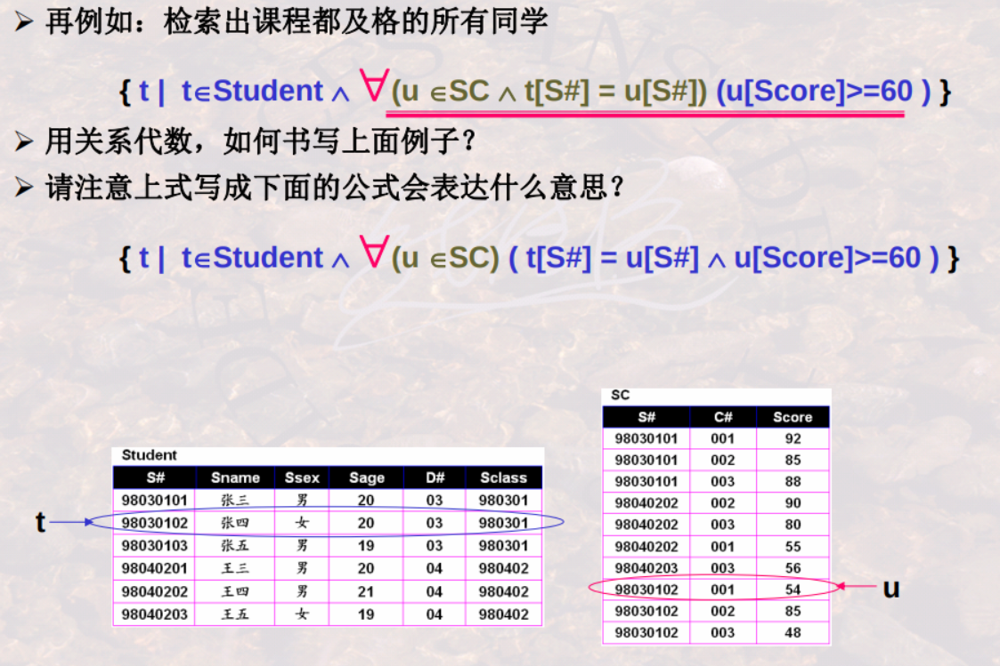
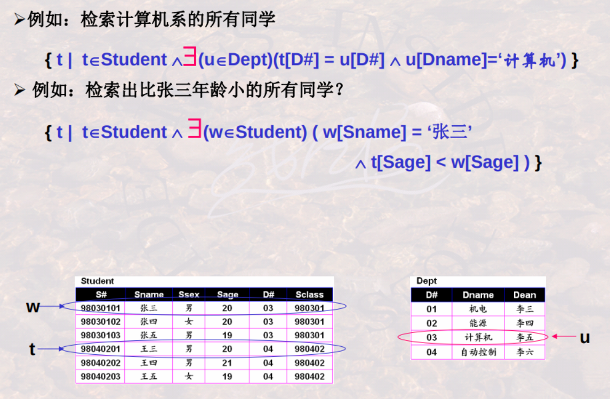
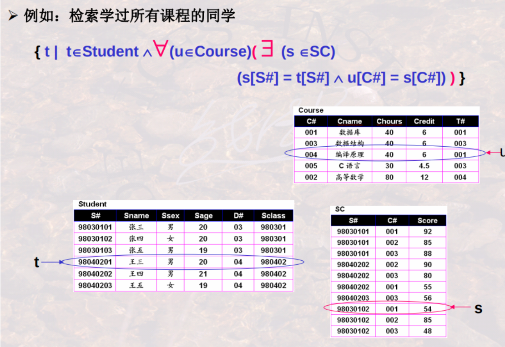
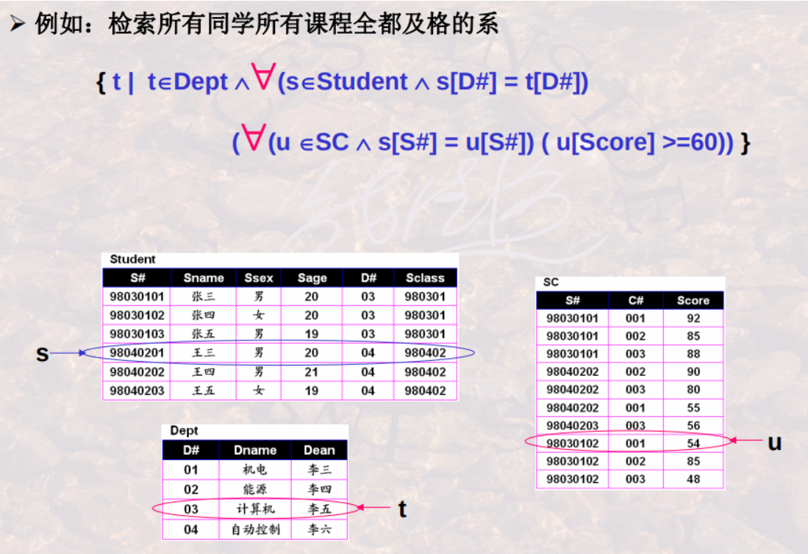
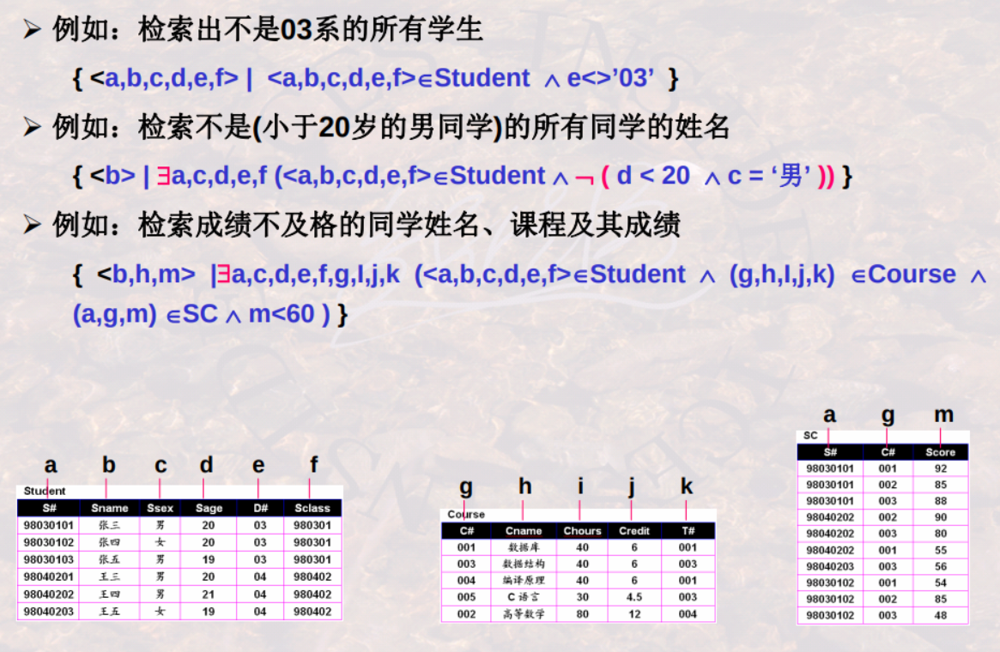
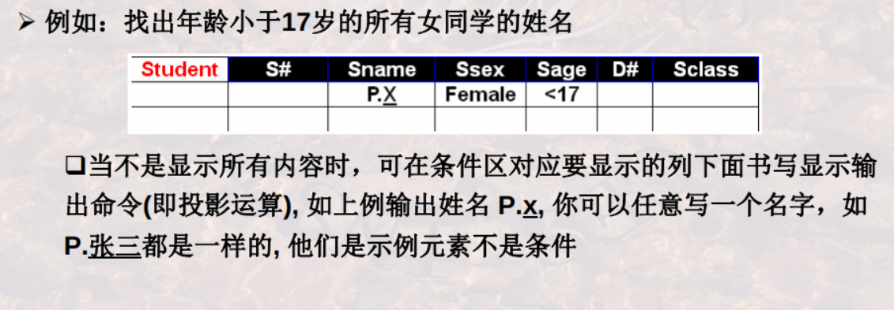
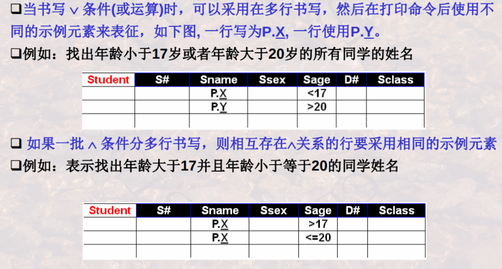
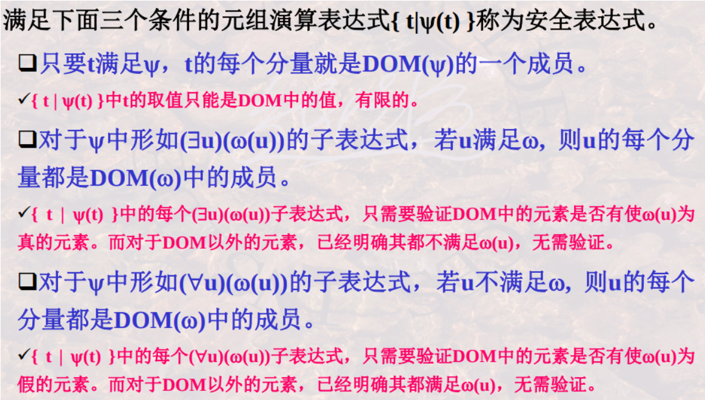

# relation algebra and calculus


<!-- @import "[TOC]" {cmd="toc" depthFrom=1 depthTo=6 orderedList=false} -->

<!-- code_chunk_output -->

- [relation algebra and calculus](#relation-algebra-and-calculus)
    - [概述](#概述)
      - [1.关系代数操作](#1关系代数操作)
        - [(1) 集合操作](#1-集合操作)
        - [(2) 纯关系操作](#2-纯关系操作)
      - [2.关系代数要求](#2关系代数要求)
        - [(1) 并相容性](#1-并相容性)
      - [3.连接操作](#3连接操作)
        - [(1) $\theta$-join (theta-连接)](#1-theta-join-theta-连接)
        - [(2) natural-join (自然连接)](#2-natural-join-自然连接)
        - [(3) outer-join (外连接)](#3-outer-join-外连接)
        - [(4) 举例](#4-举例)
      - [4.除操作](#4除操作)
        - [(1) 语义](#1-语义)
        - [(2) 要求](#2-要求)
        - [(3) 除操作](#3-除操作)
        - [(4) 举例](#4-举例-1)
      - [5.关系代数和SQL对应关系](#5关系代数和sql对应关系)
      - [6.关系演算](#6关系演算)
        - [(1) 元组演算](#1-元组演算)
        - [(2) 域演算](#2-域演算)
        - [(3)关系代数和关系元组演算的关系](#3关系代数和关系元组演算的关系)
      - [7.关系元组演算](#7关系元组演算)
        - [(1) 定义](#1-定义)
        - [(2) 存在量词和全称量词的使用](#2-存在量词和全称量词的使用)
        - [(3) 典型案例](#3-典型案例)
      - [8.关系域演算](#8关系域演算)
        - [(1) 定义](#1-定义-1)
        - [(2) 举例](#2-举例)
        - [(3) QBE(query by example)语言](#3-qbequery-by-example语言)
      - [9.关系运算的安全性](#9关系运算的安全性)
        - [(1) 定义](#1-定义-2)
        - [(2) 安全约束有限集DOM](#2-安全约束有限集dom)
        - [(3) 安全元组演算表达式](#3-安全元组演算表达式)
        - [(4) 安全域演算表达式](#4-安全域演算表达式)

<!-- /code_chunk_output -->

### 概述

#### 1.关系代数操作

##### (1) 集合操作

* union(并): $\cup$
    * 举例
    
* intersection(交): $\cap$
* difference(差): $-$
    * 举例
    
* cattesian product(笛卡尔积): $\times$
    * 举例
    

##### (2) 纯关系操作
* project(投影): $\pi$
    * 从关系中选出列 组成新的关系
    * $\pi_{A_{i1},A_{i2},...,A_{ik}}(R)=\{(t[A_{i1}],t[A_{i2}],...,t[A_{ik}]) | t\in R\}$
        * 设$R(A_1,A_2,...,A_n) 且 \{A_{i1},A_{i2},...,A_{ik}\}\subseteq \{A_1,A_2,...,A_n\}$
    * 举例
    
* select(选择): $\sigma$
    * 从关系中选出行 组成新的关系
    * $\sigma_{con}(R)=\{t|t\in R\cap con(t)=True\}$
    * 条件中运算符的优先级（由高到低）： 括号 > 比较符号 > $\neg$ > $\cap$ > $\cup$
    * 举例
    
* join(连接): $\bowtie$
* division(除): $\div$
* rename(重命名): $\rho$
    * $\rho_{SC1}(SC)$
        * 将表SC更名为SC1

#### 2.关系代数要求

##### (1) 并相容性

某些关系代数操作中（如 并、差、交等），需要满足 并相容性
* 关系R和关系S存在并相容性的 充要条件：
    * 关系R和关系S的 属性数目 必须相同
    * $\forall i$ 关系R的第i个属性 和 关系S的第i个属性 的域 相同

#### 3.连接操作

##### (1) $\theta$-join (theta-连接)
$R\bowtie_{A\theta B} S=\sigma _{t[A]\theta t[B]}(R\times S)$
* $\theta$ 表示比较
* 举例


##### (2) natural-join (自然连接)
$R\bowtie S=\sigma _{t[B]=s[B]}(R\times S)$
* 要求关系S和关系R有相同的**属性组**B
    * 即当$R.B_1=S.B_1 \land R.B_2=S.B_2 \land ... \land R.B_n=S.B_n$时才能连接
* 并在结果中去掉重复的列
* 举例


##### (3) outer-join (外连接)

* 外连接 = 自然连接 + 失配的元组
    * ⟕ (左外连接) = 自然连接 + 左侧表中失配的元组
    * ⟖ (右外连接) = 自然连接 + 右侧表中失配的元组
    * ⟗ (全外连接) = 自然连接 + 两侧表中失配的元组

* 举例


##### (4) 举例
* 表


* 案例一
    
    * 第二个是空集
        * 因为自然连接中不会存在重复的列

* 案例二
    
    * 第一个不对，可能查处所有学生
    * 第二个不对，不满足并相容性，因为 S和SC自然连接后 与 S的属性数不相同
    * 正确答案
    

* 案例三


#### 4.除操作

##### (1) 语义
$R\div S$
* 以S为基本单位，筛选出符合要求的记录组
    * 每组中 所有记录的 其他列的内容都相同，对应列的内容包含S的所有内容

##### (2) 要求
* 关系$R(A_1,A_2,...,A_n)$为n度关系
* 关系$S(B_1,B_2,...,B_m)$为m度关系
* $R\div S$的充要条件：
    * $(B_1,B_2,...,B_m)\subseteq (A_1,A_2,...,A_n)$

##### (3) 除操作
$R\div S=\{t|t\in\pi_{R-S}(R)\land\forall u\in S(tu\in R)\}$
* 设属性集$(C_1,C_2,...,C_k)=(A_1,A_2,...,A_n)-(B_1,B_2,...,B_m)$
    * k=n-m
    * 则$R\div S$由$(C_1,C_2,...,C_k)$列组成
* $\forall u\in S(tu\in R)$表示S和$R\div S$中的元素组合必须都在R中
* 举例


##### (4) 举例
* 查询选修了全部课程的学生的学号

* 案例二


#### 5.关系代数和SQL对应关系

* 关系代数
    * $\pi_{A_{i1},A_{i2},...}(\sigma_{con}(R_1\times R_2\times,...))$
* 对应的SQL
```SQL
SELECT A1,A2,...
FROM R1,R2,...
WHERE con
```

#### 6.关系演算

##### (1) 元组演算
* 以元组为变量，以元组为基本处理单位
* 先找到元组
* 然后再找到元组分量，进行谓词判断

##### (2) 域演算
* 以域为变量，以域变量为基本处理单位
* 然后再判断由这些域变量组成的元组
* 是否存在或是否满足谓词判断

##### (3)关系代数和关系元组演算的关系
* 关系代数基于集合思维
* 关系演算基于逻辑思维



#### 7.关系元组演算

##### (1) 定义
关系元组演算是以元组变量作为谓词变量的基本对象，基本形式如下：
* $\{t|P(t)\}$
    * 所有使谓词 P 为真的元组 t 的集合
        * t [A] 表示元组 t 的分量，即 t 在属性 A 上的值

##### (2) 存在量词和全称量词的使用

当条件设计到多个关系时，需要使用存在量词或全称量词

* 案例一

    * 第一个公式：选出 课程都及格的 所有学生
    * 第二个公式：选出 所有学生的所有课程都要及格

* 案例二


* 案例三


* 案例四


##### (3) 典型案例

* 已知：
    * 学生关系： Student(S#,Sname,Sage,Ssex,Sclass)
    * 课程关系： Course(C#,Cname,Chours,Credit,Tname)
    * 选课关系： SC(S#,C#,Score)

* 求学过李明老师讲授所有课程的学生姓名(全都学过)
    * 关系代数
        * 全部学生选课关系
            * $\pi_{Sname,C\#}(Student\bowtie SC\bowtie Course)$
        * 李明老师的全部课程：
            * $\pi_{C\#}(\sigma_{Tname='李明'}(Course))$
        * 结果
            * $\pi_{Sname}(\pi_{Sname,C\#}(Student\bowtie SC\bowtie Course) \div \pi_{C\#}(\sigma_{Tname='李明'}(Course)))$

    * 关系演算
        * 全部学生：
            * $t\in Student$
        * 李明老师的全部课程：
            * $\forall(u\in Course\land u[Tname]='李明')$
        * 结果
            * $\{t[Sname]|t\in Student\land \forall(u\in Course\land u[Tname]='李明')(\exist (w\in SC)(w[S\#]=t[S\#]\land w[C\#]=u[C\#]))$

* 求没学过李明老师讲授任一门课程的学生姓名(全没学过)
    * 关系代数
        * 选了李明老师课程的学生
            * $\pi_{Sname}(\sigma_{Tname='李明'}(Student\bowtie SC\bowtie Course))$
        * $\pi_{Sname}(Student)-\pi_{Sname}(\sigma_{Tname='李明'}(Student\bowtie SC\bowtie Course))$
    * 关系演算
        * 李明老师的全部课程
            * $\forall(u\in Course\land u[Tname]='李明')$
        * 结果
            * $\{t[Sname]|t\in Student\land \forall(u\in Course\land u[Tname]='李明')(\neg\exist (w\in SC)(w[S\#]=t[S\#]\land w[C\#]=u[C\#]))$

* 求学过李明老师讲授所有课程的学生姓名(至少学过一门)
    * 关系代数
        * $\pi_{Sname}(\sigma_{Tname='李明'}(Student\bowtie SC\bowtie Course))$
    * 关系演算
        * $\{t[Sname]|t\in Student\land \exist(u\in Course\land u[Tname]='李明')(\exist (w\in SC)(w[S\#]=t[S\#]\land w[C\#]=u[C\#]))$

* 求至少有一门李明老师讲授课程没有学过的学生姓名(至少有一门没学过)
    * 关系代数
        * $\pi_{Sname}(Student)-\pi_{Sname}(\pi_{Sname,C\#}(Student\bowtie SC\bowtie Course) \div \pi_{C\#}(\sigma_{Tname='李明'}(Course)))$
    * 关系演算
        * $\{t[Sname]|t\in Student\land \exist(u\in Course\land u[Tname]='李明')(\neg\exist (w\in SC)(w[S\#]=t[S\#]\land w[C\#]=u[C\#]))$

#### 8.关系域演算

##### (1) 定义
关系域演算是以域变量作为谓词变量的基本对象，基本形式如下：
* $\{<x_1,x_2,...,x_n>|P(x_1,x_2,...,x_n)\}$
    * $x_i$代表域变量或域常量，P为以$x_i$为变量的公式

##### (2) 举例


##### (3) QBE(query by example)语言



#### 9.关系运算的安全性

##### (1) 定义
不产生无限关系和无穷验证的运算被称为是安全的
* 关系代数是一种集合运算
    * 由于集合是有限的，所以关系代数是安全的
* 关系演算不一定是安全的

##### (2) 安全约束有限集DOM
$DOM(\psi)$是一个有限集合，其中的每个符号要么是$\psi$中明显出现的符号，要
么是出现在$\psi$中的某个关系R的某元组的分量

##### (3) 安全元组演算表达式


##### (4) 安全域演算表达式
同理