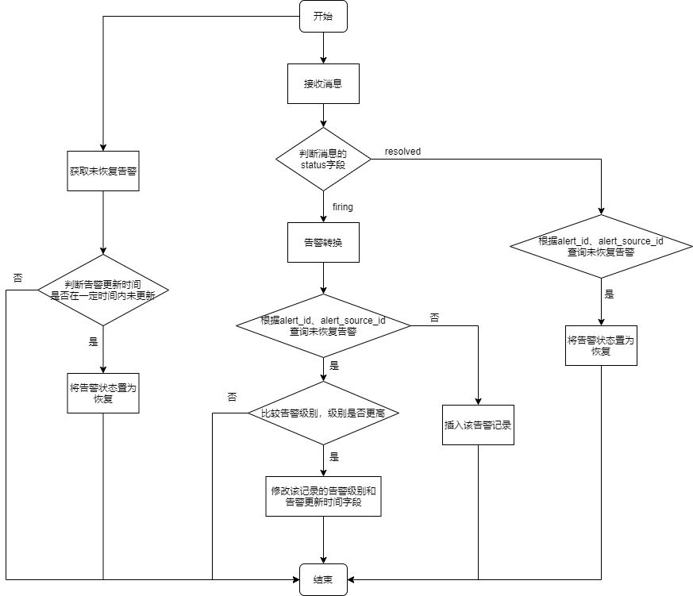

# prometheus告警设计

[toc]

### 监控设置

#### 1.blackbox监控

* icmp探测（用于探测主机设备）
```yaml
- job_name: icmp_probe
  metrics_path: /probe
  params:
    module: [icmp]
  relabel_configs:
  - source_labels:
    - __address__
    target_label: __param_target
  - source_labels:
    - __param_target
    target_label: instance
  - replacement: <blackbox_exporter>
    target_label: __address__
  scrape_interval: 30s
  static_configs:
  - targets: []
```

* http探测（用于探测业务系统）
```yaml
- job_name: http_probe
  metrics_path: /probe
  params:
    module: [http_2xx]
  relabel_configs:
  - source_labels:
    - __address__
    target_label: __param_target
  - source_labels:
    - __param_target
    target_label: instance
  - replacement: <blackbox_exporter>
    target_label: __address__
  scrape_interval: 30s
  static_configs:
  - targets: []
```

* tcp探测（用于探测原子系统）
```yaml
- job_name: tcp_probe
  metrics_path: /probe
  params:
    module: [tcp_connect]
  relabel_configs:
  - source_labels:
    - __address__
    target_label: __param_target
  - source_labels:
    - __param_target
    target_label: instance
  - replacement: <blackbox_exporter>
    target_label: __address__
  scrape_interval: 30s
  static_configs:
  - targets: []
```

#### 2.node-exporter监控
```yaml
- job_name: linux
  scrape_interval: 30s
  static_configs:
  - targets: []

- job_name: windows
  scrape_interval: 30s
  static_configs:
  - targets: []
```

#### 3.原子监控
```yaml
- job_name: oracle_exporter
  scrape_interval: 30s
  static_configs:
  - targets: []

- job_name: nginx_exporter
  scrape_interval: 30s
  static_configs:
  - targets: []

- job_name: apache_exporter
  scrape_interval: 30s
  static_configs:
  - targets: []

- job_name: postgresql
  scrape_interval: 30s
  static_configs:
  - targets: []

- job_name: tomcat_exporter
  scrape_interval: 30s
  static_configs:
  - targets: []

- job_name: mysql_exporter
  scrape_interval: 30s
  static_configs:
  - targets: []


- basic_auth:
    password: weblogic123
    username: weblogic
  job_name: weblogic_exporter
  metrics_path: /wls-exporter/metrics
  scrape_interval: 30s
  static_configs:
  - targets:
    - 192.168.41.165:7001
```

#### 4.snmp监控
```yaml
scrape_configs:
  - job_name: 'snmp'
    static_configs:
      - targets: []   #指定采集目标
    metrics_path: /snmp
    params:
      module: []    #指定模块（模块是在snmp.yml中设置的）
    relabel_configs:
      - source_labels: [__address__]
        target_label: __param_target
      - source_labels: [__param_target]
        target_label: instance
      - target_label: __address__
        replacement: 127.0.0.1:9116  #snmp exporter的地址
```

### 告警概述

#### 1.需要解决的问题
* 未收到告警消息
  * 通过设置`repeat_interval`，设置重发的时间间隔
* 未收到告警恢复消息
  * 设置定时器，检查告警的更新时间，如果在一定时间内未更新，则恢复该告警
* 在两个范围波动，从而导致未产生告警
  * 告警范围重叠
* 拍打告警
  * 通过设置持续时间

### 告警处理流程

#### 1.告警规则的设置

* service

|service|说明|
|-|-|
|host|主机设备|
|business|业务系统|
|platform|平台系统|
|atom|原子系统|
|interface|端口|

* severity

|severity|说明|
|-|-|
|1|紧急告警|
|2|严重告警|
|3|次要告警|
|4|警告告警|

##### （1）告警规则格式

```yaml
- alert: <alert_name>
  expr: <expression>
  for: <time>
  annotations:
    description: "<用中文清楚描述该告警的信息>"
    summary: <alert_name>
    value: "{{ $value }}"

  labels:
    service: <service>
    severity: <severity>
```

* 设备告警
```yaml
- alert: host_interrupt_down
  annotations:
    description: "主机中断"
    summary: host_status
  expr: probe_success{job="icmp_probe"} == 0
  labels:
    service: host
    severity: 1

```

* 业务系统告警
```yaml
- alert: business_interrupt_down
  annotations:
    description: "业务系统中断"
    summary: business_interrupt_down
  expr: probe_success{job="http_probe"} == 0
  labels:
    service: business
    severity: 1
```

* 平台系统告警（需要确认）
```yaml
- alert: platform_interrupt_down
  annotations:
    description: "平台系统中断"
    summary: platform_interrupt_down
  expr: probe_success{job="tcp_probe"} == 0
  labels:
    service: platform
    severity: 1
```

* 原子系统告警
```yaml
- alert: atom_interrupt_down
  annotations:
    description: "原子系统中断"
    summary: atom_interrupt_down
  expr: probe_success{job="tcp_probe"} == 0
  labels:
    service: atom
    severity: 1
```

* 端口告警（需要确认）

```yaml
- alert: switch_interface_down
  annotations:
    description: "端口连接断开"
    summary: switch_interface_down
  expr: ifOperStatus{ifDescr=~".*GigabitEthernet.*"} != 1
  for: 1m
  labels:
    service: interface
    severity: 1
```

##### （2）alertmanager配置
```yaml
#定义消息接收者
receivers:
- name: default-receiver
  webhook_configs:
  - send_resolved: true
    url: http://data-cleaning.aiops-dev/api/v1/resources/topics/prometheus/alert

route:
  #设置接收者
  receiver: <receiver>    #在上面定义好的
  #设置分组
  group_by: ['service']
  group_interval: 10s
  #配置重发时间
  repeat_interval: 1h

#配置告警抑制
inhibit_rules:
- target_match_re:
    severity: "[234]"
  source_match_re:
    severity: "1"
  equal:
  - alertname
  - service
  - instance
  - ifName
- target_match_re:
    severity: "[34]"
  source_match_re:
    severity: "2"
  equal:
  - alertname
  - service
  - instance
  - ifName
- target_match_re:
    severity: "4"
  source_match_re:
    severity: "3"
  equal:
  - alertname
  - service
  - instance
  - ifName
```

#####  （3）告警范围重叠
当需要实现多个阈值告警时，让告警范围重叠，比如：
```python
cpu_usage>=90

cpu_usage>=80

cpu_usage>=70

cpu_usage>=50
```

#### 2.告警的产生

##### （1）告警消息模板
```json
{
	"receiver": "3D-receiver",
	"status": "firing",
	"alerts": [
		{
			"status": "firing",
			"labels": {
				"alertname": "host_cpuusage_high",
				"instance": "192.168.90.200:9100",
				"service": "host",
				"severity": "2"
			},
			"annotations": {
				"description": "host_cpuusage_high>=75%",
				"summary": "host_cpuusage_high",
				"value": "89.49791666653861"
			},
			"startsAt": "2021-06-30T07:49:05.683743418Z",
			"endsAt": "0001-01-01T00:00:00Z",
			"generatorURL": "http://prometheus-server-559cc5b5b9-xr5jz:9090/graph?g0.expr=80+%3C%3D+%281+-+avg+by%28instance%29+%28irate%28node_cpu_seconds_total%7Bmode%3D%22idle%22%7D%5B5m%5D%29%29%29+%2A+100+%3C+90&g0.tab=1",
			"fingerprint": "3c71be7b4ff4997a"
		}
	]
}
```

#### 3.告警转换

|service|alertSourceType|alertSourceId（根据service和instance）|说明|
|-|-|-|-|
|host|1|sn|主机设备|
|business|2|业务系统名称|业务系统|
|platform|3|平台系统的uuid（根据instance找到原子，然后再找到原子所在的平台系统的uuid）|平台系统|
|atom|4|原子的uuid|原子系统|
|interface|5|sn:ifname|端口|

```python
{
  "alertMessage": string(alert.annotations.description),
  "isHit": 1,       #命中为1，未命中为0，未命中不需要处理
  "alertLevel": int(alert.labels.severity),  
  "fingerprint": string(alert.annotations.fingerprint),
  "usageRate": float(alert.annotations.value),
  "instance": string(alert.labels.instance.split(":")[0]),
  "alertId": string(alert.labels.alertname),
  "isMaintenance": <boolean>,   #是否在维护中，如果未true，就不需要处理
  "alertSourceType": <int>,
  "alertSourceId": <string>,
  "reportTime": "2021-06-30 15:49:05", #根据startsAt转换
  "primaryKey": <int>		#暂时没用到,
  "sourceDisplayInfo": "告警展示信息"
}
```

#### 4.处理告警



##### （1）告警入库
数据库需要增加告警更新时间字段
```sql
CREATE TABLE `system_alert` (
  `id` bigint(20) NOT NULL AUTO_INCREMENT COMMENT '主键 id',
  `alert_id` varchar(128) COLLATE utf8_general_ci NOT NULL COMMENT '告警id',
  `alert_source_id` varchar(256) COLLATE utf8_general_ci NOT NULL COMMENT '告警源标识id,唯一识别一个告警源的标识，对主机设备是sn,对业务系统则是业务系统名称，对平台系统是由ip+port生成的uuid，对原子系统是ip+port生成的uuid',
  `instance` varchar(256) COLLATE utf8_general_ci NOT NULL COMMENT '原始IP+port',
  `alert_source_type` tinyint(4) NOT NULL COMMENT '告警源类型 1. 主机设备，2. 业务系统 3. 平台系统 4. 原子系统',
  `alert_level` tinyint(4) NOT NULL COMMENT '告警级别 1. 一级告警，2.二级告警，3.三级告警，4.四级告警,以及 0.告警恢复，要求每一类告警都必须配置对应的告警恢复',
  `source_display_info` json DEFAULT NULL COMMENT '告警源 json',
  `alert_message` varchar(256) COLLATE utf8_general_ci DEFAULT NULL COMMENT '对告警的描述信息',
  `report_time` datetime NOT NULL COMMENT '告警上报时间,到秒',
  `update_time` datetime NOT NULL COMMENT '告警更新时间,到秒',
  `recovery_time` datetime DEFAULT NULL COMMENT '告警恢复时间，到秒',
  `recovery_status` tinyint(4) NOT NULL DEFAULT '2' COMMENT '恢复状态 0:通过0级告警上报恢复，1:通过非0级告警上报级别跃迁恢复，2:未恢复，默认值 2',
  `usage_rate` double DEFAULT NULL COMMENT '当前使用率',
  `is_hit` tinyint(2) NOT NULL COMMENT '是否命中对应告警源',
  `primary_key` int(11) DEFAULT NULL COMMENT '查询用主键',
  PRIMARY KEY (`id`),
  KEY `idx_alert_source_id_report_time` (`alert_source_id`,`report_time`),
  KEY `idx_alert_source_id_type_report_time` (`alert_source_id`,`alert_source_type`,`report_time`),
  UNIQUE KEY `alert_id` (`alert_id`,`alert_source_id`,`alert_source_type`,`report_time`)
) ENGINE=InnoDB DEFAULT CHARSET=utf8 COLLATE=utf8_general_ci AUTO_INCREMENT=665301 COMMENT='系统告警信息分时表';
```

##### （2）告警恢复

* 恢复时间为：`endsAt`字段

```json
{
	"status": "resolved",
	"labels": {
		"alertname": "host_cpuusage_high",
		"instance": "192.168.90.200:9100",
		"service": "host",
		"service_type": "Linux",
		"severity": "2"
	},
	"annotations": {
		"description": "host_cpuusage_high>=75%",
		"summary": "host_cpuusage_high",
		"value": "89.49791666653861"
	},
	"startsAt": "2021-06-30T07:49:05.683743418Z",
	"endsAt": "2021-06-30T07:50:05.683743418Z",
	"generatorURL": "http://prometheus-server-559cc5b5b9-xr5jz:9090/graph?g0.expr=80+%3C%3D+%281+-+avg+by%28instance%29+%28irate%28node_cpu_seconds_total%7Bmode%3D%22idle%22%7D%5B5m%5D%29%29%29+%2A+100+%3C+90&g0.tab=1",
	"fingerprint": "3c71be7b4ff4997a"
}
```

##### （3）推送kafka
发送到topic_message
```json
{
  "message_type": 2,
  "message_info": "告警源类型+告警源【空格】告警级别【空格】告警详情",
  "message_receiver": [],   //消息订阅人列表
  "message_menu_auth": "",
  "report_time": "告警时间"
}
```
