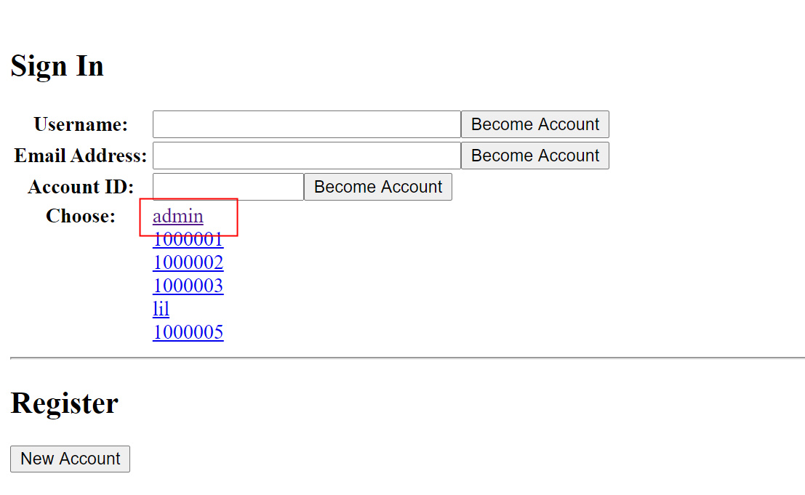
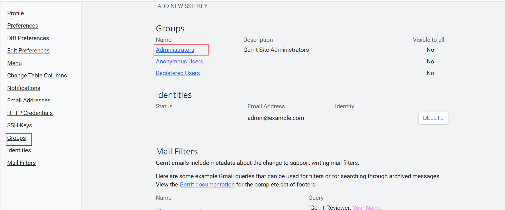
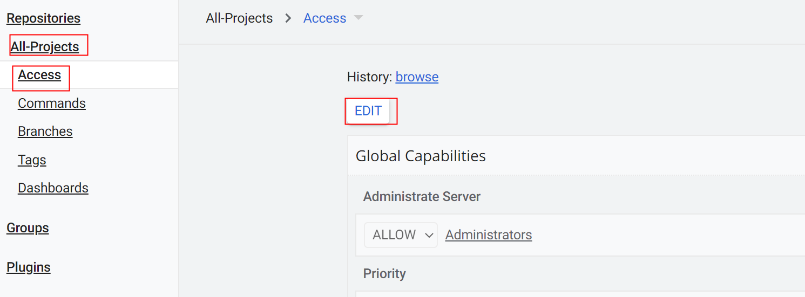
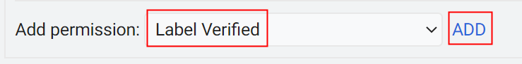
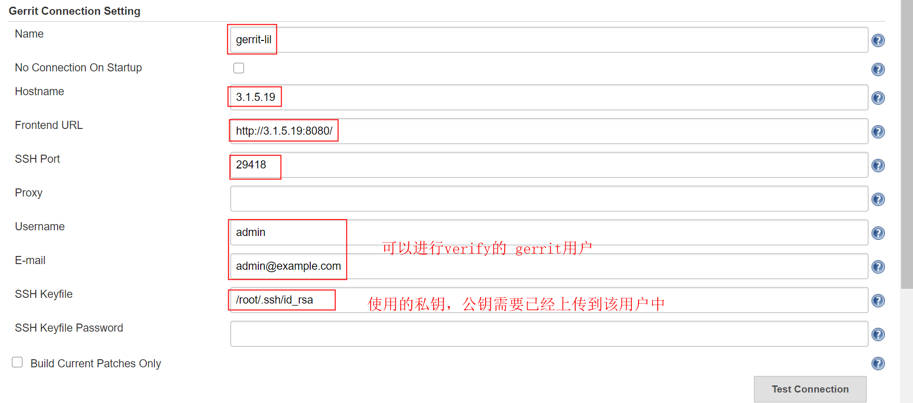
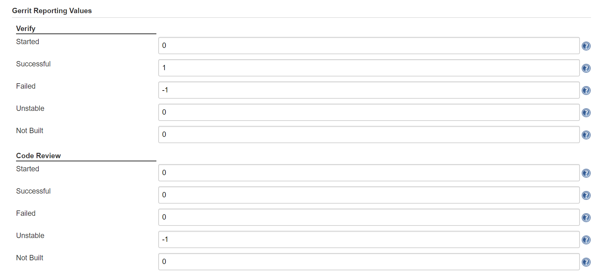
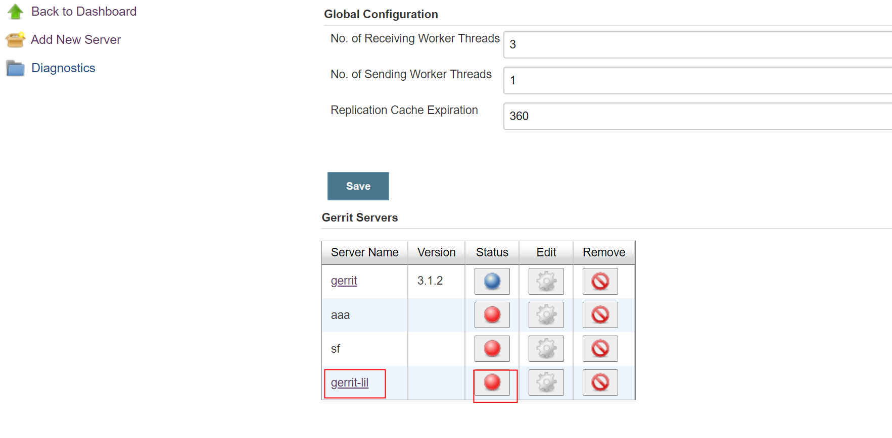
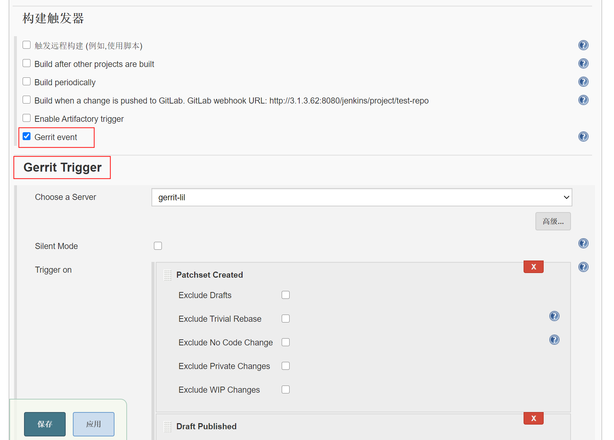
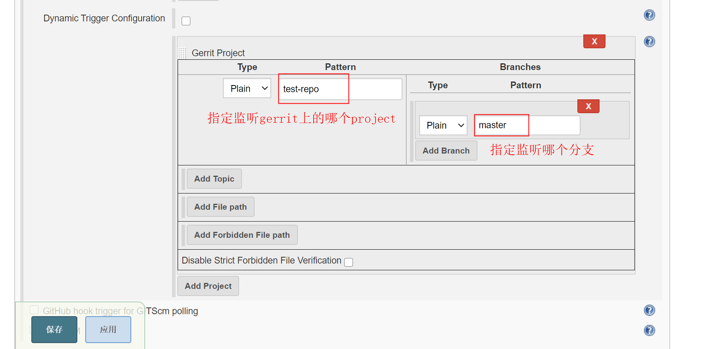

# gerrit
[toc]

### 概述
#### 1.gerrit的常用引用
* `refs/for/`
推送到这个引用后，需要code review之后才可以提交到gitlab
* `refs/head/`
推送到这个引用后，不需要code review，gerrit直接提交到gitlab
所以需要对这个引用的权限严格把控，最好不允许使用这个引用
* `refs/meta/config`
该引用用于配置projects

#### 2.引用权限的设置
设置 指定用户 对 指定引用 的权限
All-Projects -> Access

***

### 安装
* 注意：git的版本必须>=2.24

#### 1.初始化gerrit（生成gerrit目录）
* 会检查java环境
* 生成gerrit目录和相应配置
```shell
java -jar gerrit*.war init --batch --dev --install-all-plugins -d <CUSTOME_DIR>

#--batch使用默认配置，如果不设置，需要交互式进行选择
#--dev设置auth的方式为development_become_any_account

```
#### 2.修改配置
```shell
vim <CUSTOME_DIR>/etc/gerrit.config
```
* 监听端口配置
```shell
[httpd]
  listenUrl = http://0.0.0.0:8080/
```
* url配置
```shell
[gerrit]
  canonicalWebUrl = http://<IP>:8080/
```
* ldap配置
```shell
[auth]
  type = LDAP

[ldap]
  server = ldap://<HOST:PORT>

#登录ldap服务器的账号信息
  username = <ADMIN_DN>
  password = <PASSWD>

#会在该BaseDN下搜索用户
  accountBase = <BaseDN>
#设置过滤条件
  accountPattern = (&(objectClass=person)(uid=${username}))

#会在该BaseDN下搜索组
  groupBase = <BaseDN>
  groupMemberPattern = (&(objectClass=posixGroup)(cn=${groupname}))
```
#### 3.启动gerrit
```shell
<CUSTOME_DIR>/bin/gerrit.sh restart
```

#### 4.设置管理员账号
如果第一次登陆，不需要用此方法，因为第一个登录的账号默认就是管理员
##### （1）暂时修改认证方式
```shell
$ vim <CUSTOME_DIR>/etc/gerrit.config

[auth]
  type = development_become_any_account
```
##### （2）用admin账号登录，将相应账号设为管理员



</br>
将相应用户添加进去即可

##### （3）将认证方式改回来
```shell
$ vim <CUSTOME_DIR>/etc/gerrit.config

[auth]
  type = LDAP

$ <CUSTOME_DIR>/bin/gerrit.sh restart
```

***

### 利用ssh命令管理gerrit

#### 1.上传所在机器的公钥到指定账号

#### 2.命令格式
```shell
ssh -p <PORT> <USER>@<HOST> <COMMAND>

#<PORT>可以通过配置文件中的sshd配置项查看
#<USER>为添加了公钥的那个账号
```

#### 3.常用命令
* 删除一个repo（需要安装了delete-project插件）
```shell
ssh -p <PORT> <USER>@<HOST> delete-project delete <REPO-NAME> --yes-really-delete
```

***

### gerrit与gitlab集成
* 需要replication插件

#### 1.将gerrit机器上的ssh公钥添加到gitlab上
能够实现免密推拉代码

#### 2.在gerrit上添加同名仓库
* UI界面添加仓库
* 删除添加的仓库，重新克隆gitlab上的仓库：`git clone --bare ...`
因为添加的仓库是一个空仓库，而gitlab上的仓库不是空的

```shell
cd <CUSTOME_DIR>/git/

#删除刚刚创建的同名仓库
rm -rf <REPO_NAME>.git

#裸克隆，只克隆.git文件的内容，且把refs/remote内容直接复制到refs/head中，所以不会有refs/remote目录，即不会跟踪远程分支
#所以如果跳过gerrit直接操作gitlab，导致refs不一致，则就会出现问题
git clone --bare <REPO_URL>
```

#### 3.添加replication配置
添加配置后，gerrit的变化才会push到gitlab
```shell
$ vim <CUSTOME>/etc/replication.config

[remote "<REPO_NAME>"]
  url = <GIT_URL>       #可以使用变量：${name}，表示<REPO_NAME>
  push = +refs/heads/*:refs/heads/*
  push = +refs/tags/*:refs/tags/*
  push = +refs/changes/*:refs/changes/*
  threads = 3

$ <CUSTOME>/bin/gerrit.sh restart
```

#### 4.客户端使用
##### （1）克隆gerrit上的仓库
* 还必须把hook复制下来
因为hook用于插入一个change-id，这样gerrit才能看出变化

##### （2）使用
```shell
git add .
git commit -m 'xx'

git push <REMOTE_REPO_NAME> <BRANCH>:refs/for/<BRANCH>
#refs/for代表需要经过code review，gerrit才会将代码push到gitlab
```

##### （3）提交被打回如何处理
* 如果提交的内容被打回，提交者需要把本地的git仓库回滚到提交已经的状态
  * 如果只是把被打回的内容删除，然后重新提交，如果gerrit那边同意了这个提交，就会引起冲突，从而导致仓库不可用
  * 所以客户端一定要回滚

***

### gerrit和jenkins集成

#### 1.gerrit开启verified功能
* 开启后，指定用户可以进行verify，跟jenkins没有任何关系，只要登录指定用户，然后找到提交记录，点击verify按钮即可
* 与jenkins结合就是，当有记录提交，jenkins会触发构建，jenkins会利用指定账号对该记录进行verify，构建成功verify的值置为1，构建失败verify的值置为0
##### （1）修改All-Projects的配置
```shell
$ git clone <URL>/All-Projects

$ cd All-Projects

$ vim project.config
#在最后添加
[label "Verified"]
    function = MaxWithBlock
    value = -1 Fails
    value =  0 No score
    value = +1 Verified

#上传修改
git add .
git commit -m 'xx'
git push origin HEAD:refs/meta/config
```

##### （2）All-Projects添加label verified





#### 2.配置jenkins
* 需要安装插件：
  * Gerrit Code Review plugin  
  * Gerrit Trigger

##### （1）配置Gerrit Trigger
Managed jenkins -> Gerrit Trigger ->Add New Server




注意添gerrit server后，默认是关闭的，需要开启一下：

点击红点，变蓝表示开启

##### （2）配置进行verify的流水线
**注意：这里要从gerrit上拉代码，而不是gitlab**




