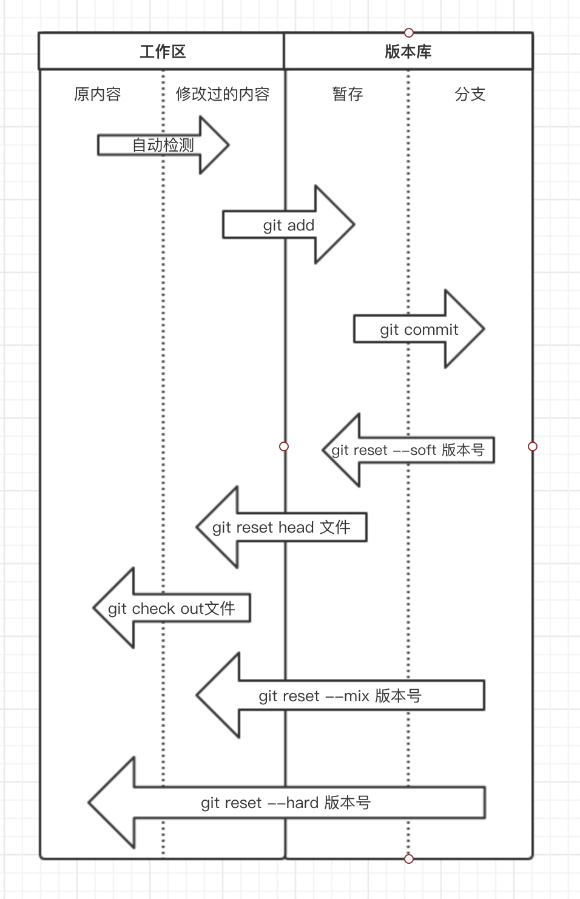
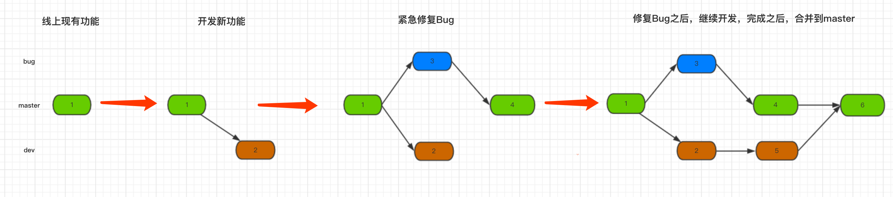

# GIT

[toc]

### 概述

#### 1.git特点
* 利用COW(写时复制技术)

#### 2.流程
```plantuml
database a [
工作区
]
database b [
暂存区
]
database c[
版本仓库（本地仓库）
]
database d[
远程仓库
]
a-->b:"git add"
b-->c:"git commit"
c-->d:"git push"
```


#### 3.引用——Refs（references）

##### （1）概念
* 引用是一类文件，用于保存commit的哈希值

##### （2）`.git/refs/`目录
* `heads/`目录
描述了所有本地的分支（在该目录下，**文件名**就是**本地分支名**）
* `remotes/`目录
描述了所有远程的分支（在该目录下，**目录名**就是**远程仓库名**，在目录中，**文件名**就是**远程分支名**）
* `tags/`目录
描述所有的标签（在该目录下，**文件名**就是**标签名**）

##### （3）完整的分支名
* 本地分支：`refs/heads/<LOCAL_BRANCH>`
简写：`<LOCAL_BRANCH>`
* 远程分支：`refs/remotes/<REMOTE_REPO_NAME>/<REMOTE_BRANCH>`
简写：`<REMOTE_BRANCH>`

***

### 配置

#### 1.配置文件（优先级由小到大）
* 系统级别（system）：一般在系统配置文件目录下
* 当前用户级别（global）：`~/.gitconfig`
* 当前项目级别（local）：`<REPO>/.git/config`

#### 2.查看配置
* 查看所有配置：`git config --list`
* 查看系统级别的配置：`git config --system --list`
* 查看全局配置：`git config --global --list`
* 查看当前仓库的配置：`git config --local --list`

#### 3.配置主要内容
```shell
#核心配置
[core]

#远程仓库配置
#这个名字不是远程仓库的名字，而是一个别名，代表了远程仓库的url等信息
#fetch中存放本地仓库和远程仓库的映射关系（因为可能存在多个远程仓库，其中一个远程仓库是和本地仓库一样的，另一个远程仓库内容比较旧，所以需要存放这些映射关系，才能清楚的知道远程仓库的情况）
#+表示强制更新
[remote "<REMOTE_REPO_NAME>"]
    url = <REMOTE_REPO_URL>
    fetch = +refs/heads/*:refs/remotes/<REMOTE_REPO_NAME>/*

#当处于<BRANCH>分支时，设置默认的远程仓库和远程分支，分支名要一样
[branch "<BRANCH>"]
    remote = <REMOTE_REPO_NAME>
    merge = refs/heads/<BRANCH>
```

***

### 命令

#### 1.基本操作
```shell
git remote add <REMOTE_REPO_NAME> <URL>       #添加一个远程仓库，起名为：<NAME>
git status                        #查看 工作区 文件状态，有哪些文件没有上传到暂存区
git add .                         #将变化的内容上传到暂存区
git commit -m '该版本的详细说明'   #将暂存区的内容上传到本地仓库   

#创建一个本地分支并同步远程的分支
git checkout -b <new-local-branch> origin/tieta-v2.2.0.0   
#查看本地分支详情
git branch -v    
#将当前分支，推送到远程某个分支
git push origin tieta-v2.2.0.0-lil
```

##### （1）将本地仓库的`<LOCAL_BRANCH>`分支 提交到名为`<REMOTE_REPO_NAME>`的远程仓库的`<REMOTE_BRANCH>`分支
```shell
git push <REMOTE_REPO_NAME> <LOCAL_BRANCH>:<REMOTE_BRANCH>
#如果远程不存在<REMOTE_BRANCH>分支，会自动创建一个临时分支，当merge之后这个分支就会消失
```

##### （2）设置默认的远程仓库和远程分支（即执行git push时，不需要指定远程仓库和远程分支）
* 如果当前没有处于相应的分支，则git push时会给出提示，需要明确指定远程仓库和分支
```shell
git push -u origin master
```

##### （3）省略本地分支名，则表示删除指定的远程分支
```shell
git push <REMOTE_REPO_NAME> :<REMOTE_BRANCH>
```

#### 2.回滚操作

##### （1）查看commit记录
```shell
git logs                  #查看该版本即之前的版本
git reflog                #查看所有的版本

#撤销某个提交
git revert <id>
git push
```

##### （2）回滚到指定commit
```shell
git reset --soft xx       #回滚到指定版本，但是当前的工作空间的内容不变
                          #用于代码在code review阶段被打回时进行的操作
git reset --hard xx       #回滚到指定版本，当前的工作空间的内容也会回滚

#回滚本地仓库后，如果需要回滚远程仓库：
#注意：master分支必须解除保护，不然无法push
git push -f origin master
```

##### （3）利用revertc回滚（建议）
这种方式相当于会多一个commit记录

* 撤销单个commit

```shell
git revert <commit_id>
```

* 撤销多个commit

```shell
git revert --no-commit <commit_id_1>
git revert --no-commit <commit_id_2>
git revert --no-commit <commit_id_3>
git commit -m "the commit message for all of them"
```

#### 3.git stash（将修改的内容暂存起来，而不是提交到暂存区，不常用这种方式，而是用branch方式）
* 存储在某个地方（不是暂存区）
* 不受版本控制（git add、commit等）的影响
```shell
git stash                #将改变的内容暂时存放起来
#中间可以做一些修改，然后add，然后commit
git stash pop            #将第一个暂存的记录恢复到工作区


git stash list           #查看有哪些暂存的内容
git stash apply 标号     #将指定的暂存记录恢复到工作区
git stash clear
git stash drop 标号
```

#### 4.分支操作
* 开发新功能和修改bug需要创建新的分支
* 一般不准直接在master分支上修改内容
* 合并是将**创建分支后**变化的部分合并过来，而不是将整个分支合并过来


```shell
git branch -a           #查看所有分支（包括本地分支和远程分支）
git branch xx           #创建xx分支，拥有和 当前分支 一样的内容
git branch -d xx        #删除xx分支

git checkout xx         #切换到xx分支
git merge xx            #当xx分支合并到 当前分支
```

#### 5.版本控制（打标签操作）
```shell
#在当前位置打标签
git tag -a <TAG> -m <msg>

#推送所有标签（并没有推送到master，此时master不是最新标签）
git push --tags

#将最新的内容推送到master
git push

#切换到指定标签
git checkout  <TAG>
```

#### 6.迁移操作（从一个库迁移到另一个库）

##### （1）首先拉取需要迁移的库
```shell
git clone <repository_url>
cd <repository>
```

##### （2）添加需要迁移到的库
```shell
git remote add <new_name> <new_repository_url>
```

##### （3）pull其他分支
```shell
git checkout -b <branch_name> origin/<branch_name>
```

##### （4）push指定分支到新的库
```shell
#这里的<branch_name>需要是已经pull的分支，参考上一步骤
git push <new_name> <branch_name>:<branch_name>
```
