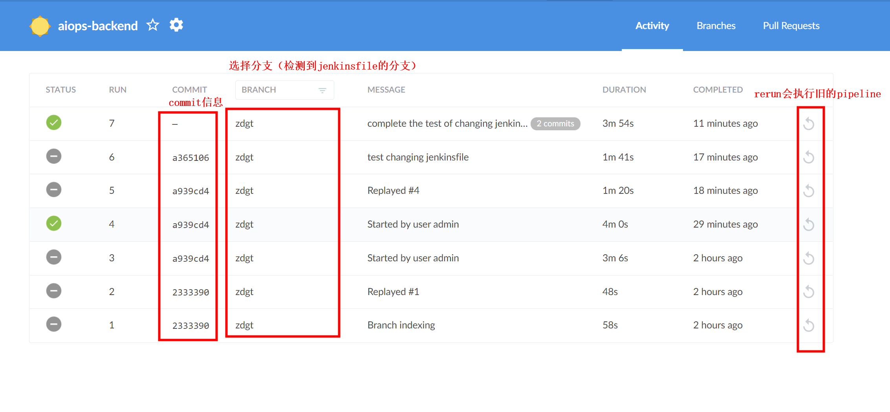
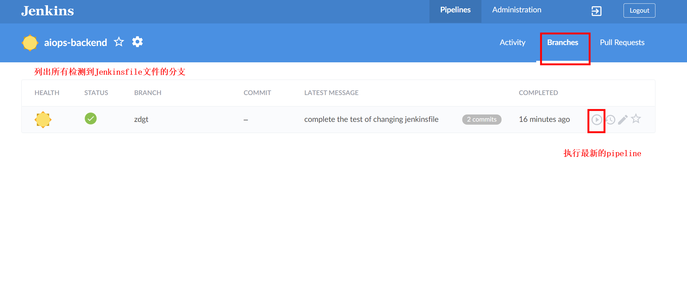

# blue ocean

[toc]

### 概述

#### 1.blue ocean
用于执行通过scm（source code manager）管理的pipeline

#### 2.使用说明

* 会自动检测 **各个分支** 下的 **Jenkinsfile** 文件
* 当Jenkinsfile发生变化
  * 可以执行新的Jenkinsfile（新的会列出跟上一次执行的变化）
  * 也可以执行旧的Jenkinsfile

