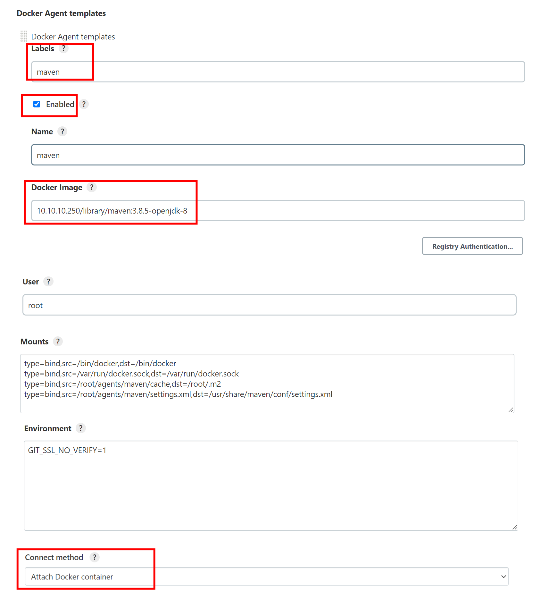
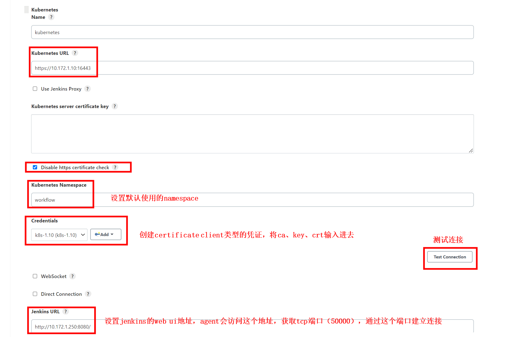
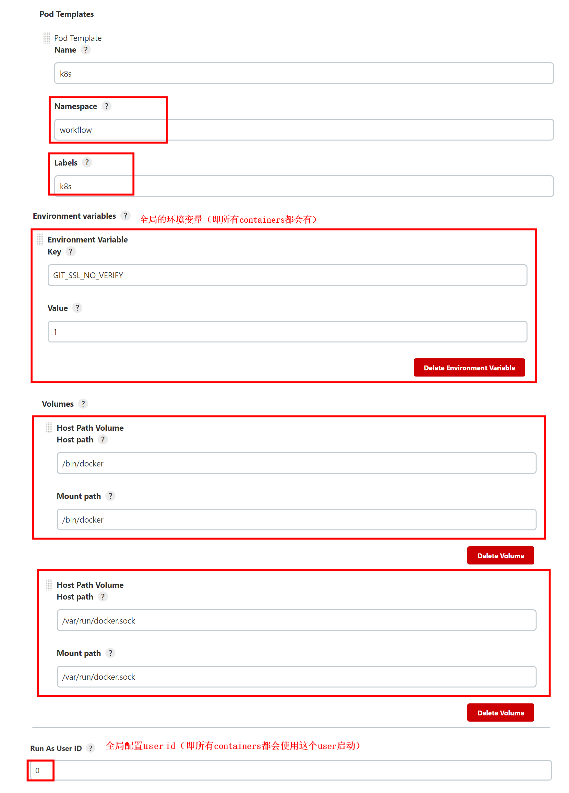
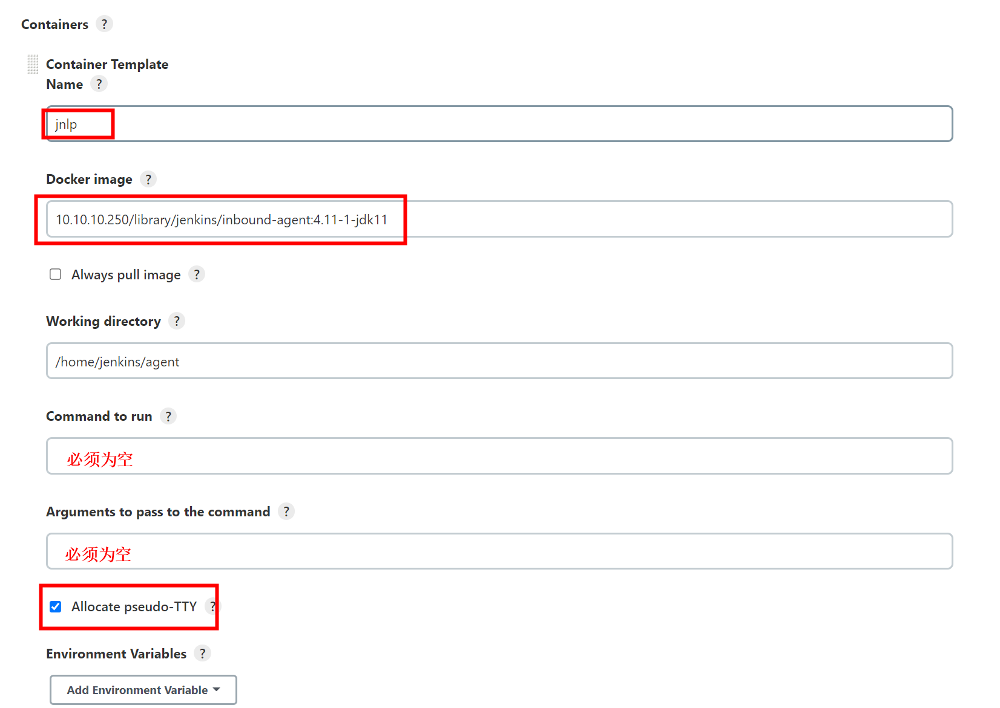
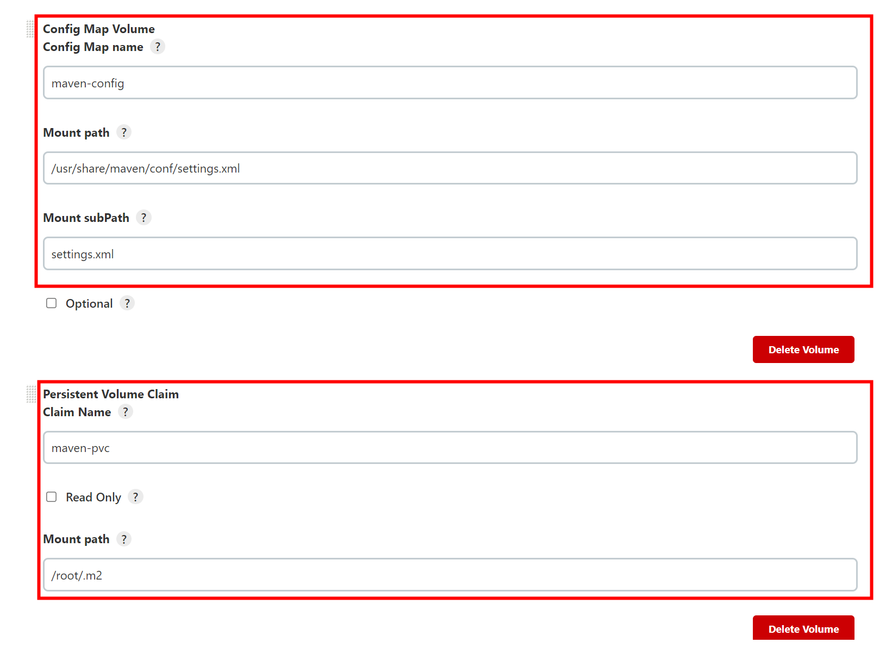
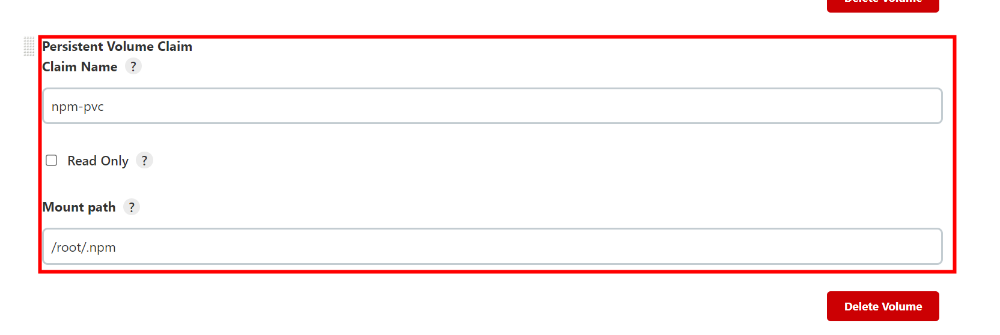
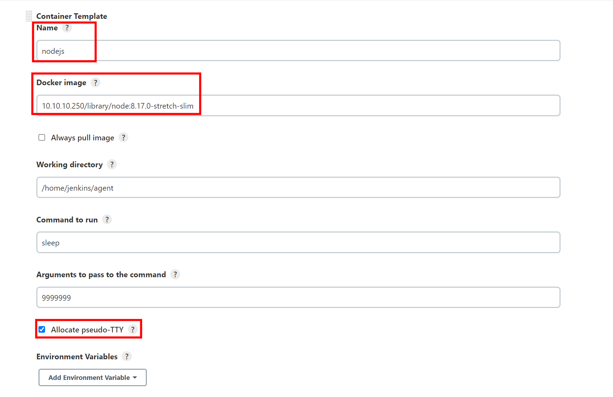

# usage

<!-- @import "[TOC]" {cmd="toc" depthFrom=1 depthTo=6 orderedList=false} -->
<!-- code_chunk_output -->

- [usage](#usage)
    - [安装jenkins](#安装jenkins)
      - [1.docker方式安装](#1docker方式安装)
      - [2.端口说明](#2端口说明)
    - [使用jenkins agent](#使用jenkins-agent)
      - [1.controller 与 agent的三种连接方式](#1controller-与-agent的三种连接方式)
      - [2.常用镜像](#2常用镜像)
        - [（1）通用配置（即每个镜像都需要配置）](#1通用配置即每个镜像都需要配置)
        - [（2）镜像列表](#2镜像列表)
      - [3.传统的静态agent](#3传统的静态agent)
      - [4.基于docker的动态agent](#4基于docker的动态agent)
        - [（1）demo: 基于docker配置maven agent](#1demo-基于docker配置maven-agent)
      - [5.基于k8s的动态agent（建议）](#5基于k8s的动态agent建议)
        - [（1）基于k8s配置agent（即pod模板）](#1基于k8s配置agent即pod模板)
        - [（2）添加maven容器](#2添加maven容器)
        - [（3）添加nodejs容器](#3添加nodejs容器)
        - [（4）在pipeline中使用k8s agent](#4在pipeline中使用k8s-agent)
        - [（5）pod template yaml](#5pod-template-yaml)
      - [6.debug动态agent](#6debug动态agent)

<!-- /code_chunk_output -->

### 安装jenkins

#### 1.docker方式安装
```shell
mkdir /root/jenkins-data
mkdir /root/jenkins-docker-certs
chown -R 1000 /root/jenkins-data
chown -R 1000 /root/jenkins-docker-certs

docker run --name jenkins --restart always -p 8080:8080 -p 50000:50000 -itd -v /root/jenkins-data:/var/jenkins_home -v /root/jenkins-docker-certs:/certs/client:ro -v /bin/docker:/bin/docker -v /var/run/docker.sock:/var/run/docker.sock --group-add <docker_group_id> 10.10.10.250/library/jenkins/jenkins:2.332.2-jdk11
```

#### 2.端口说明

|port|description|
|-|-|
|8080|web ui|
|50000|用于agent连接该controller（可以在Configure Global Security中修改|

***

### 使用jenkins agent

agent用于执行controller下发的任务，安装好jenkins后，默认有一个build-in agent（即本地的agent）

#### 1.controller 与 agent的三种连接方式

|连接方式|对环境的要求|
|-|-|
|ssh|安装了sshd和java|
|JNLP（java network launch protocol）|安装了java、启动了agent.jar|
|attach（只是用docker）|安装了java|

#### 2.常用镜像

##### （1）通用配置（即每个镜像都需要配置）

* 能够使用docker:
  * `-v /bin/docker:/bin/docker`
  * `-v /var/run/docker.sock:/var/run/docker.sock`
  * `-u root`
* git支持unauthorized ca:
  * `-e GIT_SSL_NO_VERIFY=1`

##### （2）镜像列表
|agent image|description|extra args|env|
|-|-|-|-|
|`jenkins/inbound-agent:4.11-1-jdk11`|jenkins agent基础镜像（包含java、git环境）|||
|`maven:3.8.5-openjdk-8`|提供maven|`-v /root/agents/maven/cache:/root/.m2 -v /root/agents/maven/settings.xml:/usr/share/maven/conf/settings.xml`||
|`node:8.17.0-stretch-slim`|提供nodejs和npm|`-v /root/.npm:/root/.npm`|


#### 3.传统的静态agent
agent需要一直运行着，并与controller建立连接

#### 4.基于docker的动态agent

需要创建agent（即container）模板，当指定用该agent执行任务时，会自动创建agent（即container），并与controller建立连接，当任务执行完成会自动删除该agent

##### （1）demo: 基于docker配置maven agent
注意-v源目录是docker所在机器得目录，所以即使jenkins是运行在容器内，-v源目录也是宿主机的目录

* 在docker所在机器上创建相关目录和文件
```shell
mkdir -p /root/agents/maven/cache
```
* 准备好配置文件：`/root/agents/maven/settings.xml`

* 配置maven agent
```shell
#docker host uri:
unix:///var/run/docker.sock

#image:
10.10.10.250/library/maven:3.8.5-openjdk-8

#voluems:
type=bind,src=/bin/docker,dst=/bin/docker
type=bind,src=/var/run/docker.sock,dst=/var/run/docker.sock
type=bind,src=/root/agents/maven/cache,dst=/root/.m2
type=bind,src=/root/agents/maven/settings.xml,dst=/usr/share/maven/conf/settings.xml

#env:
GIT_SSL_NO_VERIFY=1
```



#### 5.基于k8s的动态agent（建议）

需要创建agent（即pod）模板，当指定用该agent执行任务时，会自动创建agent（即pod），并与controller建立连接，当任务执行完成会自动删除该agent
* pod中可以创建多个container
  * 默认会有一个jnlp的container，即不需要在模板中添加
    * 如果需要覆盖相关配置，需要明确在模板中添加，覆盖相关配置（不需要覆盖的地方填空就行了）
    * 一般只需要覆盖镜像地址，所以只需要填写container的name和image这两个选项，其他都不填（注意其他最好置空，不然容易出现问题）
* pod通过创建empry volume，所有container都将该volume挂载到自己的workdir下，实现了数据共享
* 使用注意：
  * 不要设置customWorkspace，或者用相对路径，因为pod间的目录共享一个指定目录，如果在这里指定了其他目录，数据就不能共享
  * 所用容器使用相同的usr id，不然容易出问题，所以都设置成root用户
  * pvc最好使用RWX模式（有些sc不支持，比如：ceph rbd），否则不能启动多个任务

##### （1）基于k8s配置agent（即pod模板）

* 创建ns
```shell
kubectl create ns workflow
```

* 配置jenkins 连接k8s


* 配置pod template（即一些通用配置）
```shell
#env:
GIT_SSL_NO_VERIFY=1
#volume（hostPath）:
/bin/docker:/bin/docker
/var/run/docker.sock:/var/run/docker.sock
```



* 配置默认容器（jnlp）



##### （2）添加maven容器

* 创建maven用于缓存的pvc
```shell
vim maven-pvc.yaml
```
```yaml
kind: PersistentVolumeClaim
apiVersion: v1
metadata:
  name: maven-pvc
spec:
  accessModes:
  - ReadWriteMany
  resources:
    requests:
      storage: 10Gi
```
```shell
kubectl apply -f maven-pvc.yaml -n workflow
#查看pvc状态：kubectl get pvc -n workflow
```

* 创建maven的配置文件configmap
  * 准备好settings.xml文件
```xml
<!-- 添加下面的配置 -->

<!-- 设置私库的账号密码 -->
<servers>
  <server>
    <id>maven-public</id>
    <username>admin</username>
    <password>cangoal</password>
  </server>
  <server>
    <id>kangpaas-release</id>
    <username>admin</username>
    <password>cangoal</password>
  </server>
  <server>
    <id>kangpaas-snapshot</id>
    <username>admin</username>
    <password>cangoal</password>
  </server>
</servers>

<!-- 设置中央仓库的地址 -->
<mirrors>
  <mirror>
     <id>central</id>
     <mirrorOf>central</mirrorOf>
     <name>central</name>
     <url>http://maven.aliyun.com/nexus/content/groups/public</url>
  </mirror>
</mirrors>

<!-- 注释下面内容，否则不能使用http协议连接私库 -->
<!--<mirror>
  <id>maven-default-http-blocker</id>
  <mirrorOf>external:http:*</mirrorOf>
  <name>Pseudo repository to mirror external repositories initially using HTTP.</name>
  <url>http://0.0.0.0/</url>
  <blocked>true</blocked>
</mirror>-->
```

```shell
kubectl create configmap maven-config --from-file=settings.xml=<path> -n workflow
```

* 配置jenkins pod template添加maven容器
```shell
#volume（configmap）：
name: maven-config
subPath: settings.xml
mountPath: /usr/share/maven/conf/settings.xml

#volume（pvc）:
name: maven-pvc
mountPath: /root/.m2
```



##### （3）添加nodejs容器
* 创建npm用于缓存的pvc
```shell
vim npm-pvc.yaml
```
```yaml
kind: PersistentVolumeClaim
apiVersion: v1
metadata:
  name: npm-pvc
spec:
  accessModes:
  - ReadWriteMany
  resources:
    requests:
      storage: 10Gi
```
```shell
kubectl apply -f npm-pvc.yaml -n workflow
#查看pvc状态：kubectl get pvc -n workflow
```

* 配置jenkins pod template添加nodejs容器
```shell
#volume（pvc）:
name: npm-pvc
mountPath: /root/.npm
```



##### （4）在pipeline中使用k8s agent

* 如果不指定容器，默认使用jnlp这个容器执行任务
```groovy
steps {
  //如果不指定容器，默认使用jnlp这个容器执行任务
  sh('''#!/bin/bash
    echo "aaaa"
  ''')

  //指定在nodejs这个容器中运行下面的任务
  container('nodejs') {
    sh('''#!/bin/bash
      echo "bbbb"
    ''')
  }
}
```

##### （5）pod template yaml
```yaml
apiVersion: "v1"
kind: "Pod"
metadata:
  labels:
    jenkins/jenkins-jenkins-agent: "true"
    jenkins/label-digest: "3d6d160fd0a1df9cbbb676fe328305ef80807d1e"
    jenkins/label: "k8s"
  name: "default-c4qgh"
  namespace: "devops"
spec:
  containers:
  - args:
    - "9999999"
    command:
    - "sleep"
    env:
    - name: "GIT_SSL_NO_VERIFY"
      value: "1"
    image: "10.10.10.250/library/maven:3.8.5-openjdk-8"
    imagePullPolicy: "IfNotPresent"
    name: "maven"
    resources: {}
    tty: true
    volumeMounts:
    - mountPath: "/root/.npm"
      name: "volume-4"
      readOnly: false
    - mountPath: "/usr/share/maven/conf/settings.xml"
      name: "volume-2"
      readOnly: false
      subPath: "settings.xml"
    - mountPath: "/bin/docker"
      name: "volume-0"
      readOnly: false
    - mountPath: "/root/.m2"
      name: "volume-3"
      readOnly: false
    - mountPath: "/var/run/docker.sock"
      name: "volume-1"
      readOnly: false
    - mountPath: "/home/jenkins/agent"
      name: "workspace-volume"
      readOnly: false
    workingDir: "/home/jenkins/agent"
  - env:
    - name: "JENKINS_SECRET"
      value: "********"
    - name: "JENKINS_TUNNEL"
      value: "jenkins-agent.devops.svc.cluster.local:50000"
    - name: "GIT_SSL_NO_VERIFY"
      value: "1"
    - name: "JENKINS_AGENT_NAME"
      value: "default-c4qgh"
    - name: "JENKINS_NAME"
      value: "default-c4qgh"
    - name: "JENKINS_AGENT_WORKDIR"
      value: "/home/jenkins/agent"
    - name: "JENKINS_URL"
      value: "http://jenkins.devops.svc.cluster.local:8080/jenkins"
    image: "10.10.10.250/library/jenkins/inbound-agent:4.11.2-4"
    imagePullPolicy: "IfNotPresent"
    name: "jnlp"
    resources:
      limits:
        memory: "512Mi"
        cpu: "512m"
      requests:
        memory: "512Mi"
        cpu: "512m"
    tty: true
    volumeMounts:
    - mountPath: "/root/.npm"
      name: "volume-4"
      readOnly: false
    - mountPath: "/usr/share/maven/conf/settings.xml"
      name: "volume-2"
      readOnly: false
      subPath: "settings.xml"
    - mountPath: "/bin/docker"
      name: "volume-0"
      readOnly: false
    - mountPath: "/root/.m2"
      name: "volume-3"
      readOnly: false
    - mountPath: "/var/run/docker.sock"
      name: "volume-1"
      readOnly: false
    - mountPath: "/home/jenkins/agent"
      name: "workspace-volume"
      readOnly: false
    workingDir: "/home/jenkins/agent"
  - args:
    - "9999999"
    command:
    - "sleep"
    env:
    - name: "GIT_SSL_NO_VERIFY"
      value: "1"
    image: "10.10.10.250/library/node:8.17.0-stretch-slim"
    imagePullPolicy: "IfNotPresent"
    name: "nodejs"
    resources: {}
    tty: true
    volumeMounts:
    - mountPath: "/root/.npm"
      name: "volume-4"
      readOnly: false
    - mountPath: "/usr/share/maven/conf/settings.xml"
      name: "volume-2"
      readOnly: false
      subPath: "settings.xml"
    - mountPath: "/bin/docker"
      name: "volume-0"
      readOnly: false
    - mountPath: "/root/.m2"
      name: "volume-3"
      readOnly: false
    - mountPath: "/var/run/docker.sock"
      name: "volume-1"
      readOnly: false
    - mountPath: "/home/jenkins/agent"
      name: "workspace-volume"
      readOnly: false
    workingDir: "/home/jenkins/agent"
  hostNetwork: false
  nodeSelector:
    kubernetes.io/os: "linux"
  restartPolicy: "Never"
  securityContext:
    runAsUser: 0
  serviceAccountName: "default"
  volumes:
  - hostPath:
      path: "/bin/docker"
    name: "volume-0"
  - configMap:
      name: "maven-config"
      optional: false
    name: "volume-2"
  - hostPath:
      path: "/var/run/docker.sock"
    name: "volume-1"
  - emptyDir:
      medium: ""
    name: "workspace-volume"
  - name: "volume-4"
    persistentVolumeClaim:
      claimName: "npm-pvc"
      readOnly: false
  - name: "volume-3"
    persistentVolumeClaim:
      claimName: "maven-pvc"
      readOnly: false
```

#### 6.debug动态agent
可以将动态agent设置为不删除，这样就可以查看日志，从而定位问题
