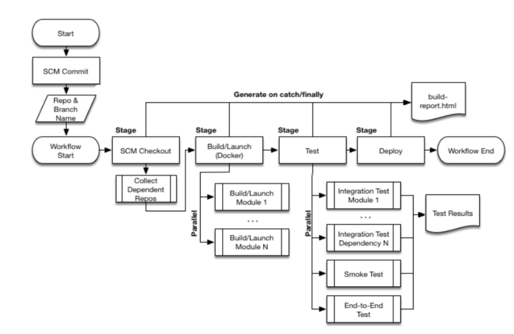

# pipeline

[toc]

### 概述

#### 1.pipeline
是一系列任务的集合，将任务 **代码化**，用于 **CD（continuous delivery）** 通过 **Jenkinsfile** 文件定义

##### （1）两种语法：declarative 和 scripted
||decalrative（建议）|scripted|
|-|-|-|
|可读性|较高|较复杂|

#### 2.常用的CD场景


#### 3.使用建议
* Think of Pipeline as a tool to accomplish a build rather than the core of a build
pipeline中的基础语句主要作用是连接各个actions，不要过度使用，尽量使用一个sh完成多步操作

***

### 语法

[参考](https://www.jenkins.io/doc/book/pipeline/syntax/)

#### 1.基本格式

* 基础语法

```groovy
//括号可以省略或者用空格替换，但是如果后面是一个文件块（{...}），不能省略
//所以建议括号都不要省略
<directive>(<arg1>: <value1>, <arg2>:<value2>)

//当只有一个参数时，参数名可以省略
<directive>(<value>)
```

|key|description|
|-|-|
|agent|能够执行任务的agent（通常是一个计算单元，比如节点、容器等）|
|stages|一个stage是一个任务子集（即包含多个steps）|
|steps|执行的最小单元|
|options|设置一些基础配置（比如超时时间等）|
|environment|设置环境变量，作用于全局或者某个stage（不仅能在pipeline中引用，还能在系统中引用该变量）|
|parameters|设置参数，用户执行pipeline时需要设置参数值（如果不设置，则用默认的）|
|when|设置执行的条件|
|parallel|设置并行执行|
|matrix|也可以并行（较复杂，通过设置参数，参数的组合决定了并行数，所以每个并行，参数值也不相同）|
|script|可以插入Scripted Pipeline，比较符合编程语言，有些地方使用比较方便|

* 基础结构
```groovy
pipeline {
    agent(any)             //选择执行的节点，这里表示可以在任何节点上
    options {
      timeout(time: 10, unit: 'MINUTES')  //如果该pipeline 10min还没执行完，则超时
      timestamps()    //控制台输出会加上时间
    }
    stages {              
        stage('Build') {  //定义Build stage
            steps {       
                //执行一些steps
            }
        }
        stage('Test') {
            steps {
                //执行一些steps
            }
        }
        stage('Deploy') {
            steps {
                //执行一些steps
            }
        }
    }
}
```

##### （1）指定具体的计算单元：agent
```groovy
//必须有一个全局的agent，也可以放在某个具体的stage中指定使用的agent
agent(<value>)
```
指定agent：

* any: `agent(any)`
* none: `agent(none)`
  * 一般全局的这样设置，表示不指定默认的agent
* label: `agent {label '<label1> &&  <label2>'}`
  * agent的名称也属于label
* node: `agent { node { label '<label1>' }  }`
* 不建议：
  * docker（需要agent存在docker命令）
  * dockerfile
  * kubernetes（需要配置好k8s cloud）
  ```groovy
  agent {
    kubernetes {
        defaultContainer 'kaniko'
        yaml '''
  kind: Pod
  spec:
    containers:
    - name: kaniko
      image: gcr.io/kaniko-project/executor:debug
      imagePullPolicy: Always
      command:
      - sleep
      args:
      - 99d
      volumeMounts:
        - name: aws-secret
          mountPath: /root/.aws/
        - name: docker-registry-config
          mountPath: /kaniko/.docker
    volumes:
      - name: aws-secret
        secret:
          secretName: aws-secret
      - name: docker-registry-config
        configMap:
          name: docker-registry-config
  '''
     }
  }
  ```
* 建议：使用cloud-based agent，即创建好agent template，然后指定该agent，即可实现动态agent

通用选项

```groovy
agent {
    node {
        label('<label>')   //用于匹配agent
        customWorkspace('<path>')  //指定工作目录（绝对或相对路径），不指定使用默认的
    }
}
```

##### （2）根据执行结果执行相应任务：post
根据post所在的位置，决定当整个pipeline 或 某个stage 执行完，执行一些额外的任务
* 可以根据执行的结果（`<condition>`），决定是否执行，常用condition:
  * always  总是执行
  * changed 当这次执行结果与上次不同
  * fixed  当这次执行结果成功，上次执行结果failed或者unstable
```groovy
pipeline {
    ...
    //当整个pipeline执行完，执行下面的任务
    post {
        <condition> {
            echo('I will always say Hello again!')
        }
    }
}
```

##### （3）指定基础配置: options

* 全局的options
* stage中的options

##### （4）设置环境变量

* 设置环境变量（全局或stage）
```groovy
pipeline {
  agent any

  environment {
      v2="dsdssd"
  }

  stages {
    stage('Stage 1') {

        steps {

            //使用变量的三种方式
            echo("$v2")
            echo(v2)
            echo(env.v2)
        }
    }
  }
}
```

* 设置动态环境变量
```groovy
pipeline {
    agent any
    environment {
        // Using returnStdout
        CC = """${sh(
                returnStdout: true,
                script: 'echo "clang"'
            )}"""
        // Using returnStatus
        EXIT_STATUS = """${sh(
                returnStatus: true,
                script: 'exit 1'
            )}"""
    }
    stages {
        stage('Example') {
            environment {
                DEBUG_FLAGS = '-g'
            }
            steps {
                sh 'printenv'
            }
        }
    }
}

//输出结果：
//  ...
//  CC=clang
//  EXIT_STATUS=1
//  DEBUG_FLAGS=-g
```

##### （5）设置参数
```groovy
pipeline {
    agent any
    parameters {

        //定义参数Greeing，默认值为：'Hello'
        string(name: 'Greeting', defaultValue: 'Hello', description: 'How should I greet the world?')
    }
    stages {
        stage('Example') {
            steps {

                //使用参数
                echo "${params.Greeting} World!"
            }
        }
    }
}
```

#### 2.steps常用语句

[全部语法](https://www.jenkins.io/doc/pipeline/steps/)

##### （1）基础语句
[参考](https://www.jenkins.io/doc/pipeline/steps/workflow-basic-steps/)

```groovy
steps {

  echo('hello world')

  sleep(time: 1, unit: 'SECONDS')

  //切换目录执行部分steps（如果没有该目录会自动创建）
  dir('<path>') {
    echo("hello work")
  }

  //判断文件是否存在
  script {
    if (fileExists('src/main/rersources/index.html') {
        echo("File src/main/rersources/index.html found!")
    }
  }
}
```

##### （2）执行shell命令: `sh`
通过`set -e`：只要某个命令执行失败，脚本就会以失败退出（不加这个的话，即使命令失败，脚本还是往下执行，jenkins上显示也是执行成功）
```groovy
steps {
    sh('''#!/bin/bash
        set -e  
        echo 'Hello world!'
        ls /tmp/
    ''')
}
```

##### （3）使用script语法
可以实现判断，定义变量等

```groovy
steps {
  script {
    def v1="aaa"
    echo "$v1"
    if (v1=="aaa") {
      echo "yes"
    }
    else {
      echo "no"
    }
  }
}
```

##### （4）同一个pipeline、同一次run中 不同agent数据共享：stash
```groovy
stages {
    stage('Stage 1') {

        agent {
            node {
                label('busybox')
                customWorkspace('/home/test')
            }
        }

        steps {
            dir(path: 'new') {
                sh('''#!/bin/bash
                    echo 'hello world' > a.txt
                ''')
            }

            //将工作目录下的文件（包含所有子目录下的文件）都暂存到data
            //如果要暂存指定的目录，比如：stash(name: 'data', includes: 'dir1/**')
            stash(name: 'data', includes: '**')

        }
    }

    stage('Stage 2') {

        agent {
            node {
                label('maven')
                customWorkspace('/home/lil')
            }
        }

        steps {
            //恢复data中的文件到当前工作目录
            unstash(name: 'data')

            sh('''#!/bin/bash
                cat new/a.txt
            ''')
        }
    }
}
```

##### （5）不同pipeline、不同run共享文件: archiveArifacts和copyArtifacts

* 首先保存arifacts: archiveArifacts
  * project: test-3
```groovy
//保存在controller上的<workspace>/下
stages {
    stage('Stage 1') {

        steps {
            dir(path: 'new') {
                sh('''#!/bin/bash
                    echo 'hello world' > a.txt
                ''')
            }

            archiveArtifacts(artifacts: '**')
        }
    }
}
```

* 其它pipeline获取arifacts: copyArtifacts
  * 需要安装copyArtifacts插件
```groovy
stages {
    stage('Stage 1') {
        steps {
            copyArtifacts(projectName: 'test-3', filter: '**', target: 'new-1')
            sh('''#!/bin/bash
                ls
                cat new-1/new/a.txt
            ''')
        }
    }
}
```

##### （6）git

```groovy
steps {
  //拉取代码到当前目录（即.git在当前目录）
  git(url:'<url>', branch:'<branch>')
  //或：checkout($class: 'GitSCM', url:'<url>', branch:'<branch>')
}
```
