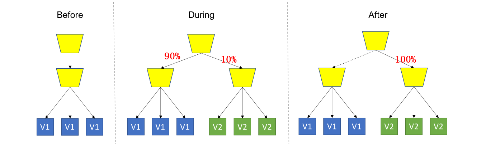

# overview

<!-- @import "[TOC]" {cmd="toc" depthFrom=1 depthTo=6 orderedList=false} -->
<!-- code_chunk_output -->

- [overview](#overview)
    - [概述](#概述)
      - [1.部署策略](#1部署策略)
        - [（1）滚动部署（rolling deployment）](#1滚动部署rolling-deployment)
        - [（2）蓝绿部署（blue-green deployment）](#2蓝绿部署blue-green-deployment)
        - [（3）金丝雀发布（灰度发布）](#3金丝雀发布灰度发布)
        - [（4）A/B Testing](#4ab-testing)

<!-- /code_chunk_output -->

### 概述

#### 1.部署策略

##### （1）滚动部署（rolling deployment）

##### （2）蓝绿部署（blue-green deployment）

* 有两套环境，一套旧版的，一套新版的，测试没问题后，将流量切换过来

##### （3）金丝雀发布（灰度发布）

##### （4）A/B Testing
与金丝雀发布比较像，只不过目的不一样
* A/B Testing是为了让一部分用户使用新版本，然后给出反馈
* 金丝雀让一部分用户使用新版本，是防止新版本有问题导致所有用户不可用
