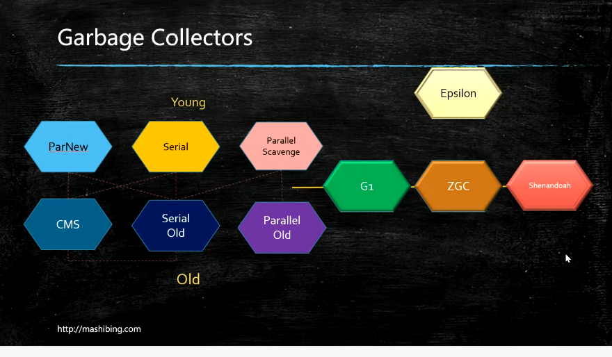
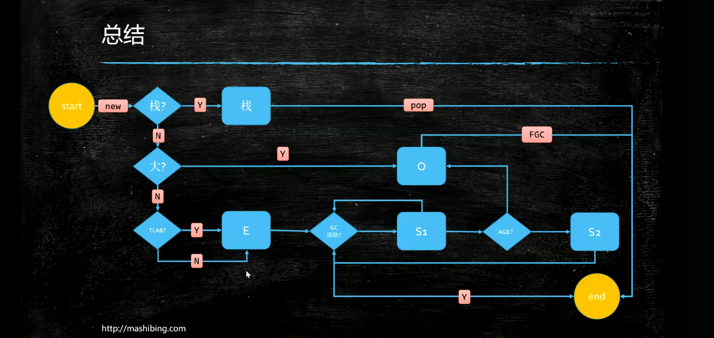

# JVM
[toc]

### 概述
#### 1.相关术语
* jvm：java virtual machine          
功能：内存管理
</br>
* jre：java runtime environment      
运行一定需要jre，包含jvm
</br>
* jdk：java development kit          
提供编译工具，监控jvm的工具，包含jre
</br>
* java特点
write once run everywhere,需要有jvm的支持
</br>
* GC：garbage collection
垃圾回收，用于回收JVM中的内存
c和c++需要手动回收内存，jvm会自动回收

##### 2.垃圾的定义
从main中的根对象出发，一直遍历下去，没有被引用的对象就是垃圾

下图中，g、h和i都是垃圾
```plantuml
frame main{
  circle a
  circle b
  circle c
}
circle d
circle e
circle f
circle g
circle h
circle i
a-->d
d-->e
c-->f
g-->h
h->i
i->g
```

#### 2.三种GC回收算法
##### （1）Mark-Sweep（标记清除）
标记出哪些是垃圾，然后清除
缺点：存在碎片问题
##### （2）Copying（拷贝）
将物理内存一分为2，只用一半内存，清理时，将所有非垃圾对象移动到其中一半，然后清除另一个
特点：效率高，但是浪费空间
##### （3）Mark-compact（压缩标记）
标记出哪些是垃圾，将非垃圾对象移动到一起，清除垃圾
特点：效率低

#### 3.十种垃圾回收器（garbage collector）


#### 4.分代模型（新生代和老年代）


* 会将内存在物理和逻辑上进行分区
新生代区：eden s0 s1
老年代区：old（空间较大）

#### 5.回收过程
* 刚刚生成的对象，会存放eden区
eden满了会进行垃圾回收，eden区大部分对象都会被回收
* 没有被回收的对象进入s0
* 当再次进行垃圾回收，eden和s0没有被回收的对象进入s1，然后清空eden和s0空间，这样效率高
* 当再次进行垃圾回收，eden和s1没有被回收的对象进入s0
* 上面的步骤重复进行
* 每回收一次，对象的年龄增加一岁，当达到指定岁数，该对象就会进入老年代区


#### 6.回收过程其他说明
* 每次进行垃圾回收时，都会STW（stop-the-world），即停止业务进程，只进行垃圾回收
