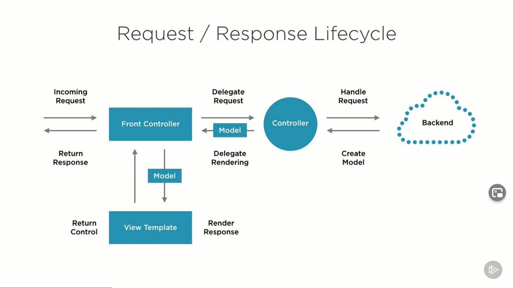

# spring MVC

[toc]

### 概述

#### 1.spring MVC
* M: model 模型层
  * 指工程中的JavaBean，用来处理数据
    * 实体类Bean: 专业存储数据的
    * 业务处理Bean: 指Service或Dao对象，处理业务逻辑和数据访问
* V: view 视图层
  * 指工程中的html或jsp，用来展示数据
* C：controller 控制层
  * 指工程中的servlet，用于接收和响应请求




***

### 使用

#### 1.基本使用

* 静态页面: `resources/static/index.html`
* 控制器: `com.example.controller.HelloController`
```java
@Controller
public class HelloController {

    @RequestMapping("/hello")
    //username会获取名为username的参数
    //当名称不一致时，可以使用: @RequestParam("username") String userName
    public String handleRequest(String username){
        System.out.println(username);
        return "index.html";    //会在相关路径下（包括resources/static/） 寻找名为index.html的这个文件
    }
}
```

##### （1）通过pojo获取参数（即通过实体类，即对象）
* 定义一个符合参数模型的polo对象: `polo/User.java`
```java
@Data
public class User {
    private String username;
    private String password;
}
```

* 控制器: `com.example.controller.HelloController`
```java
@Controller
public class HelloController {

    @RequestMapping("/hello")
    public String handleRequest(User user){
        System.out.println(user);
        return "index.html";
    }
}
```

* 访问：`http://127.0.0.1:8080/hello?username=liyi&password=123456`

#### 2.域共享数据

##### （1）请求域共享数据
  * 使用ModerlAndView
```java
@Controller
public class HelloController {

    @RequestMapping("/mav")
    public ModelAndView testMav() {
        ModelAndView mav = new ModelAndView();

        //通过model功能，共享数据
        mav.addObject("k1", "v1");

        //通过view功能，设置视图
        mav.setViewName("index.html");
        return mav;
    }
}
```

##### （2）会话域共享数据
```java
@RequestMapping("/session")
public String testSession(HttpSession httpSession) {
    httpSession.setAttribute("k1", "v1");
    return "index.html";
}
```

##### （3）应用域共享数据
```java
@RequestMapping("/application")
public String testApplication(HttpSession httpSession) {
    ServletContext servletContext = httpSession.getServletContext();
    servletContext.setAttribute("k1", "v1");
    return "index.html";
}
```
