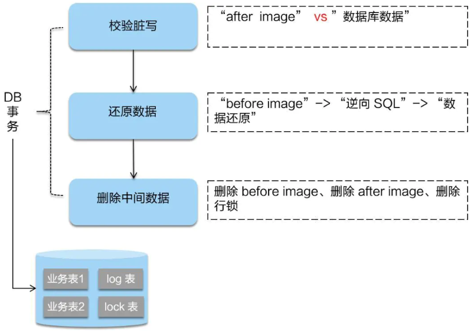

# seata

[toc]

### 概述

#### 1.seata
simple extensible autonomous transaction architecture，简单可扩展自治事务框架

#### 1.相关术语

|术语|说明||
|-|-|-|
|XID（transaction id）|全局唯一的事务id||
|TC（transaction coordinator）|事务协调器，维护全局事务的运行状态，负载协调并驱动全局事务的提交或回滚|就是seata服务器|
|TM（transaction manager）|事务管理器，控制全局事务|标注了`@GlobalTransactional`的方法|
|RM（resource  manager）|资源管理器，控制分支事务|简单理解，一个数据库就是一个RM|

#### 2.工作流程

* TM向TC申请开启了一个全局事务
  * 全局事务创建成功 并 生成一个XID
* XID在微服务调用链的上下文中传播
* RM向TC注册分支事务，TC将其纳入XID对应全局事务的管辖
* TM向TC发起 针对XID 的全局提交或回滚决议
* TC调度XID下管辖的全部 分支事务 完成提交或回滚请求

#### 3.工作原理

##### （1）第一阶段

* 拦截 并 解析 业务SQL
  * 找到 业务SQL 要更新的业务数据，在业务数据被更新前，将其保存成 before image
  * before image是为回滚（即恢复数据）
* 执行 业务SQL 更新业务数据
* 在业务数据更新之后，其保存成 after image
  * after image是为了回滚前的校验，检查数据是否被其他人修改了
* 最后生成行锁

##### （2）第二阶段（如果顺利提交）

* 将一阶段保存的快照数据和行锁删掉

##### （3）第二阶段（如果回滚）

* 数据校验
  * 校验脏写，对比 数据库当前业务数据 和 after image
  * 如果出现脏写就需要转人工处理
* 用 before image 还原业务数据
* 删除中间数据
