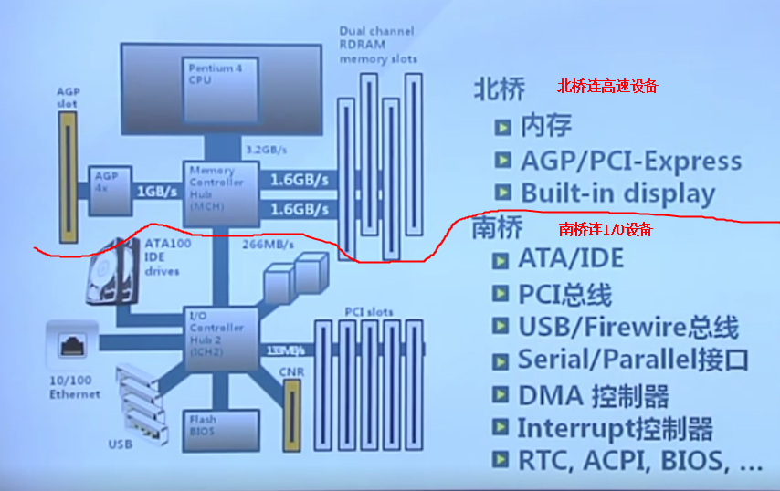
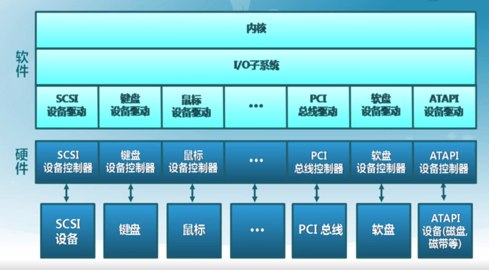

# IO子系统
### 基础概念
#### 1.三种常见设备接口类型
（1）字符设备
* 如：键盘、鼠标等
* 访问特征
以字节为单位顺序访问

（2）块设备
* 如：磁盘等
* 访问特征
以均匀的数据块为单位访问
* 访问方式
原始I/O
以文件系统接口访问
把磁盘映射到内存当中

（3）网络设备
* 如：以太网、无线等
* 访问特征
格式化报文交换

#### 2.硬件I/O结构

#### 3.内核I/O结构

#### 4.I/O地址
* cpu用来控制I/O硬件
* I/O地址是内存地址或端口号
