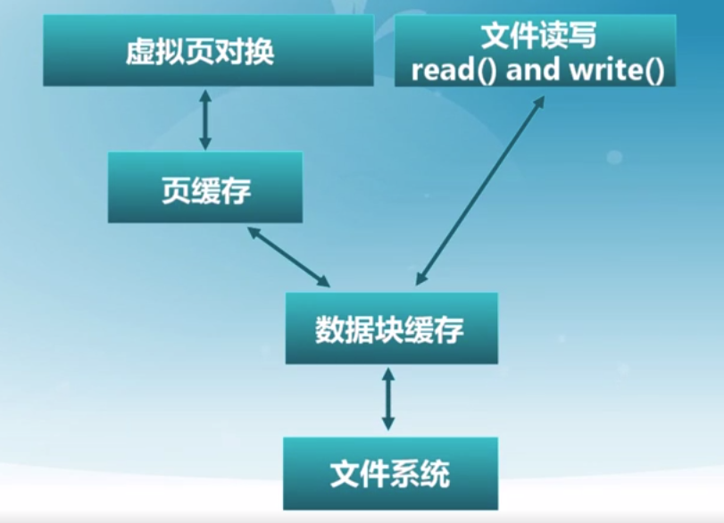
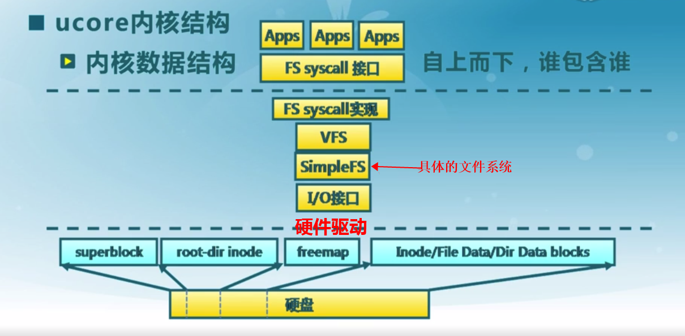

# 文件系统

[toc]

### 基本概念

#### 1.文件描述符
* 操作系统为**每个进程**维护一个**打开文件表**
* 整个系统维护一个**系统打开文件表**
* 文件描述符是打开文件的标识

#### 2.打开文件表维护的信息
* 文件指针
最近一次读写位置
* 文件打开计数
当前打开文件的次数（即多少进程打开了这个文件）
* 文件的磁盘位置
会将部分内容缓存到内存当中
* 访问权限

#### 3.数据块和扇区
数据块是逻辑存储单元
扇区是物理存储单元（一般为512 bytes）
多个扇区构成一个数据块

#### 4.文件系统中的基本操作单位是数据块

#### 5.虚拟文件系统（VFS）
对所有不同文件系统的抽象，为上层提供统一的接口
文件系统的抽象：
* 文件
* 目录项
* 索引节点
* 挂载点

#### 6.文件系统基本数据结构

#####（1）文件卷控制块（superblock）
* 每个文件系统一个
* 文件系统详细信息
* 块、块大小、空余块等

##### （2）文件控制块（inode，即索引节点）
* 每个**文件**一个（目录也是文件）
* 文件详细信息
* 访问权限、拥有者、大小、数据块等

##### （3）目录项（dentry：directory entry）

* 用来描述目录中文件层次结构（树形结构）
* 一个目录由多个目录项组成
* 指向文件控制块、父目录、子目录等
>举例：  

这里一共有三个目录项，分别是：
>>/ 和 foo
foo 和 bar
foo 和 bar2  

#### 7.文件数据块的两种缓存方式

#####（1）数据块缓存

##### （2）页缓存

将虚拟存储和数据块缓存结合，统一缓存数据块和内存页
因为虚拟存储会将部分页置换到外存即文件系统，所以这两者有密切的关系
* 将文件数据块映射成页，对文件的读写操作被转换成对内存的访问
* 在文件访问时，可能导致缺页或脏页
* 问题：需要协调用于页缓存的页面数

#### 8.UFS多级索引分配

#### 9.文件系统架构的demo

#### 10.几种特殊的文件系统类型

##### （1）`tmpfs`、`ramfs或/dev/ram*`
* `tmpfs`将数据放在虚拟内存中
  * 使用场景：
    * 1.`/dev/shm`，用于进程间通信的共享内存
    * 2.pod的临时存储（ephemeral storage）
* `ramfs或/dev/ram*`将数据放在物理内存中（不能swap）

##### （2）`/dev/loop*`
使普通文件可以作为块存储访问
  * 使用场景：
    * 挂载disk images
