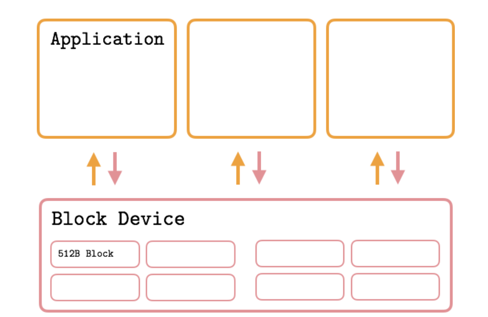

# disk

[toc]

### 概述

#### 1.基础概念

##### （1）sector: 块设备 的最小操作单元
* 一般为：512B

##### （2）block: 文件系统 的最小操作单元
* 为sector的整数倍，一般为：512B、1K、2K、4K

##### （3）page: 内存 的最小操作单元
* 为block的整数倍，一般为：4K

#### 2.I/O相关概念

[参考](./imgs/https://medium.com/databasss/on-disk-io-part-1-flavours-of-io-8e1ace1de017)

##### （1）I/O
* 一次读写请求
  * 在linux中，一次I/O就是调用一次 write/read系统调用
  * 一般I/O操作都是**异步**的，为了提高性能
    * 即先 写入/读取 到内存中，所以`I/O request size < 可用内存的大小`

* I/O过程（经过内存，最普遍的模式）

* I/O过程（O_DIRECT模式）

##### （2）I/O Request Size
* 一次I/O的数据大小，由**应用程序指定**
  * 一般设为  512B 或者 4K （这样与磁盘比较吻合，能获取最好的性能)
  * 数据先 写入/读到 内存中，所以`I/O request size < 可用内存的大小`

#### 3.disk性能指标

[参考](https://louwrentius.com/understanding-storage-performance-iops-and-latency.html)

|指标|说明|意义|HDD合理的值|SSD（SATA）合理的值|
|-|-|-|-|-|
|IOPS|每秒进行的I/O操作次数|影响IOPS的因素比较多（延迟、吞吐量、bs等），所以通过这个值判断磁盘性能比较困难|55 - 180|3,000 – 40,000|
|throughout（Bandwidth ）|每秒最大的写入|`IOPS * I/O size`|80 ~ 160 MB/s|200 ~ 550MB/s|
|latency|完成一次I/O请求需要的时间|IOPS越多 或 一次I/O数据越多，会导致latency升高|`I/O size < 4k`: 10 ~ 20 ms|`I/O size < 4k`: 1 ~ 3 ms|
|time spent doing I/Os（单位：百分比）|查看磁盘的忙碌情况，对于并行的设备：比如ssd、raid，这个值参考意义不大||
