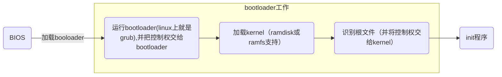

[toc]
### 概述
#### 1.启动流程

bootloader有**两个阶段**：

#### 2.内存有两种：
* RAM		  	
random access memory，断电后，这里面的内容都会清空  
 
* ROM			
read only memory，用来存储BIOS程序（主要功能：加电自检(检查硬件状况)、加载bootloader）  

#### 3.加载bootloader
* 读取磁盘的主引导扇区（MBR），指明去哪个分区（即文件系统）读取 引导加载程序（bootloader）  
* 读取指定分区的引导扇区，从而定位到bootloader程序，进而将bootloader程序读取到内存中来  
* bootloader程序的主要作用是**识别磁盘的文件系统**  
