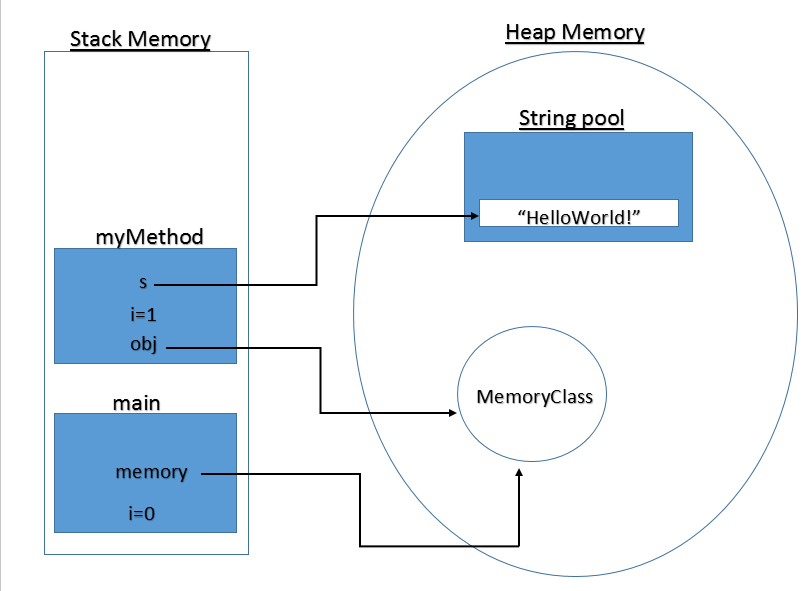

[toc]
### 基础概念

#### 1.MMU（memory management unit）
##### 功能：
##### （1）抽象  
将物理地址空间抽象为逻辑（虚拟）地址空间  

##### （2）保护  
每个进程拥有独立的地址空间  

##### （3）共享  
可以访问相同地址空间  

##### （4）虚拟化  
更大的地址空间  

##### 管理方式：

##### （1）重定位（relocation）  
直接使用物理地址，换台机器就需要重定位且一个进程的地址必须是连续的  

##### （2）分段（segmentation）   
将 逻辑地址空间 划分为 若干个段  
每一段的地址必须是连续的  
</br>
##### （3）分页（paging）  
  * 将 物理地址空间 划分为大小相同的基本单位（**页帧**，也叫帧，frame，大小为2^n）  
  * 将 逻辑地址空间 划分为大小相同的基本单位（**页面**，也叫页，page）  
  * **页表** 中存储 页面（逻辑地址）到 页帧（物理地址）的映射关系  

##### （4）虚拟内存（virtual memory）  
使用虚拟地址空间，且基本单位是页  

#### 2.物理地址
硬件支持的地址空间，起始地址0，最大地址为2^32-1（当有32条地址线时）

#### 3.逻辑（虚拟）地址
  进程看到的地址，起始地址为0

#### 4.页表
  在页表中，每个逻辑页面，都有一个页表项
  页表项的组成：**页帧号** 和 **页表项标志**
```shell
页表项标志：
  存在位（resident），表示存在一个页帧与该页面相对应
  修改位（dirty），表示这个页面中的内容已经修改
  引用位（clock/reference），表示是否访问过这个页面中的内容
```
#### 5.memory map（内存映射）
* 建立虚拟内存和物理内存的映射关系（基本单位是map area，大小不固定）
* 就是**段页式**存储，一个**map area**就是一个**段**，对应多个页
* 一个map area映射到页表中的多个页表项，从而映射到物理内存

#### 6.段页式存储
  将 **逻辑地址空间** 划分为若干个段，将每个段划分为若干个大小相等的页


#### 7.heap（堆）和stack（栈）
heap和stack都是**虚拟内存**，不是真正的物理内存，当真正需要使用时，**操作系统**会为其分配物理内存
* stack：静态内存分配，由编译器分配（用于存储局部变量、返回地址等）
  * 每个线程都有stack
</br>
* heap：动态内存分配，在程序运行时，由程序员自己分配和释放（比如调用malloc函数）
  * 所有的对象都分配在heap上
  * GC（garbage collection）用于清理**heap**中**引用计数为0**的**对象**
  * heap空间比stack大的多
</br>
* python heap和stack
  * python一切皆对象，所以python的数据都是分配在heap上
  * CPython virtual machine分配在stack上

* java heap和stack
  * 函数调用、局部变量、对象引用等分配在stack在
  * 对象分配在heap在

</br>
* 多线程时，每个**线程**有**独立的stack**，但是会**共享heap**
* OS为什么要对stack的大小做限制（`ulimit -a`查看限制）
  * 一般程序对栈的大小的要求不高
  * 如果程序陷入死循环（比如调用递归函数），函数地址是存放在stack中，所以stack的大小会越来越大，当超过限制时，程序会崩溃，但不会影响整个操作系统

***

### 非连续内存分配

#### 1.连续内存分配的缺点
  分配给程序的物理内存必须连续
  存在外碎片和内碎片（内存利用率低）

#### 2.三种方式
* 段式
* 页式
* 段页式
***
### x86特权级

#### 1.有四个特权级：
* ring 0		
内核处于ring 0特权级
* ring 1
* ring 2
* ring 3		
应用程序处于ring 3特权级

#### 2.实现特权级切换的方式：中断
***
### 虚拟内存
#### 1.出现的原因
内存不够用
#### 2.解决内存不足的技术
**（1）覆盖技术**
>原理：将程序划分为若干个功能相对独立的模块，将不会同时执行的模块共享同一块内存区域（即可以相互覆盖）  
* 必要部分（常用功能）的代码和数据 常驻内存
* 可选部分（不常用功能）的代码和数据 只在需要用到时装入内存

**（2）交换技术**
>原理：将暂时不能运行的程序放到外存  
* 换入换出的基本单位：整个进程的地址空间

**（3）虚拟内存**
>原理：与交换技术类似，只不过基本单位是页
* 装载程序时
只将当前指令执行需要的部分页面或段加载到内存  
* 指令执行中需要的指令或数据不在内存中（称为缺页或缺段）时
处理器通知操作系统将相应的页面或段调入内存
* 操作系统将内存中暂时不用的页面或段保存至外存
#### 3.虚拟页式存储（基本置换单位是页）
>原理：根据逻辑地址，查找到页表中的相应项，然后查看驻留位标志，如果驻留位为1，表示该内容在内存中，如果驻留位为0，表示该内容不在物理内存中，产生缺页异常，操作系统会将相应内容加载到物理内存中  

（1）页表的结构
* 驻留位：表示该页是否在内存中
* 修改位：表示在内存中的该页是否被修改过
* 访问位：表示该页面是否被访问过（读或写）
* 保护位：表示该页的允许访问方式（只读、可读写、可执行等）
* WT(write-through)：设为1即开启，设为0即为write-back

#### 4.缺页异常
当要访问的页不在内存中时产生缺页异常
产生缺页异常后，操作系统会去外存找到该页，读到内存中来

#### 5.页面置换算法
当产生缺页异常时，且内存已经满了，需要将内存中的某一页和访问的页进行置换。

局部页面置换算法：
* 最优页面置换算法（OPT：optimal）
需要预测未来，无法实现
* 先进先出算法（FIFO）
* 最近最久未使用算法（LRU：least recently used）
开销大
* 最不常用算法（LFU：least frequently used）

全局页面置换算法：
* 工作集置换算法
* 缺页率置换算法

#### 6.cpu利用率与并发进程数关系

出现这个问题的原因是，内存使用量会增加，之后cpu需要处理更多的页面置换

#### 7.工作集
一个进程当前正在使用的**逻辑页面**集合

#### 8.常驻集
在当前时刻，进程**实际驻留在内存**当中的**逻辑页面**集合（即操作系统分配给该进程的页帧数）

#### 9.工作集和常驻集关系
常驻集包含工作集时，缺页较少
工作集发生剧烈变动时，缺页较多

#### 10.缺页率（page fault rate）
缺页率 = 缺页次数 / 内存访问次数
或者 = 缺页平均时间间隔的倒数

#### 11.抖动问题（thrashing）
页帧数太少，不能包含工作集，造成大量缺页，频繁置换
