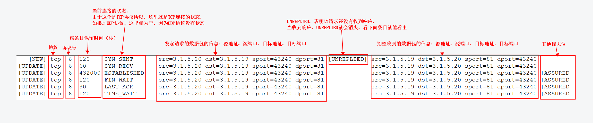

# conntrack

<!-- @import "[TOC]" {cmd="toc" depthFrom=1 depthTo=6 orderedList=false} -->
<!-- code_chunk_output -->

- [conntrack](#conntrack)
    - [概述](#概述)
      - [1.conntrack](#1conntrack)
      - [2.conntrack系统维护着两张表](#2conntrack系统维护着两张表)
        - [（1）conntrack表](#1conntrack表)
        - [（2）查看conntrack表](#2查看conntrack表)
        - [（3）expect表（这个表的条目由helper产生的）](#3expect表这个表的条目由helper产生的)
        - [（4）查看expect表](#4查看expect表)
      - [3.conntrack表的大小限制](#3conntrack表的大小限制)
        - [（1）conntrack表最大能够存储的条目数](#1conntrack表最大能够存储的条目数)
        - [（2）conntrack表满了的影响](#2conntrack表满了的影响)
        - [（3）解决：SYN泛洪引起conntrack表满了](#3解决syn泛洪引起conntrack表满了)
      - [4.应用](#4应用)
      - [5.conntrack helper](#5conntrack-helper)
        - [（1）为什么需要](#1为什么需要)
        - [（2）工作原理](#2工作原理)
        - [（3）加载helper](#3加载helper)
    - [使用](#使用)
      - [1.查看conntrack表](#1查看conntrack表)

<!-- /code_chunk_output -->

### 概述

#### 1.conntrack
connection tracking system，是Linux下的一个子系统，用于跟踪连接的状态
这里的connection指的是一个flow（流，从源计算机到目标计算机的一系列数据包），所以UDP、ICMP也会conntrack表中存在条目

#### 2.conntrack系统维护着两张表

##### （1）conntrack表
当前的连接信息和期望的数据包的信息

##### （2）查看conntrack表
* 下面展示了一次tcp请求（3.1.5.20->3.1.5.19:81）在conntrack表中**条目变化的过程**
  * src是发起请求的源地址，不是数据包的源地址
    * 3.1.5.20访问3.1.5.19:81，3.1.5.19会返回数据包给3.1.5.20，
    * 此时数据包的源地址就是3.1.5.19，但是在conntrack表中，条目的源地址依旧是3.1.5.19，
    * 并且会更新连接状态，所以能够跟踪连接
```shell
conntrack -E
```



##### （3）expect表（这个表的条目由helper产生的）
* 期望的数据包的信息 和 已有的连接信息
  * 期望的数据包的信息是根据 解析收到的数据包的信息分析出来的
  * 从而当收到期望的数据包时
    * 会在conntrack表中创建新的条目
    * 并且能够将该新的条目 关联到 已有的条目（关联关系就存在expect表中）
* 通过expect表，能够**跟踪动态创建的连接**（即能够知道动态创建的连接是由哪个连接创建的）

##### （4）查看expect表
```shell
#首先要加载相应的模块，才能解析相应的数据包，并且有相应的数据包传输，这里才有数据显示
conntrack -E expect
```


#### 3.conntrack表的大小限制

##### （1）conntrack表最大能够存储的条目数
```shell
cat /proc/sys/net/nf_conntrack_max
```

##### （2）conntrack表满了的影响
当conntrack表满了，后续的包会被丢弃

##### （3）解决：SYN泛洪引起conntrack表满了
对外部进来的流量不保存状态
```shell
-j NOTRACK
```

#### 4.应用
* NAT
* status firewall（iptables）

#### 5.conntrack helper

##### （1）为什么需要
很多应用会在客户端和服务端之间**动态建立连接**，即选择随机的端口建立连接

##### （2）工作原理
监视某个连接，解析该连接传输的数据包，从而能够知道由该连接动态创建的临时连接

##### （3）加载helper

* 查看已经加载的helper

```shell
lsmod | grep conntrack

# nf_conntrack   133095  4 nf_nat,nf_nat_ipv4,nf_conntrack_netlink,nf_conntrack_ipv4
```

* 加载新的helper
比如加载ftp helper
```shell
modprobe nf_conntrack_ftp
```

***

### 使用

#### 1.查看conntrack表
* 查看当前conntrack表
```shell
conntack -L
```

* 查看实时conntrack表
```shell
#类似于 tail -f
conntrack -E
```
