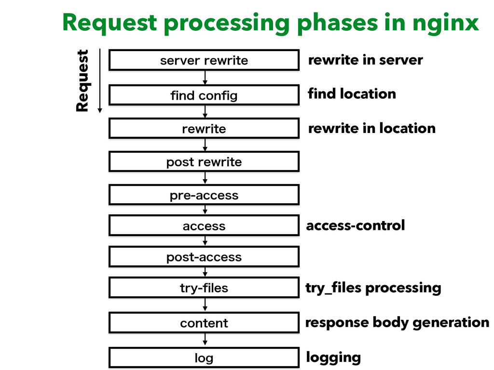

# nginx

<!-- @import "[TOC]" {cmd="toc" depthFrom=1 depthTo=6 orderedList=false} -->
<!-- code_chunk_output -->

- [nginx](#nginx)
    - [概述](#概述)
      - [1.内置变量](#1内置变量)
        - [（1）`$http_<header_name>`](#1http_header_name)
        - [（2）`$arg_<arg_name>`和`$args`](#2arg_arg_name和args)
        - [（3）`$cookie_<cookie_name>`](#3cookie_cookie_name)
        - [（4）其他常用变量](#4其他常用变量)
      - [2.http request经过的11个phases](#2http-request经过的11个phases)
        - [（1）read phase](#1read-phase)
        - [（2）server rewrite phase](#2server-rewrite-phase)
        - [（3）find config phase](#3find-config-phase)
        - [（4）rewrite phase](#4rewrite-phase)
        - [（5）post rewrite phase](#5post-rewrite-phase)
        - [（6）preaccess phase](#6preaccess-phase)
        - [（7）access phase](#7access-phase)
        - [（8）post access phase](#8post-access-phase)
        - [（9）precontent phase](#9precontent-phase)
        - [（10）content phase](#10content-phase)
        - [（11）log phase](#11log-phase)
      - [3.添加模块的方式](#3添加模块的方式)
        - [（1）编译时添加](#1编译时添加)
        - [（2）将需要的模块编译成 动态模块](#2将需要的模块编译成-动态模块)
    - [配置文件的结构](#配置文件的结构)
      - [1.顶层context（上下文）](#1顶层context上下文)
        - [（1）stream](#1stream)
        - [（2）http](#2http)
        - [（3）events](#3events)
        - [（4）mail](#4mail)
      - [2.继承](#2继承)
      - [3.virtual servers](#3virtual-servers)
        - [（1）stream上下文中的server](#1stream上下文中的server)
        - [（2）http上下文中的server](#2http上下文中的server)

<!-- /code_chunk_output -->

### 概述

#### 1.内置变量
[内置变量](https://nginx.org/en/docs/varindex.html)

##### （1）`$http_<header_name>`
获取某个请求头的值，`<header_name>`表示请求头的字段名（小写，短划线用下划线代替）
比如：有一个header，`Aaa-b: 111`，则`$http_aaa_b`的值就是111
```shell
$http_host          #http请求的Header中的Host字段（包括port）
```

##### （2）`$arg_<arg_name>`和`$args`
request line中传递的参数（即url中通过?传递的参数）

##### （3）`$cookie_<cookie_name>`
获取某个cookie的值，<cookie_name>为cookie的名字

##### （4）其他常用变量
```shell
$host               #Header中的Host字段（但不包括port信息）
$proxy_host         #当执行proxy_pass语句后，会添加proxy-host头在http请求中，然后将新的请求转发到后端
```

#### 2.http request经过的11个phases


##### （1）read phase
读取请求

##### （2）server rewrite phase
执行在server块中定义的rewrite模块的内容

##### （3）find config phase
根据url选择location

##### （4）rewrite phase
执行在location块中定义的rewrite模块的内容

##### （5）post rewrite phase
当url在rewrite phase被改写，再次进入find config phase

##### （6）preaccess phase
访问控制预处理阶段（比如控制并发数、请求速率等等）

##### （7）access phase
访问控制阶段（比如认证、检查权限等）

##### （8）post access phase
访问控制后处理阶段，处理上述检查都通过的请求

##### （9）precontent phase
生成响应的预处理（比如：try_files）
当在这个阶段生成了响应，则跳过content phase

##### （10）content phase
生成响应（比如index等等）
当在这个阶段，某个语句生成了响应，则下面的语句就不会执行了（但不影响log phase阶段）

##### （11）log phase
记录日志

#### 3.添加模块的方式

##### （1）编译时添加
从源码编译nginx，通过--add-module添加该模块，之后就不需要在配置文件中`load_module`了

##### （2）将需要的模块编译成 动态模块

* 已经装好了nginx，利用对应版本的nginx源码编译将该模块编译成动态块

```shell
./configure --with-compat --add-dynamic-module=<path>
make modules
cp obj/<xx>.so /etc/nginx/modules/
```

* 在配置文件中通过`load_module`添加该模块

```shell
load_module modules/<xx>.so;
```

***

### 配置文件的结构

#### 1.顶层context（上下文）

##### （1）stream
用于处理 **TCP和UDP流量**
```shell
stream {
  ...
}
```

##### （2）http
用于处理 **HTTP流量**
```shell
http {
  ...
}
```

##### （3）events
常规连接处理
```shell
events {
  #一个worker process能够同时打开的最大连接数
  worker_connections <number>;
}
```

##### （4）mail
用于处理mail流量

#### 2.继承
child context会继承parent context的内容，但是可以进行覆盖

#### 3.virtual servers
在每个 流量处理上下文 中，都包含一个或多个server context，用于设置请求处理
```python
server {...}
```

##### （1）stream上下文中的server
```python
server {

  #<ADDRESS>可以省略，<PORT>可以写一个范围，比如:80-82
  #ssl表示所有与该端口的连接应该采用ssl模式
  #udp表示监听在udp端口
  #还有其他更多选项
  listen <ADDRESS>:<PORT> [ssl] [udp];
}
```

##### （2）http上下文中的server
```python
server {

  #支持多个主机名
  #主机名支持：
  #   域名后缀，比如：.example.com 等价于 example.com和*.example.com
  #   在域名的第一部分或最后一个部分使用通配符（*），比如：*.example.com
  #   正则（~），
  server_name <SERVER_NAME_1> <SERVER_NAME_2>;

  #跟stream差不多
  #这里的listen可以省略，<PORT>也可以省略，默认就是80
  listen <ADDRESS>:<PORT> [ssl] [udp];
}
```

* proxy protocol

该协议，允许当nginx作为负载均衡时，可以传递客户端的原始信息
开启proxy protocol
```shell
http {
    #...
    server {
        listen 80   proxy_protocol;
        listen 443  ssl proxy_protocol;
        #...
    }
}
```
