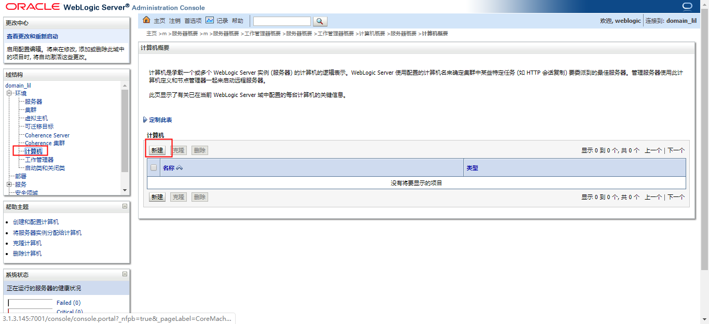
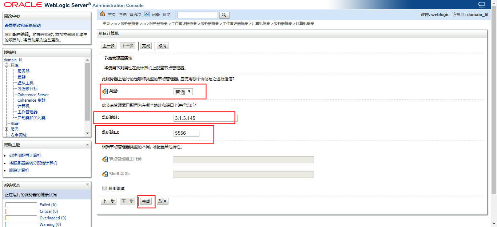
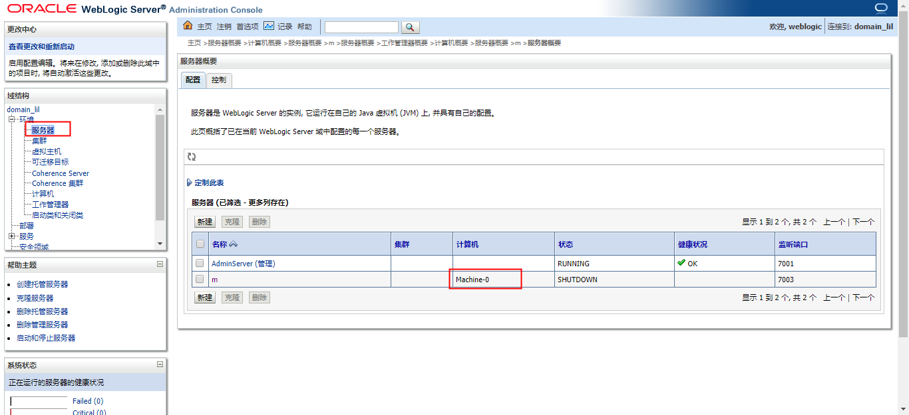
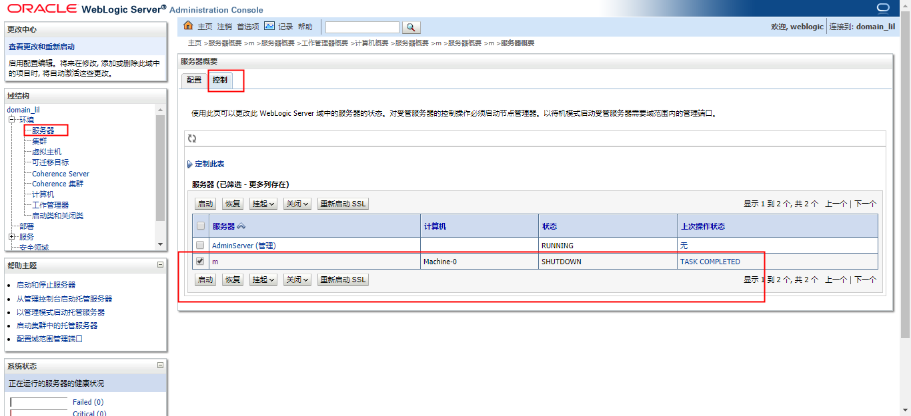

### 基础概念

#### 1.domian
  一组server的集合，至少包含一个administration server
  可选的包含managed server和cluster

#### 2.server
  是类weblogic.Server的一个实例

#### 3.administration server
  是一个domain中的管理者，负责管理其他server

#### 4.managed server
  是一个domain中被管理的server
  功能就是：执行具体的业务逻辑

#### 5. as（administration server）的功能（通过JMX实现这些功能的）
  提供该domain内的所有server的配置
  记录server的重要日志
  监控ms（managed server）

#### 6.NodeManager
一台机器上启动一个，用于远程管理该机器上的servers

### 基本操作

#### 1.静默方式安装weblogic
* 新版安装
```shell
#需要用非root的身份去执行
java -jar xx.jar
```
* 老版安装

（1）修改静默方式的配置文件
```shell
#这个文件是事先准备号的
#主要修改安装路径
vim silent.xml

#BEAHOME，一些通用的库的目录
#WLS_INSTALL_HOME，weblogic的安装目录，不需要明确指定，会自动装在BEAHOME目录下的wlserver_<version>目录中
```
（2）执行安装
```shell
java -jar wls1036_generic.jar -mode=silent -silent_xml=./silent.xml -log=./weblogic10_install.log
```

#### 2.创建域（利用wlst，weblogic script tool 创建）
```shell
cd <WLS_INSTALL_HOME>
cp ./common/templates/scripts/wlst/basicWLSDomain.py ./

vim basicWLSDomain.py
```
```py
readTemplate("/home/weblogic/wls12214/wlserver/common/templates/wls/wls.jar")

cd('Servers/AdminServer')
set('ListenAddress','xx')
#这里一定要填ip，不然下面把整个域复制到另一他机器时，通过节点管理器无法启动被管服务器，因为被管服务器尝试联系127.0.0.1
set('ListenPort', 7001)

cd('/')
cd('Security/base_domain/User/weblogic')
cmo.setPassword('weblogic123')

setOption('OverwriteDomain', 'true')
writeDomain('需要创建的域的绝对路径')
closeTemplate()

exit()
```
```shell
./common/bin/wlst.sh basicWLSDomain.py
```

#### 3.启动weblogic控制台
```shell
#一般都是在BEAHOME下
cd <BEAHOME>/user_projects/domains/<DOMAIN_NAME>

nohup ./bin/startWebLogic.sh &
#需要等好几分钟才能启动起来
```

#### 4.启动NodeManager

* 找到nodemanager目录（一般在相应的域目录下），修改nodemanager.properties
```shell
#vim nodemanager.properties
SecureListener=false
```
* 修改startNodeManager.sh脚本，指定nodemanager目录
```shell
cd <WLS_INSTALL_HOME>
vim ./server/bin/startNodeManager.sh
```
```
NODEMGR_HOME="/home/weblogic/wls12214/user_projects/domains/domain_lil/nodemanager/"
```
（1）在本机上启动NodeManager
```shell
cd <WLS_INSTALL_HOME>

nohup ./server/bin/startNodeManager.sh &
#指明该机器上的NodeManager监听的地址
#第一次启动需要等比较久的时间
```

（2）在另一台机器上启动NodeManager
前提条件：
* 该机器安装了weblogic
* 需要把这个域整个复制到该机器上
* 最后启动NodeManager

#### 5.使用NodeManager
（1）创建 计算机（machine）资源，用于连接NodeManager



（2）将 服务器（server） 与 指定计算机（machine）关联
需要该server部署在这台计算机上，即可以远程管理server了


（3）管理相关server


#### 6.创建managed server

（1）访问控制台：http://xx:7001
  环境 -> 服务器 -> 新建 -> 设置服务器名称和监听端口

**注意**：当启动了NodeManager，就可以通过NodeManager进行管理了，不需要手动管理，即下面的步骤就不需要了

（2）设置免密启动
```shell
mkdir ./servers/xx/security		#在被管服务器的目录下创建security目录
vim ./servers/xx/security/boot.properties
```
```
username=xx
password=xx
```

（3）启动managed server
```shell
nohup ./bin/startManagedWeblogic.sh 服务器名 http://xx:7001 &
#指明Administrator Server的地址
```
