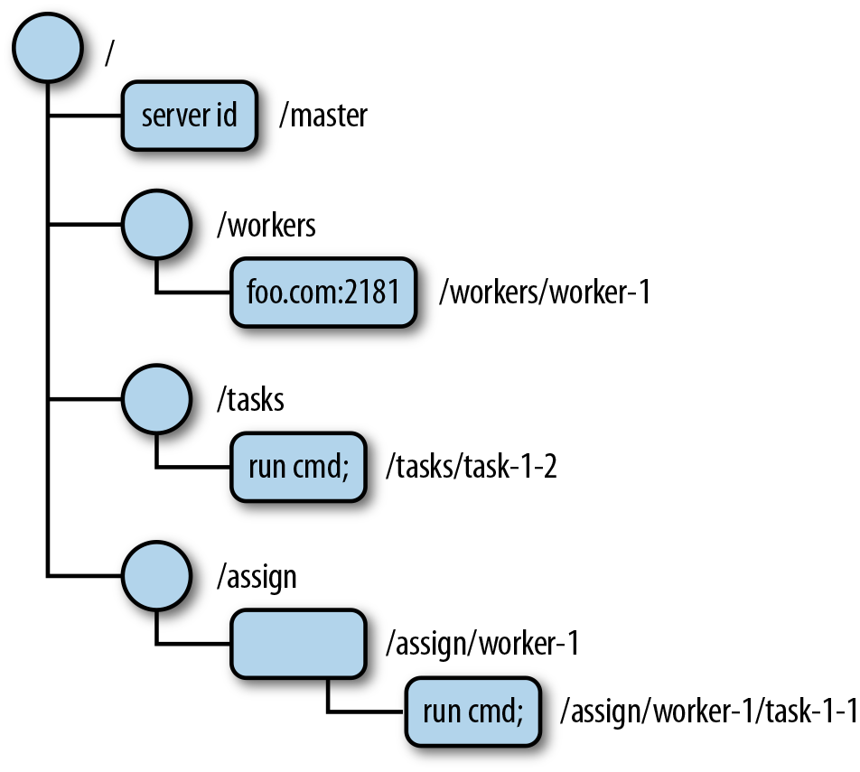
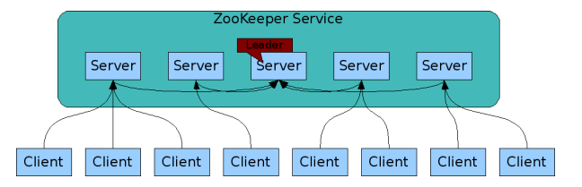

# zookeeper

<!-- @import "[TOC]" {cmd="toc" depthFrom=1 depthTo=6 orderedList=false} -->
<!-- code_chunk_output -->

- [zookeeper](#zookeeper)
    - [概述](#概述)
      - [1.数据模型](#1数据模型)
        - [（1）namespace（类似文件系统）](#1namespace类似文件系统)
        - [（2）nodes 和 ephemeral nodes](#2nodes-和-ephemeral-nodes)
      - [2.核心功能](#2核心功能)
      - [3.集群](#3集群)
        - [（1）leader 和 follower](#1leader-和-follower)
        - [（2）observer](#2observer)
        - [（3）选举机制](#3选举机制)
      - [4.应用场景](#4应用场景)
    - [配置](#配置)

<!-- /code_chunk_output -->

### 概述

**本质**：存储的是key-value，跟etcd差不多

#### 1.数据模型

* 这里所说的node统一称为：**znode**（zookeeper data node）



##### （1）namespace（类似文件系统）
分层级的存储nodes，每个层级用`/`隔开
通过name（即绝对路径）找到各个node，所以叫namespace

##### （2）nodes 和 ephemeral nodes
* 每个node（本质就是key），都可以设置值
* ephemeral node，短暂节点，当创建node的会话结束，将删除该node


#### 2.核心功能
* 分布式一致性

#### 3.集群



##### （1）leader 和 follower
* zookeeper集群中只有一个leader，其余都是follower或者observer
* 读请求每个server都可以自己响应
* 写请求只有leader server能够操作，当其余server收到写请求，会转发给leader
  * **每次写请求都需要投票**，只有获得一半以上的票数，写请求才会成功

##### （2）observer
* observer与follower区别就是不参加选举
  * 当集群中follower过多，写请求就会更慢

##### （3）选举机制
* leader是通过选取产生的,必须获得超过一半的票数(总票数不会因为有主机宕机而变少)

* 所需至少需要3台主机才能实现可高用,当一台宕机后,可以选举出新的leader

#### 4.应用场景

* 配置一致
比如几个程序监听 zookeeper中的某个key，如果这个key变化了，则程序采取相应操作

* HA
主程序，创建一个key，如果该程序挂掉，则该key会自动清除
备份程序监听这个key，如果该key清楚了，会自动创建，如果该key存在，则继续监听着

* 服务发现
* 负载均衡
* 分布式锁

***

### 配置

```shell
#server.<ID>=主机名:2888:3888[:observer]
#<ID>号不重复进行，有多少个节点，就写多少个server
server.1=192.168.1.1:2888:3888
server.2=192.168.1.2:2888:3888
server.3=192.168.1.3:2888:3888
```

* 需要在zookeeper的数据目录下设置该节点的id

```shell
mkdir <DATA_DIR>

echo <ID> > <DATA_DIR>/myid
```

* 启动

```shell

```
