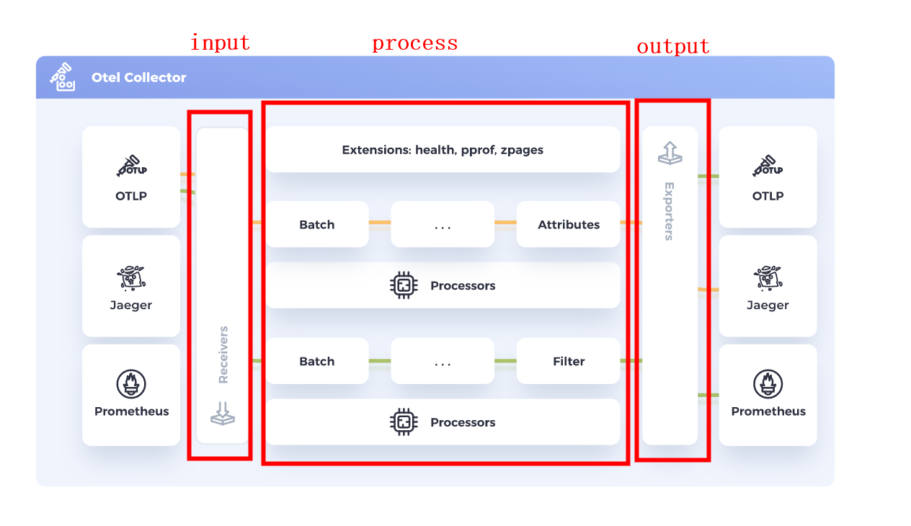

# overview

<!-- @import "[TOC]" {cmd="toc" depthFrom=1 depthTo=6 orderedList=false} -->
<!-- code_chunk_output -->

- [overview](#overview)
    - [概述](#概述)
      - [1.opentelemetry（标准化）](#1opentelemetry标准化)
      - [2.术语](#2术语)
      - [3.architecture](#3architecture)
        - [（1）数据处理: collector（与jaeger的collector不同）](#1数据处理-collector与jaeger的collector不同)
        - [（2）存储存储: TSDB、Trace DB等](#2存储存储-tsdb-trace-db等)
      - [3.signals（监控数据）](#3signals监控数据)
      - [4. context propagation（通过Propagators）](#4-context-propagation通过propagators)
        - [（1）tracecontext（默认开启）](#1tracecontext默认开启)
        - [（2）baggage（默认开启）](#2baggage默认开启)
        - [（3）b3（即b3 single，即只有一个http header）](#3b3即b3-single即只有一个http-header)
        - [（4）b3multi（有多个http header）](#4b3multi有多个http-header)
      - [5.sample数据](#5sample数据)
      - [5.demo](#5demo)

<!-- /code_chunk_output -->

### 概述

#### 1.opentelemetry（标准化）

将OpenTracing和OpenCensus合并
* 提供 监控数据 存入 后端存储 的API标准
* 提供 各种语言的SDK（遵循API标准）
  * 用于装配在服务上，采集服务的signals（包括：traces、metrics、logs、baggage）

#### 2.术语

|term|description|
|-|-|
|OTel|opentelemetry|
|OTLP|opentelemetry protocol|
|otelcol|opentelemetry collector|

#### 3.architecture


##### （1）数据处理: collector（与jaeger的collector不同）

* 用于 处理 数据
  * 支持多种数据源（即receivers）和backend（exporters）
* 哪些场景需要：
  * 比如: 可以把多个服务的metrics发往一个collector，然后prometheus到collector采集metrics

##### （2）存储存储: TSDB、Trace DB等

#### 3.signals（监控数据）

|signal|description|
|-|-|
|traces|链路数据|
|metrics|指标数据（如：读写的总字节数、进程资源的使用的等）|
|logs|访问日志等（还不成熟）|
|baggage|用户在context中定义的元数据|

#### 4. context propagation（通过Propagators）

不同的propagators就是添加不同的http header，来传递上下文
常用propagators（[参考](https://github.com/open-telemetry/opentelemetry-java/tree/main/sdk-extensions/autoconfigure#propagator)）:

##### （1）tracecontext（默认开启）
* http header
```yaml
traceparent: <version>-<trace_id>-<parent_id>-<trace_flags>
```

##### （2）baggage（默认开启）
* 用于传递用户定义的信息（貌似只能在代码中实现添加baggage）
* http header
```yaml
baggage: key1=value1;property1;property2, key2 = value2, key3=value3; propertyKey=propertyValue
```

##### （3）b3（即b3 single，即只有一个http header）
* http header
```yaml
#最后两个字段可选的
#注意这里的SpanID就相当于traceparent中的<parent_id>
b3: {TraceId}-{SpanId}-{SamplingState}-{ParentSpanId}
```

##### （4）b3multi（有多个http header）
* http header
```yaml
x-b3-traceid: 33b048580e8e53788bc12faadc74e914
x-b3-spanid: 47164b7954a4b30c
#下面两个不是必须的
x-b3-sampled: 1
x-b3-parentspanid: 0694bd1dd428ffd2
```

#### 5.sample数据

* span数据格式

```json
{
  //基本信息
  "trace_id": "7bba9f33312b3dbb8b2c2c62bb7abe2d",
  "name": "/v1/sys/health",
  "parent_id": "",
  "span_id": "086e83747d0e381e",

  //开始和结束时间
  "start_time": "2021-10-22 16:04:01.209458162 +0000 UTC",
  "end_time": "2021-10-22 16:04:01.209514132 +0000 UTC",

  //状态（当发生异常，且处理了则为ERROR，未处理UNSET）
  "status_code": "STATUS_CODE_OK",
  "status_message": "",

  //元数据
  "attributes": {
    "net.transport": "IP.TCP",
    "net.peer.ip": "172.17.0.1"
  },

  //日志数据
  "events": {
    "name": "",
    "message": "OK",
    "timestamp": "2021-10-22 16:04:01.209512872 +0000 UTC"
  }
}
```

#### 5.demo
[参考](https://opentelemetry.io/community/demo/)
