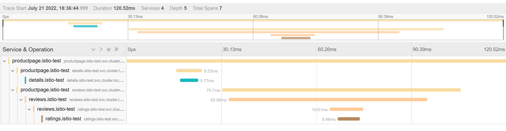
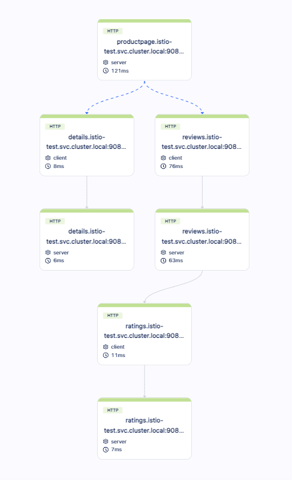
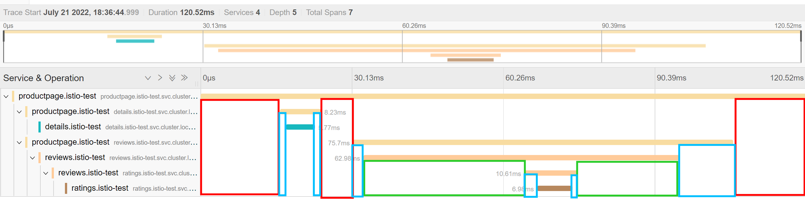

# distributed tracing

<!-- @import "[TOC]" {cmd="toc" depthFrom=1 depthTo=6 orderedList=false} -->
<!-- code_chunk_output -->

- [distributed tracing](#distributed-tracing)
    - [概述](#概述)
      - [1.distributed tracing](#1distributed-tracing)
      - [2.tracing相关概念](#2tracing相关概念)
        - [（1）span相关属性（以Jaeger为例子）](#1span相关属性以jaeger为例子)
        - [（2）示例](#2示例)
        - [（3）时间分析](#3时间分析)
      - [3.tracing fields](#3tracing-fields)
      - [4.前提](#4前提)
      - [5.两种装配模式](#5两种装配模式)
        - [（1）automatic instrumentation](#1automatic-instrumentation)
        - [（2）manual instrumentation](#2manual-instrumentation)
      - [6.采集策略](#6采集策略)
      - [7.常用语言的装配](#7常用语言的装配)

<!-- /code_chunk_output -->

### 概述

* 服务发送请求，会生成一个新的span（比如图中的span B是service 1生成的）
  * 展示的时候，这个span会跟发起的服务关联（比如图中的B是service 1关联）
* 服务收到请求后，会生成一个新的span（比如图中的span A 、span C等）

#### 1.distributed tracing
* 现有的分布式Trace基本都是采用了google 的Dapper设计
* 在一个请求链中传播context，从而记录一条请求链的状态

#### 2.tracing相关概念

|term|description|
|-|-|
|trace|一个trace代表一个调用链|
|span|在一个trace中的一个调用|

##### （1）span相关属性（以Jaeger为例子）

|span属性|说明|
|-|-|
|operation name|一个span都有一个operation name（不同的span可以重复），用 调用链接 命名|
|span kind|server（处理请求）或client（发送请求）|
|start time|开始时间|
|duration|执行时间|
|ST (self-time)|自身花费的时间（去除调用其他服务的时间）|
|node id|实例的id，表示具体的哪个实例产生的这个span|

##### （2）示例

* 同一个颜色：代表同一个service

* 同一个服务，连续有两个span
  * 一个是server类型的，一个是client类型的（即这个服务首先接收请求，然后这个服务去访问其他服务）

##### （3）时间分析

* 红色标注的是productpage服务的self-time（即自身所用时间）
* 绿色标注的是reviews服务的self-time（即自身所用时间）
* 蓝色标注的是**网络中损耗的时间**

#### 3.tracing fields

|field|description|
|-|-|
|spanid|定义当前的span|
|parentid|前一个span|
|traceid|唯一标识一条调用链|
|traceflags|元数据（可以自定义）|

#### 4.前提
* 应用需要传递相应的http header
  * 所以需要对应用进行更改
    * 有两种装配模式
    * java更容易，因为可以通过字节码进行注入，不需要更改任何代码）

#### 5.两种装配模式

##### （1）automatic instrumentation
使用指定的框架和库，这样能够自动生产span

##### （2）manual instrumentation
需要在代码中调用相应的SDK，开始和结束一个span

#### 6.采集策略

* Sample everything
  * 适合测试环境，不适合生产环境，成本比较大

#### 7.常用语言的装配

下面以opentelemtry为例子，[参考](https://opentelemetry.io/docs/instrumentation/)

|语言|装配方式|原理|修改代码程度|支持的采集内容|
|-|-|-|-|-|
|java|自动|利用字节码注入，修改代码|无|tracs、metrics、logs|
|python|自动|通过相应的telemetry库利用monkey patch，在运行时重写相应的方法和类（需要了解代码应用了哪些库，然后需要安装相应的telemetry库）|无|tracs、metrics、logs|
|go|手动||需要修改代码|tracs、metrics|
