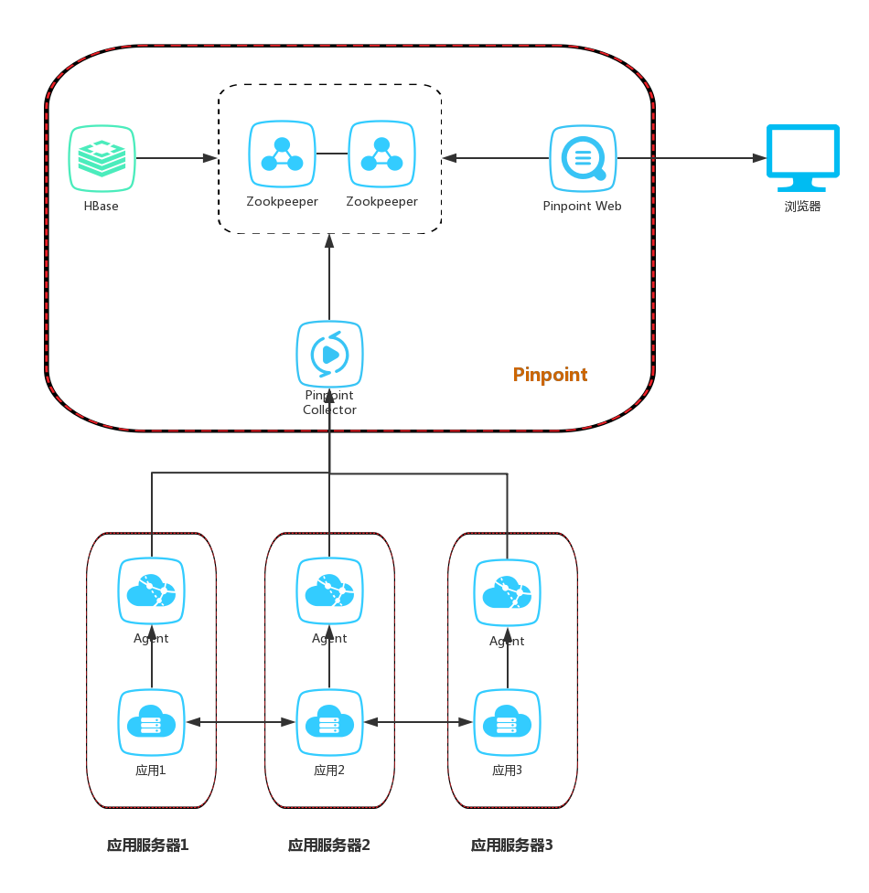

# pinpoint

<!-- @import "[TOC]" {cmd="toc" depthFrom=1 depthTo=6 orderedList=false} -->
<!-- code_chunk_output -->

- [pinpoint](#pinpoint)
    - [概述](#概述)
      - [1.架构](#1架构)
        - [（1）HBase](#1hbase)
        - [（2）collector](#2collector)
        - [（3）web](#3web)
        - [（4）agent](#4agent)
        - [2.主要功能](#2主要功能)

<!-- /code_chunk_output -->

### 概述

#### 1.架构

##### （1）HBase
存储后端数据

##### （2）collector
处理agent采集到的数据，然后存储数据库

##### （3）web
展示

##### （4）agent
采集数据

##### 2.主要功能
* serverMap
可视化组件，展示分布式系统的拓扑

* Realtime Active Thread Chart
实时监控应用程序内部的活动线程

* Request/Response Scatter Chart
展示请求数和响应情况

* CallStack
调用栈

* Inspector
查看有关应用程序的其他详细信息，例如CPU使用率，内存/垃圾收集，TPS和JVM参数
  * 需要flink和zookeeper
