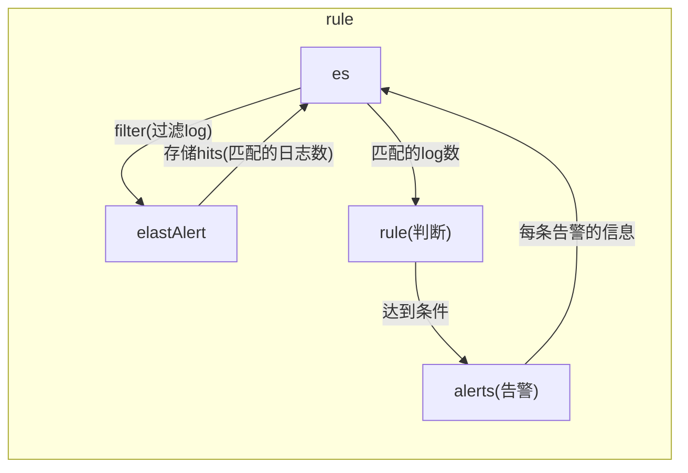

# elastAlert
###  基础概念
#### 1.工作流程

#### 2.elastaler状态保存在es中
* elastalert_status
```
存储每一次触发的详细信息（即触发一次，就会产生一条记录）：
  hits数量
  matches数量
  alert是否成功
  match_body

#match_body包含触发告警的document的详细信息
#注意触发告警只能是一个document
#包含该document所在索引，agent信息，message内容等等
```
* elastalert_status_status
```
存储每一次触发的概要信息
  hit数量、match数量等
```
* elastalert_status_silence
```
存储被压缩的告警的信息
```
* elastalert_status_error
```
存储错误日志
```

#### 3.hits
查询es得到的日志的数量
注意：查询包括了**过滤**的动作

#### 4.matchs
经过rule处理后，达到了告警的要求的数量（为0或1）
注意：matches不代表发送了告警，有可能发送告警失败

#### 5.alerts
成功发送告警的次数

#### 6.buffer_time、run_every和timeframe区别
* run_every
```
多长时间去query一次（这个时间依据的是当前的时间）
```
比如当运行elastAlert后，elastAlert会每隔run_every的时间去query一次
* buffer_time
```
设置每次query的窗口大小（窗口是一个时间段，该时间依据是document记录在es中的时间）
```
比如现在是12:00，窗口大小为10分钟，则查询日志的时间范围是11:50-12:00

为什么需要这样
如果不设置窗口大小，则每次查询的是一个点，则会遗漏到很多日志
* timeframe
```
某些rule类型进行判断时，用来进行统计的时间段
```
比如5分钟内，某个发生3次则报警，这个5分钟就是timeframe
会利用内存进行相关记录，比如发生了发生了一次，记录在内存中
这样就能判断是否在5分钟内是否发生了3次

#### 7.避免报警风暴
我们在使用的时候要预防报警风暴（在实际使用中我们遇到过可能一分钟成百上千的错误，要是都是发出来，就有问题了）。我们利用下面的一些措施来控制报警风暴：
（1）aggregation： 设置一个时长，则该时长内，所有的报警（同一个配置文件内的报警）最终合并在一起发送一次：
（2）realert: 设置一个时长，在该时间内，相同 query_key 的报警只发一个
（3）exponential_realert： 设置一个时长，必须大于realert 设置，则在realert到exponential_realert之间，每次报警之后，realert 自动翻倍
***
### 基本使用
#### 1.安装
```shell
yum -y install python3 python3-devel
pip3 install elastalert
pip3 install elasticsearch==7.6.0
```
#### 2.基本配置
（1）全局配置：config.yml（放在当面目录下即可）
```yaml
#存储 elastalert状态的es的地址
es_host: xx
es_port: xx

#多久去查询es一次
run_every:
  minutes: xx

buffer_time:
  minutes: xx

#设置在es中创建的索引（用于保存elastalert的状态）
writeback_index: xx

#指定存放rule的目录，会加载该目录下所有的.yaml文件
rules_folder: xx
```
（2）rule的配置：$(rules_folder)/xx.yaml
```yaml
#该rule去哪个es查询log
es_host: xx
es_port: xx

#查询哪个index
index: xx

#定义rule
name: xx      
type: xx      
KEY: VALUE    #注意不同type，需要的选项不一样

#定义filter
#filter为空表示，匹配该index中所有document
filter: []

#定义alert
alert: [...]

```
### 3.在es中建立索引
```shell
elastalert-create-index --config xx
```
#### 4.测试rule
```shell
#可以设置开始和结束的时间
elastalert-test-rule --config xx rule文件路径
```

#### 5.运行elastAlert
```shell
#可以设置起始和结束时间，如果设置了结束时间，程序运行完就立即停止
elastalert --verbose --config xx --rule rule文件名
```
***
### 配置扩展
#### 1.全局配置
```yaml
#报警时会添加告警元数据（包括：category，description，owner，priority）
add_metadata_alert: True
```
#### 2.rule配置
```yaml
#将多个matches合并为一个alert
aggregation:
  hours: 2
#比如在12:00产生了一个match，会在14:00的时候发送一个alert，不管这中间发生了多少match

#在一段时间内防止重复告警
realert: ...

#设置alert的元数据
owner: STRING         #标明告警的利益相关者
priority: INT         #标明告警的级别
category: STRING      #标明告警的类别
description: STRING   #对该告警的描述信息
```
***
### 常用filter（过滤器）

（1）query_string  
```yaml
filter:
#query模糊匹配
- query:
    query_string:
      query: "username: bob"      #username字段包含bob
- query:
    query_string:
      query: "_type: login_logs"
- query:
    query_string:
      query: "field: value OR otherfield: othervalue"
#使用OR连接
- query:
    query_string:
       query: "this: that AND these: those"
#使用AND连接
```
(2)term
```yaml
filter:
#term精确匹配
- term:
    name_field: "bob"     #name_filed==bob
- term:
    _type: "login_logs"
```
```yaml
filter:
- terms:
    field: ["value1", "value2"]   #field == value1或者value2
```
（3）wildcard（通配符）
```yaml
filter:
- query:
    wildcard:
      field: "foo*bar"
```
（4）range
```yaml
filter:
- query:
    wildcard:
      field: "foo*bar"
```
（5）使用kibana的过滤器
```yaml
filter:
  download_dashboard: "My Dashboard Name"
```
[更多的过滤器](https://www.elastic.co/guide/en/elasticsearch/reference/current/query-filter-context.html)
***
### 支持的rule类型（可扩展）
**any**：只要有匹配就报警；
**blacklist**：compare_key字段的内容匹配上 blacklist数组里任意内容；  
```yaml
compare_key: "request"
blacklist:
  - /index.html        #request字段匹配有请求/index.html就报警
  - "!file /tmp/blacklist1.txt"
  - "!file /tmp/blacklist2.txt"
```
**whitelist**：compare_key字段的内容一个都没能匹配上whitelist数组里内容；  
```yaml
compare_key: "request"
ignore_null: "true"
whitelist:
  - /index.html        #request字段匹配过滤请求/index.html的请求
  - "!file /tmp/blacklist1.txt"
  - "!file /tmp/blacklist2.txt"
```
**change**：在相同query_key条件下，compare_key字段的内容，在 timeframe范围内 发送变化；  
```yaml
#1分钟内，当server字段值没有变化，codec字段值变化时，触发告警
name: change_rule
type: change
index: testalert

timeframe:
    minutes: 1

compare_key: codec

ignore_null: true

query_key: server
```
**frequency**：在相同 query_key条件下，timeframe 范围内有num_events个被过滤出 来的异常；  
```yaml
type: frequency
index: n-nanjing-console
num_events: 5
timeframe:
    minutes: 1
filter:
- term:
   status: "404"
```
**spike**：在相同query_key条件下，前后两个timeframe范围内数据量相差比例超过spike_height。其中可以通过spike_type设置具体涨跌方向是- up,down,both 。还可以通过threshold_ref设置要求上一个周期数据量的下限，threshold_cur设置要求当前周期数据量的下限，如果数据量不到下限，也不触发；
```yaml
#参考窗口数据量为3，当前窗口超过参考窗口数据量次数1次，触发告警。
name: spike_rule
type: spike
index: testalert

timeframe:
    minutes: 1

threshold_cur: 3

spike_height: 1

spike_type: "up"

filter:
- term:
    status: "spike"
```  
**flatline**：timeframe 范围内，数据量小于threshold 阈值；  
```yaml
#当1分钟内信息量低于3条时，触发告警
name: flatline_rule
type: flatline
index: testalert

timeframe:
    minutes: 1

threshold: 3
```
**new_term**：fields字段新出现之前terms_window_size(默认30天)范围内最多的terms_size (默认50)个结果以外的数据；  
**cardinality**：在相同 query_key条件下，timeframe范围内cardinality_field的值超过 max_cardinality 或者低于min_cardinality  
```yaml
#1分钟内，level的数量超过2个(不包括2个)，触发告警
name: test_rule
index: testalert
type: cardinality

timeframe:
    minutes: 1

cardinality_field: level

max_cardinality: 2
```
***
### 支持的告警类型（可扩展）
* Command（执行脚本，灵活性更高）
```yaml
alert:
  - command
command: ["/bin/send_alert", "--username", "{field}"]
#传递参数：{字段[子字段]}
```
* Email
* JIRA
* OpsGenie
* SNS
* HipChat
* Slack
* Telegram
* Debug
* HTTP POST
```yaml
alert: post
http_post_url: "http://localhost:8088/alertapi"
http_post_static_payload:
    rule_name: flatline_rule
    rule_level: medium
```
* zabbix（每命中一次，发送“1”到zabbix-server指定的item）
