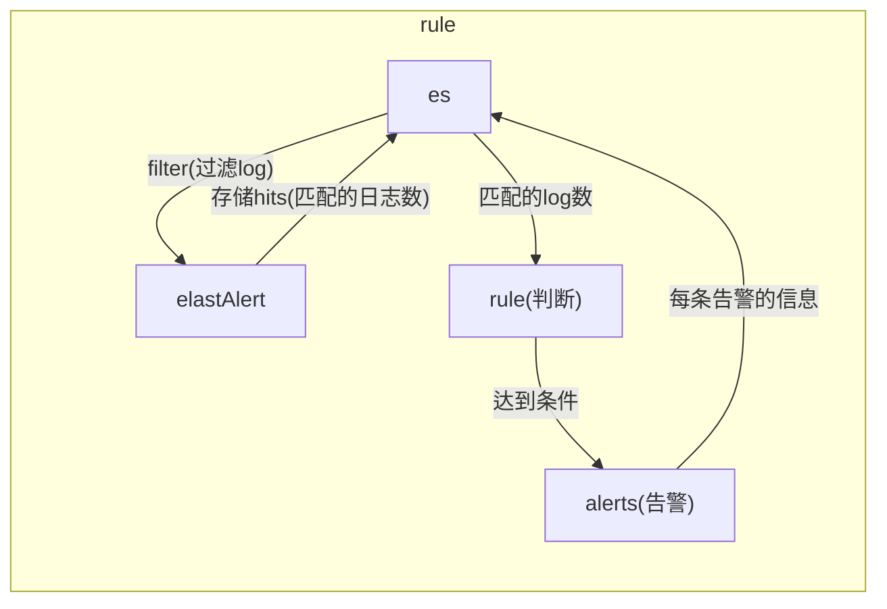

# elastAlert

<!-- @import "[TOC]" {cmd="toc" depthFrom=1 depthTo=6 orderedList=false} -->
<!-- code_chunk_output -->

- [elastAlert](#elastalert)
    - [基础概念](#基础概念)
      - [1.工作流程](#1工作流程)
      - [2.elastaler状态保存在es中](#2elastaler状态保存在es中)
      - [3.hits](#3hits)
      - [4.matchs](#4matchs)
      - [5.alerts](#5alerts)
      - [7.避免报警风暴](#7避免报警风暴)
    - [基本使用](#基本使用)
      - [1.elastAlert创建index（不是必须，运行时会自动创建）](#1elastalert创建index不是必须运行时会自动创建)
      - [3.测试rule](#3测试rule)
      - [4.运行elastAlert](#4运行elastalert)

<!-- /code_chunk_output -->

###  基础概念

#### 1.工作流程

#### 2.elastaler状态保存在es中
* elastalert_status
```
存储每一次触发的详细信息（即触发一次，就会产生一条记录）：
  hits数量
  matches数量
  alert是否成功
  match_body

#match_body包含触发告警的document的详细信息
#注意触发告警只能是一个document
#包含该document所在索引，agent信息，message内容等等
```
* elastalert_status_status
```
存储每一次触发的概要信息
  hit数量、match数量等
```
* elastalert_status_silence
```
存储被压缩的告警的信息
```
* elastalert_status_error
```
存储错误日志
```

#### 3.hits
查询es得到的日志的数量
注意：查询包括了**过滤**的动作

#### 4.matchs
经过rule处理后，达到了告警的要求的数量（为0或1）
注意：matches不代表发送了告警，有可能发送告警失败

#### 5.alerts
成功发送告警的次数


#### 7.避免报警风暴
我们在使用的时候要预防报警风暴（在实际使用中我们遇到过可能一分钟成百上千的错误，要是都是发出来，就有问题了）。我们利用下面的一些措施来控制报警风暴：
（1）aggregation： 设置一个时长，则该时长内，所有的报警（同一个配置文件内的报警）最终合并在一起发送一次：
（2）realert: 设置一个时长，在该时间内，相同 query_key 的报警只发一个
（3）exponential_realert： 设置一个时长，必须大于realert 设置，则在realert到exponential_realert之间，每次报警之后，realert 自动翻倍

***

### 基本使用

#### 1.elastAlert创建index（不是必须，运行时会自动创建）

```shell
docker run -it --name elastalert --rm \
-v $(pwd)/elastalert.yaml:/opt/elastalert/config.yaml \
-v $(pwd)/rules:/opt/elastalert/rules \
--entrypoint elastalert-create-index \
jertel/elastalert2
```

#### 3.测试rule
```shell
docker run -it --name elastalert --rm \
-v $(pwd)/elastalert.yaml:/opt/elastalert/config.yaml \
-v $(pwd)/rules:/opt/elastalert/rules \
--entrypoint elastalert-test-rule \
jertel/elastalert2 <rule_file_path>
```

#### 4.运行elastAlert
```shell
#可以设置起始和结束时间，如果设置了结束时间，程序运行完就立即停止
elastalert --verbose --config xx --rule rule文件名
```
