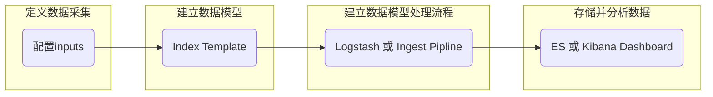

# filebeat
### 基础概念
#### 1.input
* 用于采集日志，包括从文件读取、从端口读取等
* 从一个input的采集的日志，存储在同一个index中（除非是动态index）
#### 2.index template
* 用于定义index的settings和mappings（类似于表结构）
* 要将数据传入es，必须要先设置index template
* 在output的时候，可以创建template（即指定template的name和pattern）
> 当模板已经存在时，不明确说明要覆盖的话，不会对该模板有任何影响  
> 当模板不存在时，则会利用默认配置和这里的相关配置创建相应的template    
* 其中有一项index pattern，用于设置匹配的index
>比如pattern设为"filebeat*"，则该模板会被应用到"filebeat*"的index上   

### 流程

### 配置filebeat
（1）设置input
```yaml
#当使用模块时，就将input设为false
filebeat.inputs:
- type: log
  path: xx
  index: xx         
#设置索引
#最好将ilm关闭，因为ilm匹配不到这个索引，会自动生成一个内容为空的索引
```
（2）导入kibana dashboard
```yaml
setup.dashboards.enabled: true
#设置可视化的索引，dashboard是由一个个可视化组成的
setup.dashboards.index: "xx"  
setup.kibana:
  host: "IP:PORT"
```
（3）output
```yaml
output.elasticsearch:
  hosts: ["IP:PORT"]
  index: "xyxy"           
#当es设置了index lifecycle management，这里的设置就无效
#如果设置了这项，必须设置template的name和pattern

#给自动加载的template取个名字
setup.template.index: "xx"

#指明将此template用于那个index，所以这里写的要匹配上面的index
setup.template.pattern: "xyxy*"       

#关闭index lifecycle management
setup.ilm.enabled: false
```
### 更多配置
**参考配置模板：/etc/filebeat/filebeat.refernce.yaml**
* input
```yaml
filebeat,inputs:

#支持的typ类型：
#   log,container,docker,kafka,redis,udp,tcp,syslog
  - type: xx

#打标签
    tags: ["xx"]

#增加额外信息到output
    fields:
      KEY:VALUE

#设置该input的索引
    index: "xx"
```
* general
```yaml
name: "xx"           
#用于设置该beat的名字，反应在agent.name字段

tags: ["xx1","xx2"]
#用于给beat打标，从而可以更利于分类

fields: {"key1":"vaule1","key2":"value2"}
#用于添加额外信息到输出中
fields_under_root: true
#设为true，如果添加的字段与原先冲突，添加的会覆盖原先的
```
* 加载外部配置文件  
```yaml
filebeat.config.inputs:
  enabled: true
  path: inputs.d/*.yml
```
* 配置queue（用于缓存，然后一次性输出）
```yaml
queue.mem:
  events: 4096                  #能够缓存4096个events
  flush.min_events: 512         #当达到512个时输出
  flush.timeout: 5s             #或当超过5s后输出
```
* output
```yaml
output.elasticsearch:
  hosts: ["IP:PORT"]
  indices:                      #根据条件设置index
    - index: "xx1"
      when.contains:
        message: "WARN"
    - index: "xx2"
      when.contains:
        message: "ERR"

output.elasticsearch:
  hosts: ["IP:PORT"]
  indices:
    - index: "xx"             #这里是动态的index才有意义，会进行映射      
      mappings:               #根据原先的index，映射成新的index
        xx1: "yy1"
        xx2: "yy2"
      default: "yy3"          #当没有匹配的时，就用默认的
```
* 扩展index template  
```yaml
output.elasticsearch:
  index: "customname-%{[agent.version]}-%{+yyyy.MM.dd}"
setup.template.name: "your_template_name"

#不使用默认模板，必须手动加载
setup.template.enabled: false
setup.template.fields: "path/to/fields.yml"     #这里面定义该template的内容，包括pattern

#覆盖已加载模板的配置
#setup.template.overwrite: true
```
* index lifecycle management  

管理索引，比如索引超过多少大小或多长时间，就打包在一起（起一个别名）
```yaml
#有三种模式：auto(默认，根据es的设置),true,false
setup.ilm.enabled: auto

#如果以下配置在模板加载以后设置，需要覆盖索引模板的配置
#setup.template.overwrite: true
setup.ilm.name: "xx"              #使用的策略的名字
setup.ilm.rollover_alias: "xx"    #rollover后，这些index的统称的名字
```
* 日志设置  

```yaml
logging.level: info         #debug,info,warning,error
logging.to_files: true
logging.files:
  path: /var/log/filebeat
  name: filebeat
  keepfiles: 7
  permissions: 0644
```
### modules
* 简化了常见日志格式的收集、解析和可视化  
* 一个module就是一个配置好的配置文件  
包括日志的路径、加载的index template和kibana dashboards等等
* 每个module都提供一些变量供用户修改，从而能改变一些设置，比如日志的路径等
* input是在module中定义的，但是可以覆盖；output是在module外定义的

（1）开启指定模块
```shell
filebeat list               #查看有哪些模块，哪些是enable的
filebeat enable xx          #开启某个模块
ls /etc/filebeat/modules/   #可以在该目录下的具体文件中，设置变量，从而修改模块的配置
```
（2）配置模块
```yaml
#/etc/filebeat/modules.d/nginx.yaml

- module: nginx
  access:
    enabled: true
    var.paths: ["xx"]

#可以 覆盖input ，包括type，paths，index等
#当覆盖paths时，上面的vars.paths就不要填了
    input:
      KEY: VALUE        #这里可以填input模块下的任何配置（比如index等）

#这里有两种日志，所以每种日志设置一个索引
  error:
    enabled: false

#/etc/filebeat/filebeat.yml
```
（3）配置kibbana dashboard和output
```yaml
setup.dashboards.enabled: true
#设置可视化的索引，dashboard是由一个个可视化组成的
setup.dashboards.index: "xx"  
setup.kibana:
  host: "IP:PORT"

output.elasticsearch:
  hosts: ["IP:PORT"]
#可以通过在input处设置index，从而区分不同的采集
#最好在output处区分，这里会更加灵活，可以在input处打标等
#自定义索引，就将ilm关闭
setup.ilm.enabled: false
```
（3）启动模块
```yaml
启动filebeat即可
```
### 注册表
/var/lib/registry
