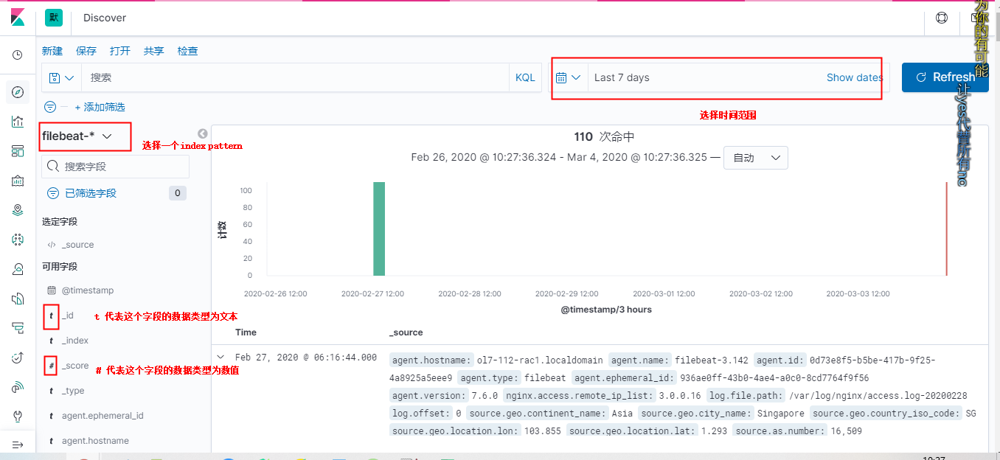
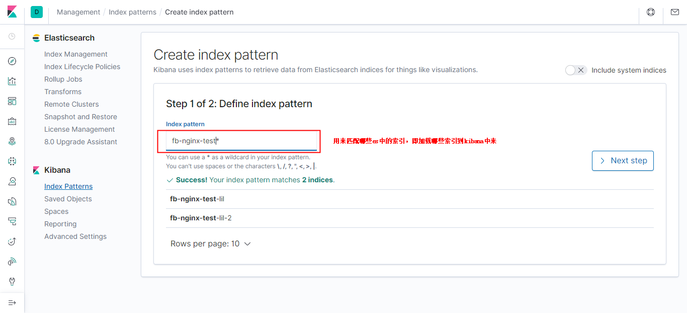
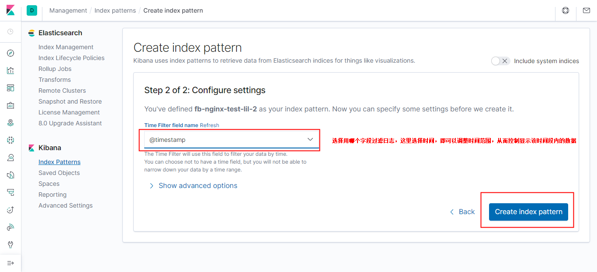
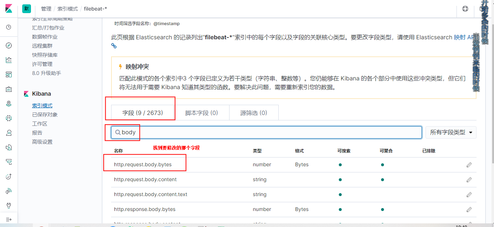
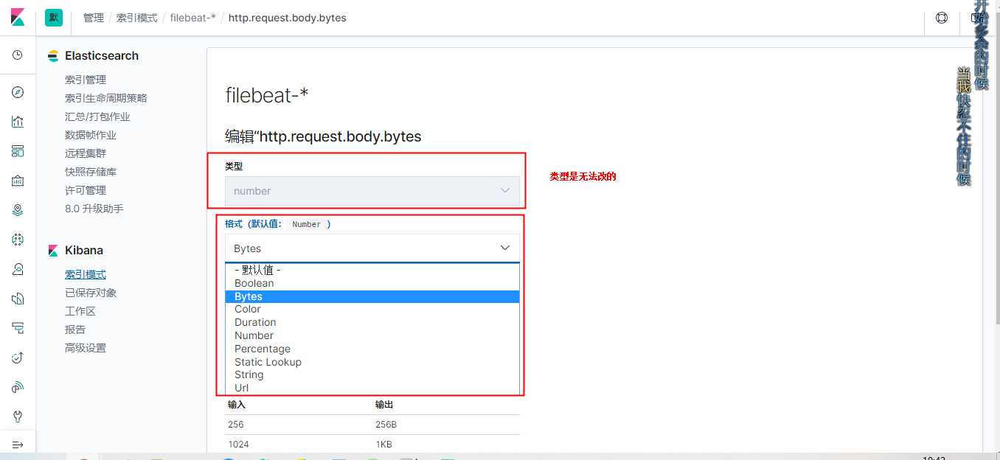

# kibana
### 基础概念
##### 1.index patterns
用于匹配es中的索引，即加载到kibana中来，可以使用通配符
>比如：es中有以下索引：test-1，test-aaa，testindex  
>可以利用test*匹配这些索引  

##### 2.discovery
可以显示匹配到的index中的日志
```
t          代表字段的类型为文本
#          代表字段的类型为数值
圆形图标    代表字段的类型为坐标
日历图标    代表字段的类型为时间
```


##### 3.visualize（可视化）
根据index patterns，找到对应Index，从而将该index中的数据用某些图形展示出来
一个visualize就是一个图形面板

（1）buckets
相当于分类器，一个类别就是一个桶，将属于同一类的document放入同一个桶中
* 比如 时间分类器，每个时间点是一个桶，一个桶内是这个时间点的document集合  
* 比如 词条分类器（terms），给定一个字段，该字段中的每一个值作为一个类别

（2）metrics
对每个桶中的document进行相关统计
* 比如 统计每个类别中document的数量（count）  
* 比如 统计每个类别中document的某个字段的值的总量，是将一个类别中所有document的这个字段的值相加得到的（sum）  

##### 4.dashboard
由一个个visualize组成

##### 5.kibana的数据存储
kibana的数据存储在es中的.kibana索引下

***
### 基本操作
#### 1.创建index patterns
（1）创建Index patterns





（2）查看


#### 2.修改某个字段的显示格式
比如一个数值类型的数据，可以设置显示格式为Bytes（即将数值转换为字节为单位的形式显示）

（1）找到那个字段所在索引


（2）找到那个字段



（3）修改显示格式


#### 2.visualize（可视化）

#### 3.dashboard
由一个个visualize组成
