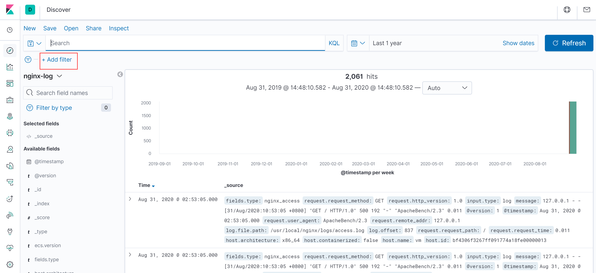
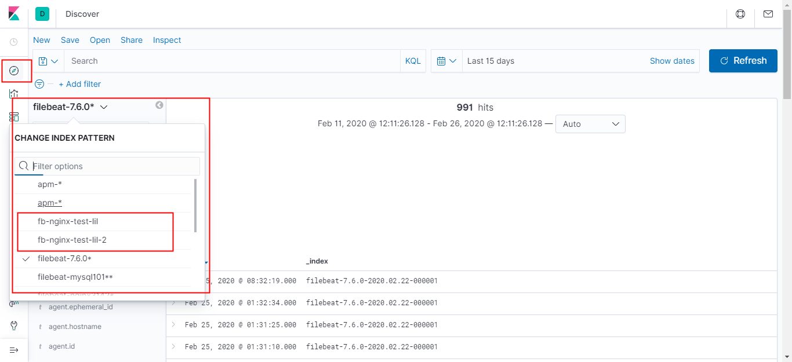
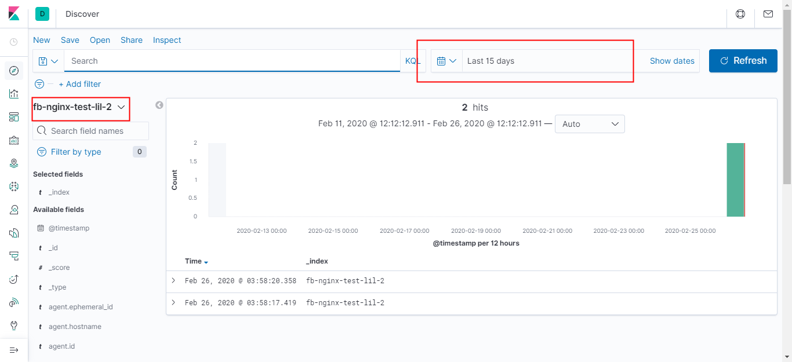
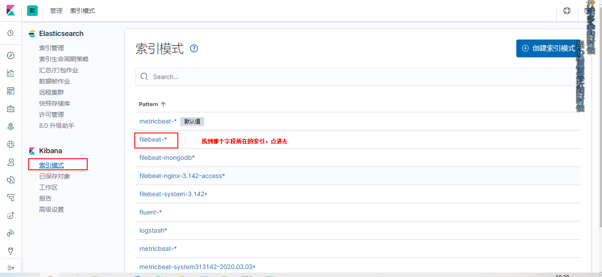

# kibana

<!-- @import "[TOC]" {cmd="toc" depthFrom=1 depthTo=6 orderedList=false} -->
<!-- code_chunk_output -->

- [kibana](#kibana)
    - [基础概念](#基础概念)
      - [1.index patterns](#1index-patterns)
      - [2.discovery](#2discovery)
      - [3.filter](#3filter)
      - [4.aggregation（在visualize中配置）相关概念](#4aggregation在visualize中配置相关概念)
        - [（1）buckets](#1buckets)
        - [（2）metrics](#2metrics)
        - [（3）split series](#3split-series)
        - [（4）split chart](#4split-chart)
      - [5.常用metric aggregation](#5常用metric-aggregation)
      - [6.常用bucket aggregation](#6常用bucket-aggregation)
        - [（1）bucket aggregation的排序（order）问题](#1bucket-aggregation的排序order问题)
      - [7.dashboard](#7dashboard)
      - [8.kibana的数据存储](#8kibana的数据存储)
    - [基本操作](#基本操作)
      - [1.创建index patterns](#1创建index-patterns)
      - [2.修改某个字段的显示格式](#2修改某个字段的显示格式)
      - [3.设置filter](#3设置filter)
        - [（1）设置单个条件](#1设置单个条件)
        - [（2）多个条件结合：](#2多个条件结合)

<!-- /code_chunk_output -->

### 基础概念

#### 1.index patterns
用于匹配es中的索引，即加载到kibana中来，可以使用通配符
>比如：es中有以下索引：test-1，test-aaa，testindex  
>可以利用test*匹配这些索引  

如果某个index patterns的匹配的index的某个字段类型为string，但是之后把这个index删除了，新创建了index，新创建的index的那个字段类型为integer，这时需要刷新该index patterns，不然index patterns的该字段的类型还是为string

#### 2.discovery
可以显示匹配到的index中的日志
```
t          代表字段的类型为文本
#          代表字段的类型为数值
圆形图标    代表字段的类型为坐标
日历图标    代表字段的类型为时间
```


#### 3.filter
用于过滤出符合要求的document
在discovery、visualize和dashboard中都可以使用


#### 4.aggregation（在visualize中配置）相关概念
根据index patterns，找到对应Index，从而将该index中的数据用某些图形展示出来
一个visualize就是一个图形面板

##### （1）buckets
相当于**分类器**，一个类别就是一个桶，将属于同一类的document放入同一个桶中
* 比如 时间分类器，每个时间点是一个桶，一个桶内是这个时间点的document集合  
* 比如 词条分类器（terms），给定一个字段，该字段中的每一个值作为一个类别

##### （2）metrics
对**每个桶中的document**进行相关**统计**
* 比如 统计每个类别中document的数量（count）  
* 比如 统计每个类别中document的某个字段的值的总量，是将一个类别中所有document的这个字段的值相加得到的（sum）  

##### （3）split series
在backet内，再进行一次分类
当有多个split series时，会进行组合
比如：
  * 一个split series设置的为request.status（当前数据有200和401两种情况）
  * 另一个split series设置的为request.path（当前数据有/和/index.html两种情况）
  * 所有就有4种分类：
    * 200-/
    * 200-/index.html
    * 401-/
    * 401-/index.html

##### （4）split chart
与split series类似，区别是：
* split series是在一个坐标轴上
* split chart是一个类别在一个坐标轴上

#### 5.常用metric aggregation
用于documents的指标

|metric aggregation|description|
|-|-|
|median|中值|
|percentiles|比如设为90，查询到的值为x，表示：`90%的值 <= x <= 10%的值`（中值就相当于50th percentiles）|
|percentile ranks|比如为90，查询到的值为x（百分比），表示：`x%的值 <= 90 <= (100-x)%的值`

#### 6.常用bucket aggregation
用于聚合bucket中的documents
|bucket aggregation|description|
|-|-|
|date histogram|按照时间分类|
|term|按照某个字段的值分类|

##### （1）bucket aggregation的排序（order）问题
* 比如有一下数据
```shell
doc1: {a:"1", b:"12", c:"33"}
doc2: {a:"2", b:"2", c:"3"}
doc3: {a:"3", b:"21", c:"31"}
doc4: {a:"1", b:"22", c:"33"}
doc5: {a:"2", b:"24", c:"34"}
doc6: {a:"1", b:"22", c:"33"}
```
比如采用term聚合方式（字段选a），一个term的值就是一个类别，则上面就能分为3类
order的方式比如设为document的数量，按照降序排列，size为1，表示会对这3类计算其中的documents的数量，然后按照降序排列，size为1表示只展示document最多的那一类的指标聚合（这里就是a: "1"的指标聚合）

#### 7.dashboard
由一个个visualize组成

#### 8.kibana的数据存储
kibana的数据存储在es中的.kibana索引下

***

### 基本操作

#### 1.创建index patterns
（1）创建Index patterns


（2）查看




#### 2.修改某个字段的显示格式
比如一个数值类型的数据，可以设置显示格式为Bytes（即将数值转换为字节为单位的形式显示）

（1）找到那个字段所在索引



（2）找到那个字段


（3）修改显示格式


#### 3.设置filter

##### （1）设置单个条件

* 某个key的value包含 某个词
```shell
<KEY>: <TERMS>
#比如：message: "error"
#过滤出：message内容中有error的日志
```

* 使用通配符过滤包含某个词的内容
```shell
#比如：
os:win*

#如果内容为：dsdswindows10, win11111111
#会匹配windows 10和 win11111111
#特殊符合不会被匹配，比如逗号
```

* 存在某个key
```shell
<KEY>:*
#过滤出存在这个key的日志
```

* 设置范围
```shell
reponse >= 400
```

##### （2）多个条件结合：
* or
* and
* 括号

```shell
response:200 and not (message:error or message:info)
```
