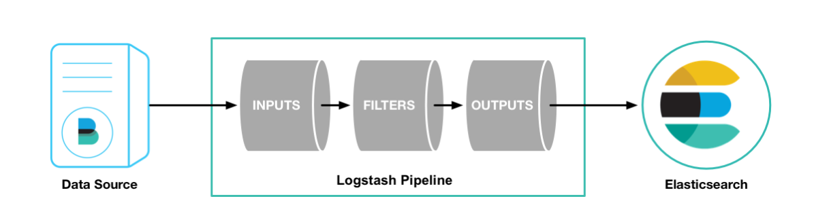

# logstash
[toc]
### 概述
#### 1.特点
* **接收**不同数据源的数据，进行**清洗**，**发往**指定目的地

#### 2.pipeline（数据管道）
串联的data processing elements的集合，
一个element的输出，是下一个element的输入

#### 3.logstash pipeline
logstash pipeline有三个elements：
* input
* filter
* output



#### 4.工作方式
* 每个input，都有一个单独的线程进行处理
* inputs将events写入内存或磁盘的中央队列，工作线程，会从该队列中取走一批事件进行处理
  * 取走的事件数量和工作线程数量都是可配置的
* logstash使用内存缓冲数据，如果logstash异常终止，数据会丢失
  * 为了防止这种情况，logstash可以启动持久化队列

#### 5.两类 配置文件
* pipeline配置文件
一般在`/etc/logstash/conf.d/`目录下
</br>
* settings配置文件
  </br>
  * logstash.yml
  用于配置logstash参数
  </br>
  * pipeline.yml
  用于配置pipeline
  </br>
  * jvm.options
  用于配置jvm的参数
  </br>
  * log4j2.properties
  用于配置log4j2
  </br>
  * startup.options（linux）
  用于配置logstash的启动参数

#### 6.codec
用于设置event的数据展现形式（比如：json格式、rubydebug形式等）

***

### 通用配置

#### 1.logstash.yml
```yaml
path:
  data: <PATH>        #用于持久化存储数据

config:
  reload:
    automatic: <BOOL,false>      #当设为true，会周期性检查配置文件是否改变并重新加载
    interval: <3s>               #多长时间检查一次
```

#### 2.pipeline.yml
* 用于配置pipeline
* 可以在一个logstash实例中启动多个pipeline
```yaml
#可以定义多个pipeline，一个pipeline是列表的一项
- pipeline:
    id: <id>            #比如：main
    workers: <NUM>      #配置workers线程数量，默认为当前可用cpu的数量
    batch:
      size: <NUM,125>         #每个worker一次最大可取的events数量
      delay: <NUM,50,毫秒>    #当worker取一个batch，但events数量不够，等待一个event的时长

  path:                 #pipeline具体内容的配置文件
    config: "<PATH or DIR or wildcard>"

  config:               #当没有配置path.config时，可以直接在这里配置pipeline的内容
    string: |
      input {}
      output {}

  queue:
    type: <memory or persisted>    #默认是用内存作为events缓存，但当主机宕机，数据容易丢失
                                   #设置为persisted，用磁盘作为events缓存
    path: <PATH>                   #当type为persisted时，需要设置path
```

***

### codec
#### 1.处理multiline events
* 如果用beats作为input的话，最好在beats端处理多行的情况
* 在logstash中处理多行event的方式：multiline codec

```shell
codec => multiline {
  pattern => "<PATTERN>"     #用于匹配行
  negate => <BOOLEAN>        #默认为false，即匹配符合上面正则的行
                             #当为true，匹配不符合上面正则的行

  what => "<DIRECTION>"      #有两个方向：
                             #previous，匹配的行是前一行的一部分
                             #next，匹配的行是下一行的一部分
}
```
