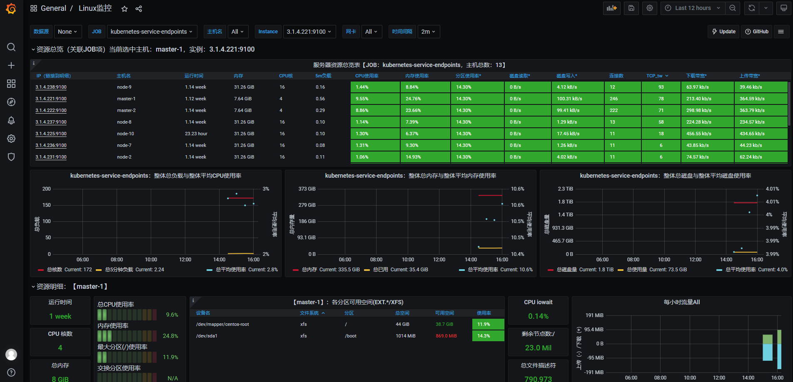
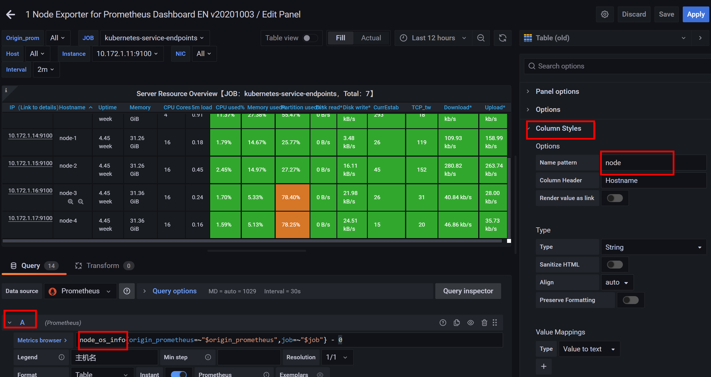
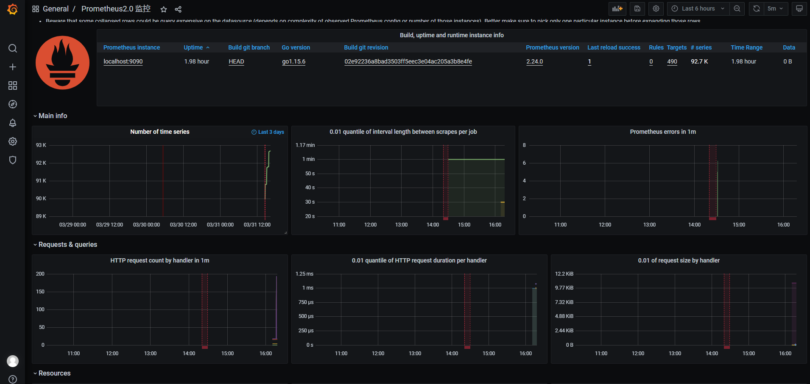
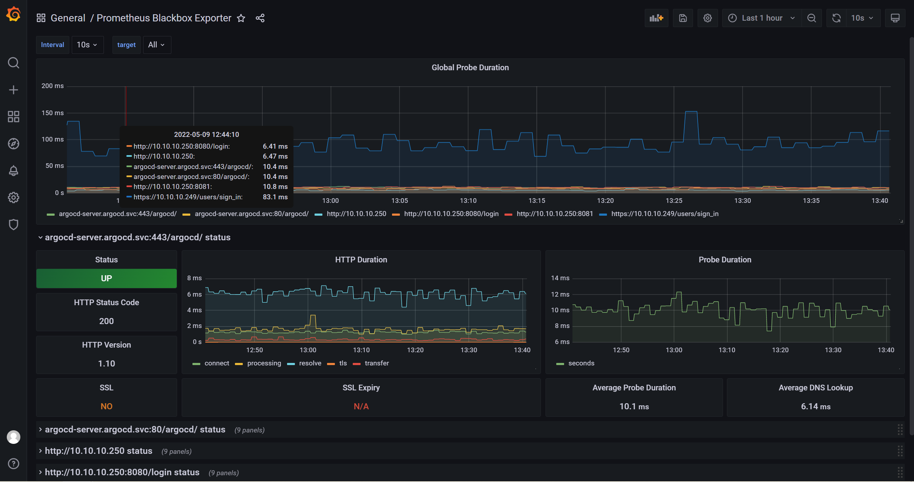

# dashboard

[toc]

### virtualizations组件

#### 1.table
多行合并为一行的条件：
* timestamp
* 可以有多个不同的label，但相同的label的值必须相同

***

### 常用dashboard

[dashboard网站](https://grafana.com/grafana/dashboards/)

#### 1.监控Linux：8919

* 可能需要修改一下table（存在bug）:

#### 2.监控prometheus：3681

#### 3.监控blackbox: 7587

#### 4.监控k8s：15520

