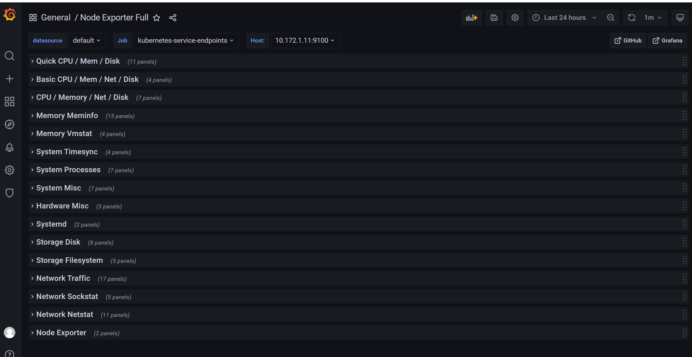
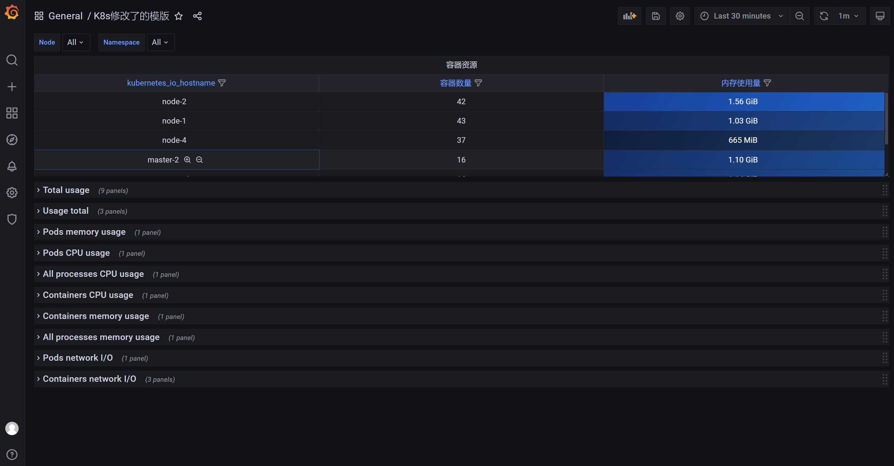
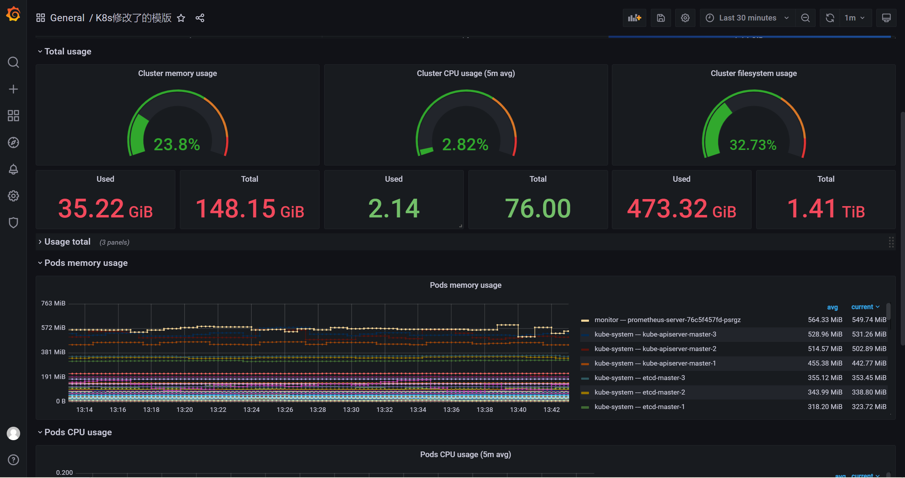
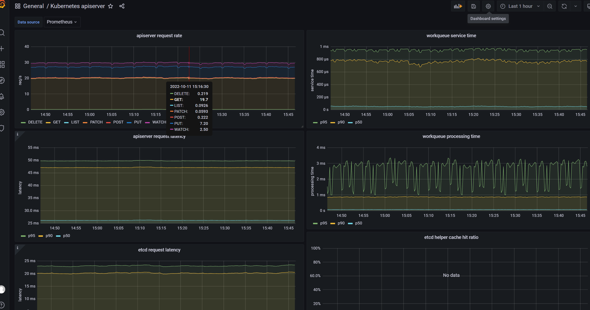
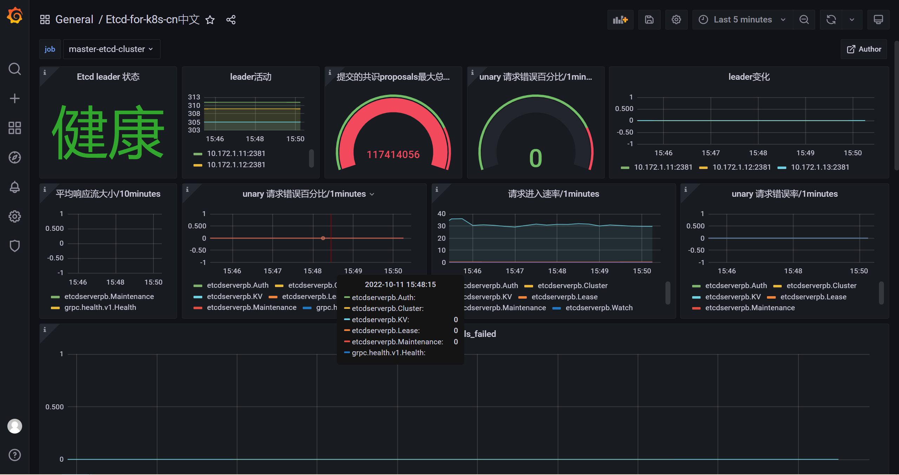
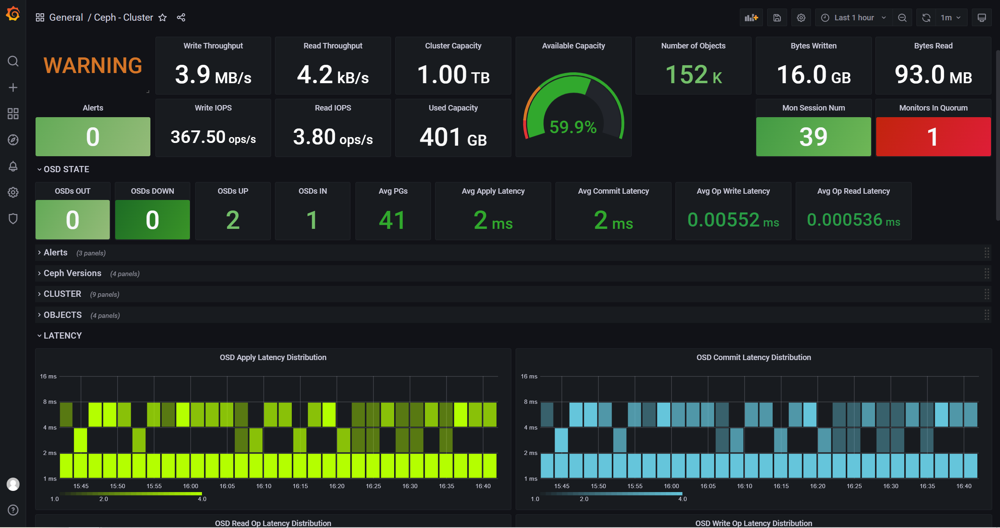

# dashboard

[toc]

### virtualizations组件

#### 1.table
多行合并为一行的条件：
* timestamp
* 可以有多个不同的label，但相同的label的值必须相同

***

### 常用dashboard

[dashboard网站](https://grafana.com/grafana/dashboards/)

#### 1.监控Node（基础信息）：8919

* 可能需要修改一下table（存在bug）:

#### 2.监控Node（全量信息）: 1860
* 包括网络的详细信息、系统的详细信息等

#### 3.监控prometheus：3681

#### 4.监控blackbox: 7587

#### 5.监控k8s：15520、11454

* 系统状态: 15520

* pv状态: 11454

* apiserver: 12006

#### 6.监控etcd: 9733

#### 7.监控ceph: 2842

