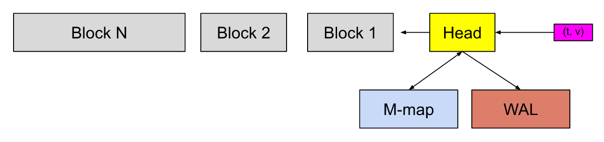

# perfermance

[toc]

### TSDB（内存 + 存储）

#### 1.专业术语

##### （1）chunk
一个chunk存储一种时间序列的sample（即`<metric>{<label>}`唯一标识一个chunk）

创建新的chunk的条件（旧的chunk会被压缩）：
* 当chunk满了（120个sample）
  * 比如采样周期为30s，则一个小时，旧的chunk就会满，就会创建新的chunk
* 该chunk存在的时间达到了chunkRange（默认2小时，这个值会动态调整）
  * 注意这个两小时，不是从启动时间开始，而是会对齐特定的时间（比如在12点钟的时候启动的，会在3点钟的时候进行flush，之后两小时flush一次）

##### （2）block
多个chunk放到一个block中，每两个小时的chunck会被放到一个block，存储到磁盘上

##### （2）head
当前时间的block被称为head，head在**内存**中

##### （3）WAL
write-ahead log，保证了head block中数据的安全，当prometheus重启后，head block中的数据会丢失，可以通过WAL恢复head block中的数据

##### （4）memory-map（2.19版本之后）
在head block中的某个chunk满了，会先将该chunk存储到磁盘中，然后内存中会保留相关索引，当需要时，会将该chunk读取内存

#### 2.sample的存储过程


* sample先存储到head block中（即内存中）
* 待一段时间后，会被flush到磁盘或者memory-map
  * memory-map中的数据之后也会被flush到磁盘

#### 3.需要的资源

##### （1）所需存储计算方式
```shell
needed_disk_space = retention_time_seconds * ingested_samples_per_second * bytes_per_sample
```

##### （2）所需要的内存
利用压测工具进行压测，进行测试

***

### 压测

#### 1.avalanche工具
[github地址](https://github.com/open-fresh/avalanche)

##### （1）拉取镜像
```shell
docker pull quay.io/freshtracks.io/avalanche:latest
```

##### （2）查看命令参数
```shell
docker run  --rm quay.io/freshtracks.io/avalanche:latest --help
```

##### （3）使用参数
```shell
--metric-count=500    #metric数量
--series-count=10     #序列的数量，即每次采集，会有：500*10个sample

--label-count=10      #每个metric的标签数量


--series-interval=864000  #多久更改一次序列的号码，即标签：cycle_id
--metric-interval=864000  #多久更改一次metrics的名字，默认120s
```
