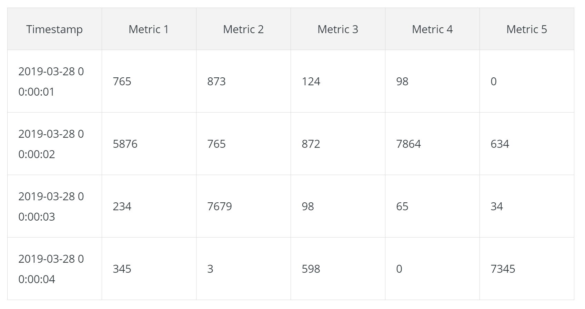

#overview

[toc]

### 预备知识

#### 1.时间序列
How Data is Structured in a Time-Series Database?



***

### 基础知识

#### 1.prometheus特点
* 所有查询基于**数学公式**
* 采用HTTP协议 pull/push两种采集方式

#### 2.架构图


#### 3.组件
* exporter
  * 客户端程序，用于pull模式
  * 以http-server的方式运行在后台
</br>
* pushgateway
  * 客户端程序，用于push模式
  * 用于设置自定义监控项
  * 工作原理：
  ```mermaid
  graph LR
  A[自定义脚本]-->|push采集到的数据|B[pushgateway]
  B-->|push|C[prometheus]
  ```

#### 4.相关名词

##### （1）metric
* 一个metric是一个**特征**
* 比如：
  * `node_memory_MemAvailable_bytes`（内存可用量）
  * `node_cpu_seconds_total`（cpu使用时间）
  * `http_requests_total`（http请求数）

##### （2）label
* 标识**不同维度**的**metric**
* 比如（`{<labels>}`)：
  * `node_memory_MemAvailable_bytes{instance="192.168.1.1:9100"}`（192.168.1.1这个主机的内存可用量）
  * `node_cpu_seconds_total{instance="192.168.1.1:9100，mode="idle"}`（192.168.1.1这个主机的cpu空闲时间）

##### （3）sample
* 一个sample就是 **时间戳 + 值：`(t,v)`**

##### （4）time series
* 连续的sample就是time series
* `<metric>{<labels>}`唯一标识一个时间序列

##### （5）instance（target）
* 能够抓取数据的endpoint

##### （6）job
* 具有相同目的的insance的集合
* 举例：
  * job: api-server
    * instance 1: 1.2.3.4:5670
    * instance 2: 1.2.3.4:5671
    * instance 3: 5.6.7.8:5670
    * instance 4: 5.6.7.8:5671

#### 5.标签（label）

##### （1）元标签（meta label）
* 以`__`开头的label供内部使用，不会出现在最终的时间序列中
  * 元标签会影响配置，详情见prometheus_config

##### （2）抓取时自动生成的标签（通过配置文件或者元标签生成）
* `job="在配置文件中配置的job_name"`
* `instance="<ip>:<port>"`

#### 6.metrics的主要类型
* gauge
瞬时状态，只有一个简单的返回值

* counter
计数器

* histogram
统计数据的分布情况

***

### 基本使用

#### 1.通过url获取exporter数据
`http://IP:PORT/metrics`

获取的数据如下：
```
# HELP node_sockstat_UDP_mem_bytes Number of UDP sockets in state mem_bytes.
# TYPE node_sockstat_UDP_mem_bytes gauge
node_sockstat_UDP_mem_bytes 12288
```
