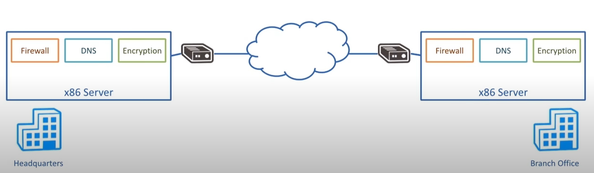

# overview

<!-- @import "[TOC]" {cmd="toc" depthFrom=1 depthTo=6 orderedList=false} -->
<!-- code_chunk_output -->

- [overview](#overview)
    - [概述](#概述)
      - [1.NFV(network function virtualization)](#1nfvnetwork-function-virtualization)
      - [2.与传统的network function比较](#2与传统的network-function比较)

<!-- /code_chunk_output -->

### 概述

#### 1.NFV(network function virtualization)
分离硬件和软件，能够在普通服务器上，部署网络功能（比如：防火墙、load balance等，不需要特定的设备）

#### 2.与传统的network function比较

