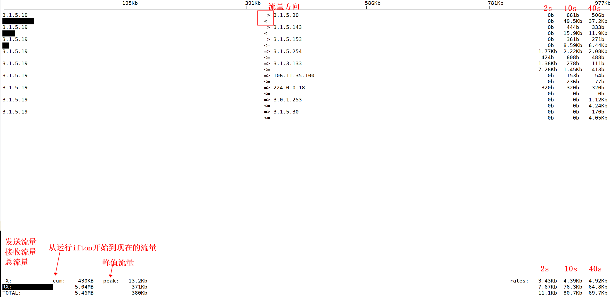

# iftop

<!-- @import "[TOC]" {cmd="toc" depthFrom=1 depthTo=6 orderedList=false} -->
<!-- code_chunk_output -->

- [iftop](#iftop)
    - [使用](#使用)
      - [1.展示](#1展示)
      - [2.参数](#2参数)
      - [3.常用组合](#3常用组合)

<!-- /code_chunk_output -->

### 使用

#### 1.展示


#### 2.参数
```shell
-n  #不解析主机名
-N  #不将端口号换成服务名
-p  #开启混杂模式，获取经过该网卡的流量，不能局域网内的所有流量

-B  #用字节作为单位（默认用比特作为单位）


-F <ip/mask>    #只获取该网段内的流量，即源ip 或 目标ip在该网段内

-t  #text，会连续打印输出，而不是动态变化，这样就可以看到记录

```
* shift+s 显示源port
* shift+d 显示目标port

#### 3.常用组合
```shell
iftop -nN -B
```
