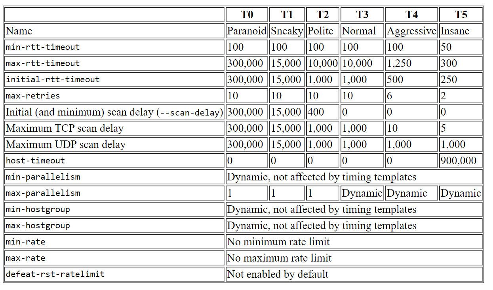

# nmap
[toc]
### 基础

#### 1.nmap的扫描默认有两个阶段
* 主机发现（-Pxx）
```shell
-Pn      #No Ping，跳过主机发现阶段
```
* 对在线的主机执行端口扫描（-Sxx)
```shell
-sn      #No port scan，跳过端口扫描阶段
```

#### 2.指定目标主机
* 主机名
```shell
nmap ... host1.local.com host2.local.com
```
* cidr
```shell
nmap ... 3.1.1.0/24
```
* 范围
```shell
nmap ... 3.1.1.1-50
```
* 以上三种形式混合

#### 3.nmap特点
##### （1）是有状态的扫描
* 会将状态存在内存中，这样有些请求失败，会再次进行请求，从而保证了更好的准确率

##### （2）自动调节
* 会在扫描过程中自动调节速度，以适应当前的网络状况

***

### 主机发现
#### 1.基本主机扫描方式
（1）`-sL`（List scan）
列出指定范围内在线主机，返回ip地址（如果有域名则返回域名）
不能与更高级的扫描（端口扫描等）结合使用

（2）**`-sn`（No port scan）**
跳过端口扫描阶段（即只进行主机发现），不加这一项，都会进行端口扫描
利用以下方式进行主机发现：
* icmp echo-request
* icmp timestamp-request
* SYN 到443端口
* ACK 到80端口  
* arp（在局域网内）

能够与更高级的扫描结合使用

（3）`-PS<port list>`（TCP SYN Ping）
（4）`-PA<port list>`（TCP ACK Ping)
（5）`-PU<port list>`（UDP Ping）
（6）`-PY<port list>`（STCP INIT Ping)
（7）`-PO<port list>`（protocol Ping）

（8）`--disable-arp-ping`

（9）`--traceroute`
***
### 端口探测（用于获取端口的状态）
#### 1.nmap端口扫描基于tcp以下特性：
* 收到SYN包，打开的tcp端口会回复SYN/ACK，其他端口会回复RST
* 收到ACK包，所有端口会回复RST
* 收到FIN包，打开的tcp端口不回复，其他端口回复RST

#### 2.nmap可以检测出的6种端口状态
|Port State|说明|可能出现该状态的扫描方式|
|-|-|-|
|open|检测到该port正处于listening状态|SYN|
|closed|该port能够响应nmap发送的探测包，但是并没有应用监听在此端口上|SYN|
|filtered|由于网络原因（比如防火墙），无法检测到该port</br>这会迫使Nmap重试几次，以防万一由于网络拥塞而不是过滤导致探针被丢弃。 这会大大降低扫描速度|SYN、ACK|
|unfiltered|**无法检测到该端口**，只能判断出其未被防火墙过滤</br>当用ACK扫描时会出现这种状态，用于判断端口是否被防火墙过滤</br>close或open端口收到ACK，都会回复RST|ACK|
|open\|filtered|port处于open或者filtered的状态</br>当用FIN、UDP等扫描时会出现这种状态</br></br>close的port接收到FIN，会直接回复RST</br>open的port接收到FIN，会不回复</br>通过不回复不能判断是open，因为不回复也有可能是filter的原因|FIN、UDP|
|closed\|filtered|当用idle方式扫描时，可能出现着这种状态|idle|

#### 3.基础端口扫描方式
（1）**`-sS`（TCP SYN scan）**
发送SYN包进行探测，不完成完整的tcp连接

（2）`-sA`（TCP ACK scan）
发送ACK包进行探测，用来检测端口是否被**filter**了


（3）`-sT`（TCP connect scan）
建立tcp连接，建议使用SYN扫描方式

（4）`-sU`（UDP scan）
速度慢的原因：
* 串行执行的
* open port和filter port可能不回复，所以超时后，会进行重发

（5）`-sY`（SCTP INIT scan）
类似于tcp的SYN扫描方式

（6）`-sO`（IP protocol scan）
扫描哪些ip协议是打开的


#### 4.高级端口扫描方式
（1）`-sI`（idle scan）
利用一台中间空闲机器去扫描
原理：
* 与中间机通信，获取当前的ip id
* 伪造SYN请求，以中间机身份发往目标机，目标机会回应中间机
* 与中间机通信，获取当前的ip id，与开始的ip id进行比较，如果增加1，表示中间机没有回复目标机（可能收到目标机发来的RST包，或者没有收到任何包），如果增加2，表示中间机回复了目标机，如果增加很多，表示中间机增长机制可能是随机的或者忙于通信

#### 5.选项
（1）指定端口
```shell
#默认只扫描1000个常用端口
#指定扫描端口
-p 1-65535
```
***
### 版本探测
#### 1.尝试获取的信息
* 端口使用的服务协议
* 应用的名称
* 版本号
#### 2.原理
与端口进行通信，根据返回的相关信息，从而判断该端口提供的协议，进而获取应用名称和版本号
#### 3.命令：`-sV`
***
### OS探测
#### 1.尝试获取的信息
* 主机名
* 设备类型
* os family
#### 2.原理
向多个端口发送指定报文，根据返回的信息生成系统指纹，对比系统指纹库，寻找最接近的系统
#### 3.命令：`-O`

***

### 脚本探测
#### 1.概述
* 脚本扫描被认为是有侵入性的，因此，未经许可不能使用

#### 2.命令：`-sC`

***

### 深入扫描（Aggressive scan）
#### 1.概述
会进行以下几个方面的扫描
* OS扫描（`-O`）
* 版本扫描（`-sV`）
* 脚本扫描（`-sC`）
* 路由跟踪（`--traceroute`）

#### 2.命令：`-A`

***

### 优化
影响nmap性能的主要因素是**网络状况**，而不是进程数量等
所以，nmap是一个**单实例**，有一个**内置的并行系统**
提高效率的本质方法：
* 降低准确率（减少扫描端口、减少重试次数、减小超时时间等）（**端口数量影响最大**）
* 增加网络带宽
* 减少UDP的等待时长
#### 1.减少扫描的端口：`--top-ports`
* 默认扫描最常用的1000个端口
* `-F` 使用该选项，只扫描`/etc/services`中的端口（大约一百多个）

#### 2.不进行DNS解析
* `-n`

#### 3.时间优化选项
##### （1）`--min-hostgroup`
* 主机组大小，nmap每次只扫描一个主机组
* 主机组越大，效率越高，每个主机组扫描完，才会有相应结果输出
* 这个参数，对于主机发现阶段无效，对端口扫描阶段有效
* 对于C类网段，主机组最好设置为256，当主机开放的端口比较多时，主机组小一些比较好

##### （2）`--min-parallelism`
并且启动的扫描数 最小为多少
nmap会根据当前网络状况，自动调节

##### （3）`--min-rtt-timeout`
探测的超时时间

##### （4）`--max-retries`
最大重试次数

##### （5）`--host-timeout`

##### （6）`--min-rate`
每秒发送探测包的速率
`--min-rate 100 --max-retries 0` 能够模拟无状态扫描
`--min-rate`可以设为200等，如果速率过快，结果可能会错误，后果自负

#### 4.扫描参数模板（五个模板）：`-T<NUM>`

##### （1）paranoid（`-T0`，多疑的）
很慢的探测，防止引起对方系统的怀疑

##### （2）sneaky（`-T1`，鬼鬼祟祟的）

##### （3）polite（`T2`，礼貌的）

##### （4）normal（`T3`，正常的）(默认使用的是这个模板)

##### （5）aggressive（`T4`，侵略性的）

##### （6）insane（`T6`，疯狂的）

#### 5.常用组合
```shell
nmap -A -n -T5  --min-rate 100 --max-retries 2 --top-ports 100 ...
```
