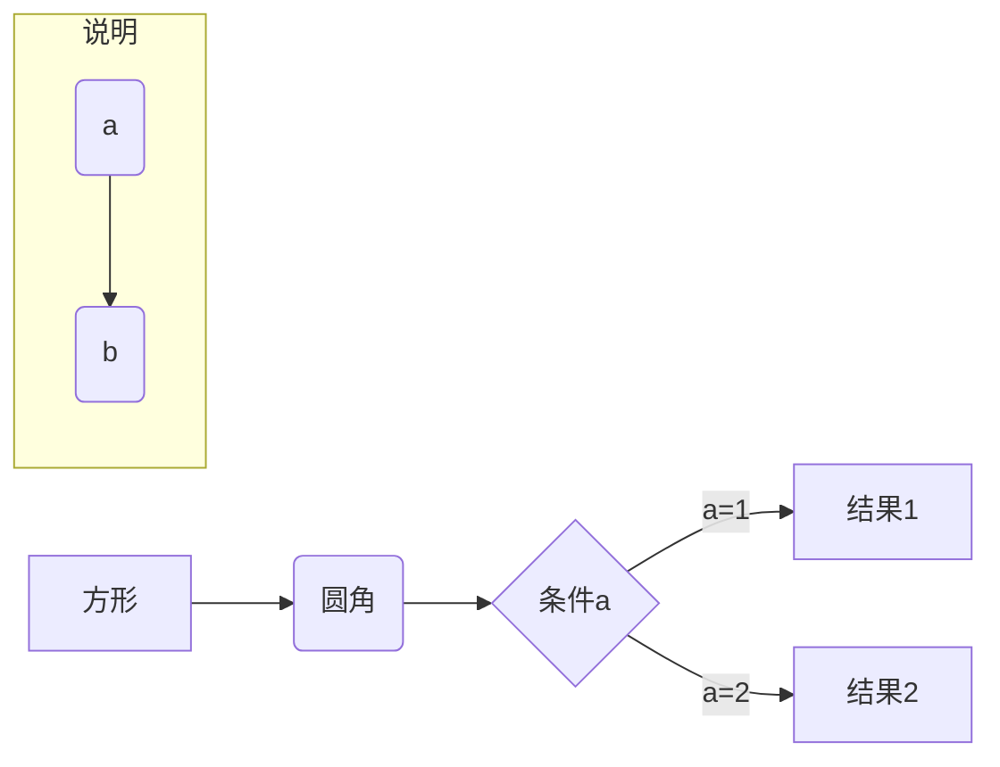

# 基础语法
## 分级标题
```
# xx      //一级标题
## xx     //二级标题
...以此类推
```
## 换行
```
xx        //结尾需要两个空格
```
## 分割线
```
***
效果如下：
```
***
## 加粗和斜体
```
*xx*        //斜体
**xx**      //加粗
***xx***    //斜体加粗
效果如下：
```
*xx*
**xx**
***xx***
## 上下标
```
<sup>xx</sup>     //上标
<sub>xx</sub>     //下标
效果如下：
```
a<sup>b</sup>
a<sub>b</sub>
## 插入链接
```
[显示名称](链接到的地址)
效果如下：
```
[test](http://baidu.com)
## 插入图片
```


//xx1：如果图片不能显示就显示该文件
//xx2：图片地址，可以是本地的相对路径（比如：./a.img)
//xx3：将鼠标放图片上显示的文字

效果如下：
```

# 高级用法
## 列表
### 无序列表
```
* xx1     
* xx2
...以此类推
效果如下：
```
* xx1
* xx2

### 有序列表
```
1. xx1
2. xx2
...以此类推
效果如下：
```
1. xx1
2. xx2

### 任务列表
```
- [ ] xx   //未做列表
- [x] xx   //已做列表
效果如下：
```
- [ ] xx
- [x] xx  

## 代码块
```
\`\`\`        //后面可以接具体语言，如python
代码
\`\`\`

或者

`代码`
```
## 表格
```
| 来分隔不同的单元格
- 来分隔表头和其他行
-: 设置内容和标题栏居右对齐。
:- 设置内容和标题栏居左对齐。
:-: 设置内容和标题栏居中对齐。
效果如下：
```
|t1|t2|t3|
|-|-|-|
|sa|aa|bb|

## 区块
```
> xx
>> xx
>>> xx
效果如下：
```
> xx
>> xx
>>> xxx

## 画图
```python
代码块类型为：mermaid

graph LR    
#LR：left to right
#RL：right to left
#TD: Top to Down

A["方形"]       //A是这个图形的名字，方形里面显示的文字是“方形”
("圆角"")
{"菱形"}

A --> B       //设置箭头方向（这一个方向，可以调换图形的名字，从而改变指向）

A --说明-->B


subgraph xx       //大图里包含小图，xx显示在大图内的说明
                  //大图无法直接相连，需要通过大图中的元素相连
  这里嵌套小图语法
end

#例子：       
graph LR
A["方形"] --> B("圆角")
B --> C{"条件a"}
C --"a=1"-->D[结果1]
C --"a=2"-->E[结果2]
#效果如下：
```

