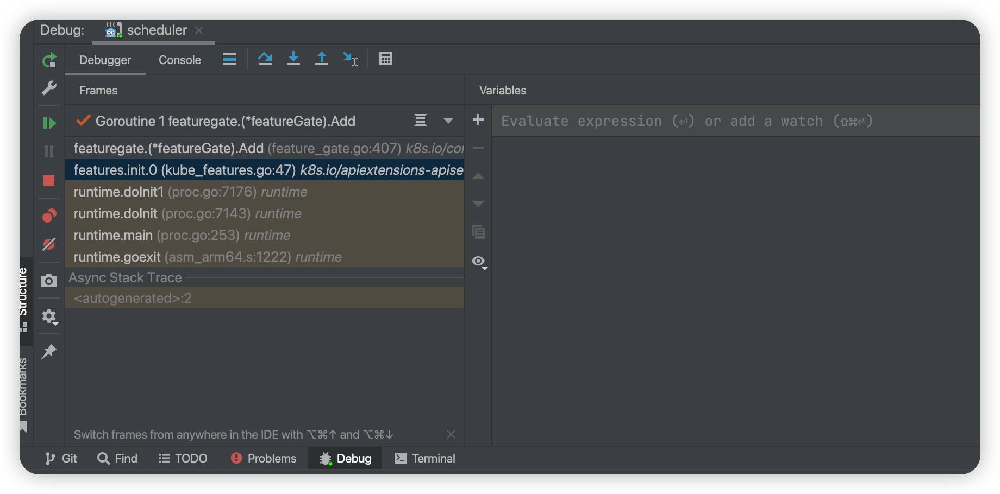

# Debug


<!-- @import "[TOC]" {cmd="toc" depthFrom=1 depthTo=6 orderedList=false} -->

<!-- code_chunk_output -->

- [Debug](#debug)
    - [Overview](#overview)
      - [1.compile-time vs runtime](#1compile-time-vs-runtime)
      - [2.Package-Level Variables (go)](#2package-level-variables-go)
      - [3.watch Package-Level Variables](#3watch-package-level-variables)
      - [4.pay attention to stack trace and gorutines](#4pay-attention-to-stack-trace-and-gorutines)

<!-- /code_chunk_output -->


### Overview

#### 1.compile-time vs runtime

* something can only be understood at compile-time or runtime
* e.g.
    ```go
    import (
        utilversion "k8s.io/apiserver/pkg/util/version"
    )
    ```
    * compile-time can understand `utilversion` which runtime doesn't understand
    * runtime only understands `k8s.io/apiserver/pkg/util/version`
    * so when debug, evaluate variables in `utilversion`:
        * `"k8s.io/apiserver/pkg/util/version".klogLevel` instead of `utilversion.klogLevel`

* e.g.
    * define an varaible
    ```go
    var v1 func(name string) int
    ```
    * during compile-time, you can only see the type of the variable
    * during runtime, you can see the value of variable

#### 2.Package-Level Variables (go) 
* Can't You Set a Breakpoint for Package-Level Variables, because
    * Package-Level Variables Are Initialized at Compile-Time
    * the compiler will generate implicit initialization code
* e.g.
    * Package-Level Variables
    ```go
    var b = testinit()
    ```
    * generated implicit initialization code by compiler
    ```go
    func init() {
        b = testinit()
    }
    ```

#### 3.watch Package-Level Variables
e.g. `"k8s.io/apiserver/pkg/util/version".DefaultComponentGlobalsRegistry`

#### 4.pay attention to stack trace and gorutines
