# syntactic analysis


<!-- @import "[TOC]" {cmd="toc" depthFrom=1 depthTo=6 orderedList=false} -->

<!-- code_chunk_output -->

- [syntactic analysis](#syntactic-analysis)
    - [概述](#概述)
      - [1.语法分析](#1语法分析)
        - [(1) 任务](#1-任务)
        - [(2) 分析方法](#2-分析方法)
      - [2.自上而下: 推导](#2自上而下-推导)
        - [(1) 解决左递归问题](#1-解决左递归问题)
        - [(2) 解决回溯问题](#2-解决回溯问题)
      - [3.LL(1) (自上而下推导)](#3ll1-自上而下推导)
        - [(1) FIRST和FOLLOW集](#1-first和follow集)
        - [(2) grammar](#2-grammar)
        - [(3) 构建分析表](#3-构建分析表)
        - [(4) parser (算法过程)](#4-parser-算法过程)
        - [(5) 举例](#5-举例)
      - [4.递归子程序 (自上而下推导)](#4递归子程序-自上而下推导)
      - [5.算符优先文法 (自下而上归约)](#5算符优先文法-自下而上归约)
        - [(1) 算符文法](#1-算符文法)
        - [(2) 算符优先文法](#2-算符优先文法)
        - [(3) FIRSTVT() 和 LASTVT()](#3-firstvt-和-lastvt)
        - [(4) 优先表构造](#4-优先表构造)
        - [(5) 算法](#5-算法)
        - [(6) 总结](#6-总结)
      - [6. LR (自下向上)](#6-lr-自下向上)
        - [(1) 基本概念](#1-基本概念)
        - [(2) 分析动作 表 和 状态转移 表](#2-分析动作-表-和-状态转移-表)
      - [6. LR(0) 分析表](#6-lr0-分析表)
        - [(1) 项目](#1-项目)
        - [(2) 构建识别活前缀的DFA](#2-构建识别活前缀的dfa)
        - [(3) 构建分析表](#3-构建分析表-1)
      - [7.SLR(1)](#7slr1)
        - [(1) 解决冲突](#1-解决冲突)
        - [(2) 算法概述](#2-算法概述)
      - [8.LR无法解决所有二义问题](#8lr无法解决所有二义问题)

<!-- /code_chunk_output -->

### 概述

#### 1.语法分析

##### (1) 任务
* 在词法分析识别出单词符号串的基础上
    * 分析并判定程序的语法结构是否符合语法规则
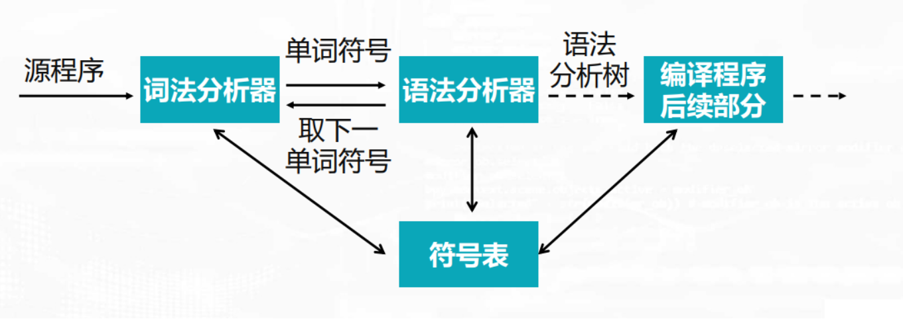

##### (2) 分析方法

* 自上而下
    * 从文法的开始符号出发
    * 根据产生式规则，往下进行推导
    * 判断是否能够推导出给定句子

* 自下而上
    * 从输入串开始
    * 逐步进行归约
    * 判断是否能够归约到文法的开始符号

#### 2.自上而下: 推导

##### (1) 解决左递归问题

* 问题描述:
    * 比如生成式: A -> Aa|b，则当试图匹配输入串时，会无限往左递归
        * 因为匹配输入串时，需要从左开始
* 解决: 消除左递归
    * 消除直接左递归
        * 原生成式: 
            * P -> Pα|β
        * 消除后生成式: 
            * P -> βP’
            * P’-> αP’| ɛ
    * 消除间接左递归
        * 原生成式:
            * S -> Qc|c
            * Q -> Rb|b
            * R -> Sa|a
        * 分析:
            * 存入如下左递归: S => Qc => Rbc => Sabc
            * 消除左递归: R -> Rbca|bca|ca|a
        * 消除后生产式
            * S -> Qc|c
            * Q -> Rb|b
            * R -> bcaR’|caR’|aR’
            * R’ -> bcaR’|ε

##### (2) 解决回溯问题

* 问题描述:
    * 当匹配到一定程度，发现无法继续匹配，则会向上回溯
* 解决: 提取左因子
    * 原生成式:
        * A -> δβ1 | δβ2 | ... | δβn | α1 | α2 | ... | αm
    * 提取左因子后的生成式:
        * A -> δA’ | α1 | ... | αm 
        * A’ -> β1 | β2 | ... | βn

#### 3.LL(1) (自上而下推导)

* L: left-to-right (从左向右扫描)
* L: leftmost derivation (最左推导)
* 1: 每次会使用前瞻字符（即当前输入字符的下一个字符）来帮助决策

##### (1) FIRST和FOLLOW集
* FIRST(X)
    * 表示X生存式，能够产生的句子的首个终止符
        * * 因为生成式最终会生成句子，即不含有非终止符
    * 比如: 
        * 存在生成式: 
            * F -> abc
            * F -> dd
        * 则FIRST(F) = {a,d}
* FLLOW(A)
    * 表示紧跟A后面的终止符
        * 因为生成式最终会生成句子，即不含有非终止符
    * 能够从开始符，推导出这种格式 S =*> $\alpha A\beta$，则FLLOW(A) = FIRST($\beta$)
        * 其中开始符的FOLLOW(S)=#
    * 比如：
        * 存在生成式: 
            * 开始符号是E
            * F -> Eab
        * 则FOLLOW(E) = {#,a}

##### (2) grammar
* 分析表不含多重入口（即二义性）就是LL(1)文法
    * 对于每一个非终止符A的 任何两个不同的生成式 -> $\alpha|\beta$，满足
        * $FIRST(\alpha)\cap FIRST(\beta)=\empty$
        * 若β =*> ɛ，$FIRST(\alpha)\cap FOLLOW(A)=\empty$
* LL(1)具有的性质:
    * 没有二义
        * 可通过消除回溯方法达到
    * 不会发生左递归
        * 可通过消除左递归方法达到
* 不是所有文法都可以转换成LL(1)文法

##### (3) 构建分析表
* 行是生成式
* 列是终止符
* 元素是 当指针处于指定终止符时，非终止符对应的生成式
* 构建分析表
    * 对于每个生成式A进行如下操作
    * 对于终止符a ∈ FIRST(A)，则M[A,a]的元素就是该生成式
    * 若ɛ ∈ FIRST(A)，对于终止符a ∈ FOLLOW(A)，则M[A,a]的元素就是该生成式

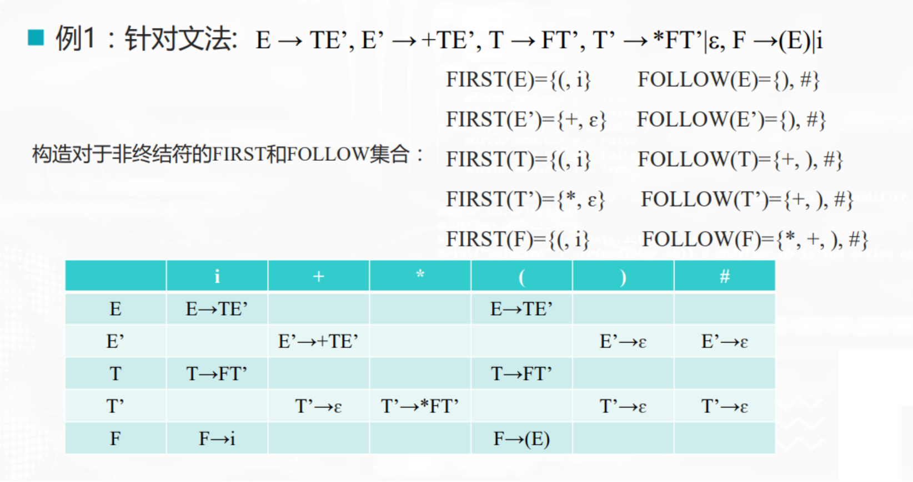

##### (4) parser (算法过程)

* 说明
    * 在输入串后 和 分析栈stack 中放入 `#`
    * X代表stack的栈顶元素，a代表指针指向的输入串字符（刚开始指向最左边的字符）
    * 开始: 把开始符push到stakc中
    * 比较X和a
        * 存在如下情况:
            * 1.若X=a=“#”，则成功并停止分析
            * 2.若X=a≠“#”，则把X弹出，a指向下一个输入符
            * 3.若X ∈ Vn，则查分析表
            * 若X ∈ VT且X≠a，则报错并停止分析
        * 重复比较步骤，直到停止分析

* 表示: $ X \xrightarrow[i]{a} Y $
    * 当栈顶是X，指针指向输入串字符a时，判断条件符合i(i是上述1、2、3中的某个)，栈变为Y

##### (5) 举例
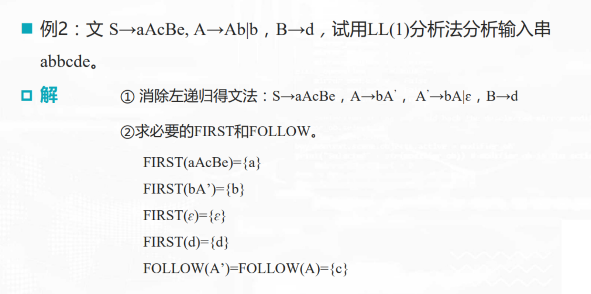
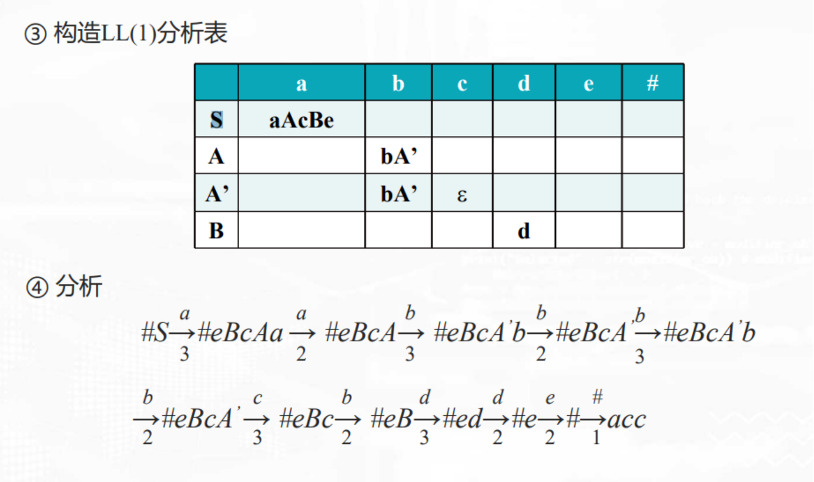

#### 4.递归子程序 (自上而下推导)

* 一个非终止符对应一个子程序
* SYS: 代表当前指针指向的输入字符
* ADVANCE: 代表移动指针，指向下一个输入字符

* 比如，存在生成式
    * E -> TE’
        * 对于子程序
        ```
        PROCEDURE E；
        BEGIN
            T；E’
        END
        ```
    * F -> (E) | i
        * 对应子程序
        ```
        PROCEDURE F；
        IF SYM=‘i’ THEN
            ADVANCE
        ELSE
            IF SYM=‘(’ THEN
            BEGIN
                ADVANCE;
                E；
                IF SYM=‘)’ THEN
                    ADVANCE
                ELSE ERROR
        END
        ELSE ERROR;
        ```
    

#### 5.算符优先文法 (自下而上归约)

##### (1) 算符文法
生成式右边不存在相邻的非终止符，形如: …QR…

##### (2) 算符优先文法

* 对于任何一对终止符a,b，可能存在下面三种关系
    * $a \eqcirc b$
        * 当且仅当文法G中含有形如P -> …ab… 或P -> …aQb…的产生式
    * a <· b
        * 当且仅当G中含有形如P -> …aR… 的产生式，而R =+> b… 或 R =+> Qb…
    * a ·> b 
        * 当且仅当G中含有形如P→…Rb… 的产生式，而R =+> …a 或 R =+> …aQ
* 算符优先文法
    * 对于算法文法中的任意两个终止符，至多满足上述一种关系（即不能满足多种或者一个都不满足）

##### (3) FIRSTVT() 和 LASTVT()
* FIRSTVT(P) = {a|P =+> a… 或 P =+> Ra… }
    * P经过若干推导后的第一个终止符

* LASTVT(P) = {a|P =+> …a 或 P =+> …aR }
    * P经过若干推导后的最后一个终止符

##### (4) 优先表构造
* 检查所有生成式
    * 若有P -> …aQb… 或 P -> …ab…的产生式，则$a \eqcirc b$
    * 若有形如…aP…的候选式，则a <· b (其中b ∈ FIRSTVT(P))
    * 若有形如…Pb…的候选式，则a ·> b (其中a ∈ LASTVT(P))
* 构造顺序
    * 先找出所有相等的
    * 再找出所有小于的
    * 最后找出所有大于的

* 举例
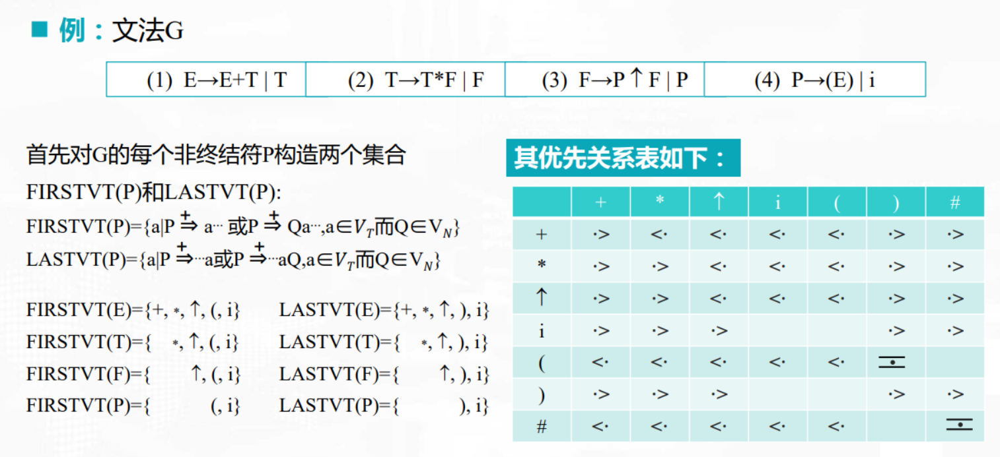

##### (5) 算法

* 最左素短语
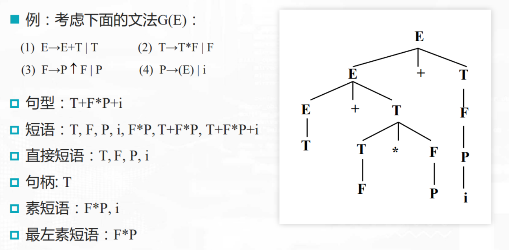

* 通过算法寻找最左素短语
    * 算符优先文法句型
        * #$N_1a_1N_2a_2…N_na_nN_{n+1}$#
            * 其中每个$a_i$都是终结符，$N_i$是可有可无的非终结符
    * 寻找满足如下条件的最左子串： $N_ja_j…N_ia_iN_{i+1}$
        * 其中 $a_{j-1} <· a_j$
        * $a_j \eqcirc a_{j+1}, ... , a_{i-1} \eqcirc a_i $
        * $a_i ·> a_{i+1}$ 

* 举例
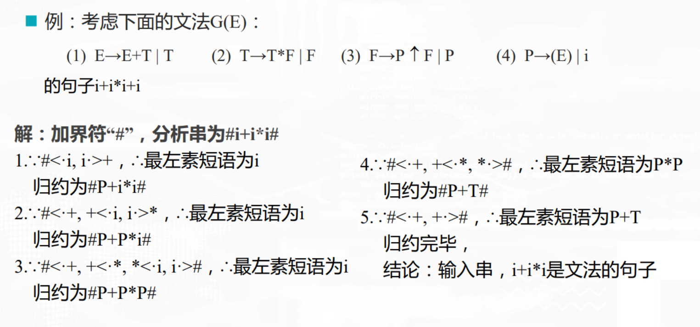

##### (6) 总结
* 优点
    * 简单，快速
* 缺点
    * 可能**错误**接受非法句子，能力有限

#### 6. LR (自下向上)
* L: left to right
* R: Rightmost derivation in reverse

##### (1) 基本概念
* 可归约前缀 和 活前缀
    * 字符串前面可归约的前缀成为可归约前缀
    * 不可归约的前缀成为活前缀

##### (2) 分析动作 表 和 状态转移 表
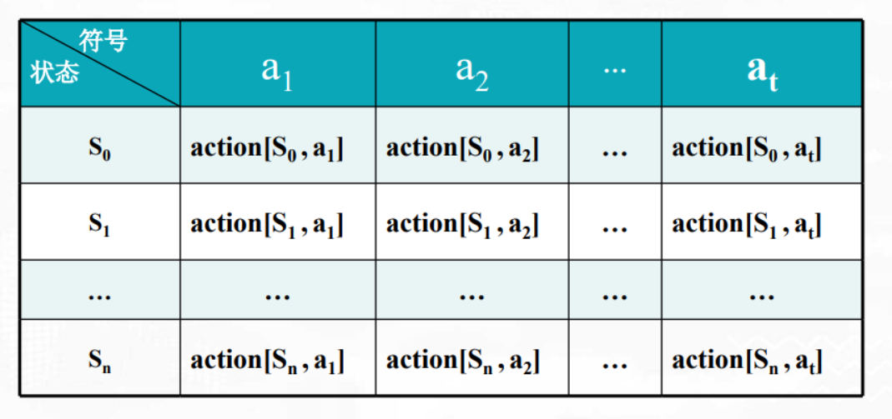
* 识别为活前缀的，则移进；识别为可归前缀的，则归约
* $action[S_i,a_j]$
    * 表示当状态为$S_i$，输入符号为$a_j$ (终止符iu)，执行该动作
    * 有四种可能的动作
        * 移进(S)
        * 归约(r)
        * 接受(acce)
        * 出错(error)


* 为了识别活前缀及可归前缀
* $goto[S_i,X_j]$
    * 表示当状态为$S_i$时，输入符号为$X_j$ (非终止符)，则转移到指定状态

#### 6. LR(0) 分析表
对一个文法的LR(0)项目集规范族不存在移进归约或归约归约冲突时，称该
文法为LR(0)文法

##### (1) 项目
* 用于描述分析过程中，已经归约的部分和等待归约的部分
* 一个项目就是一种分析过程中的状态
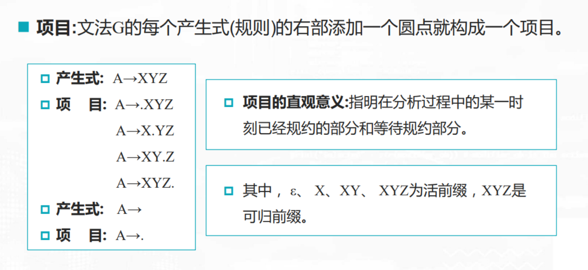
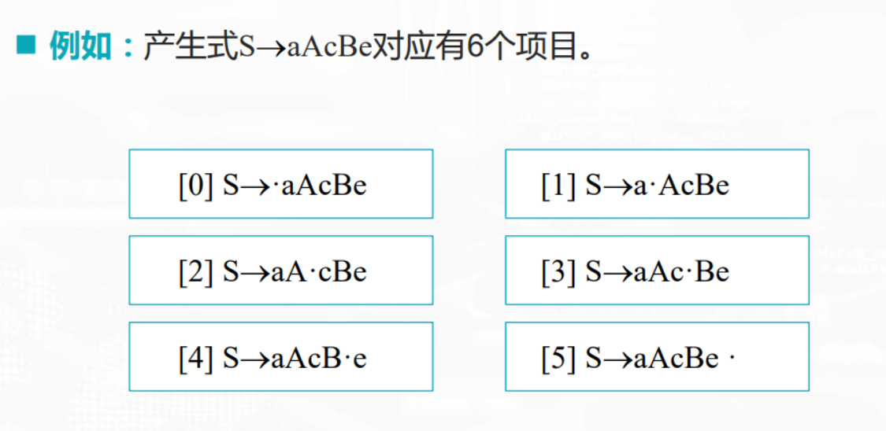

* 项目集规范族
    * 一种状态就是项目集合
    * $S_i是S_k$关于符号X的后继状态
        * 则$BASIC(S_i)=\{A -> \alpha X.\beta \}$
            * 其中$A -> \alpha.X\beta \in S_k$
            * 即当输入字符是X时，$S_i是S_k$的下一个状态
        * 则$CLOSURE(S_i)$，包括
            * $BASIC(S_i)$
            * .后面如果紧跟非终止符且有相应的生成式，则进行相应转换，转换后，继续重复
    * $GOTO(S_k,X) = S_i$
        * 规定了识别文法规范句型活前缀的DFA从状态I(项目集)出发，经过X弧所应该到达的状态(项目集合)

* 分类
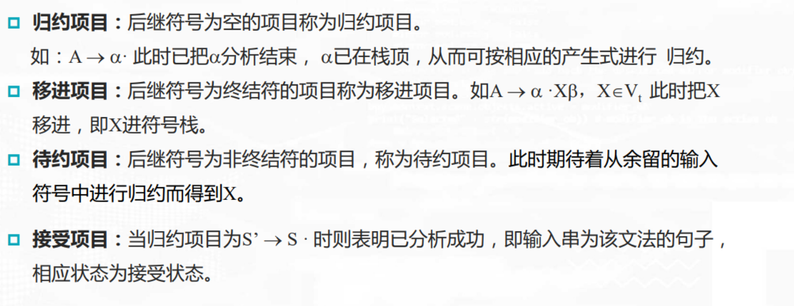

* 举例
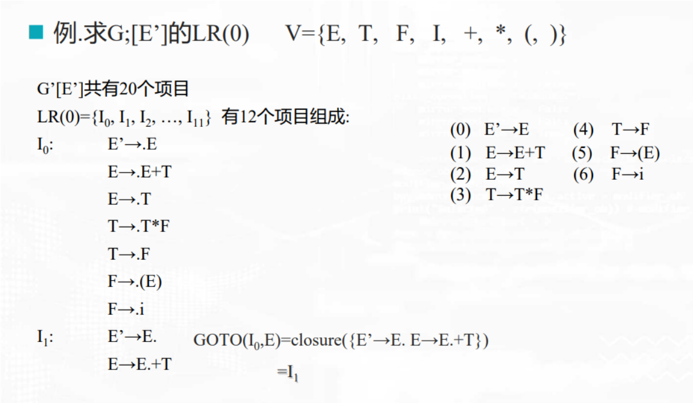
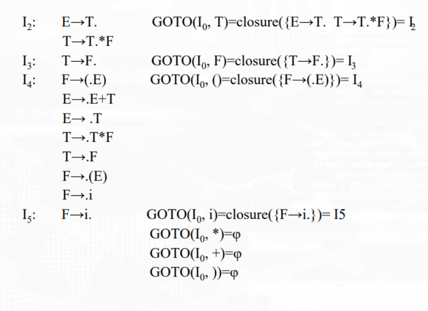
后面的以此类推

##### (2) 构建识别活前缀的DFA
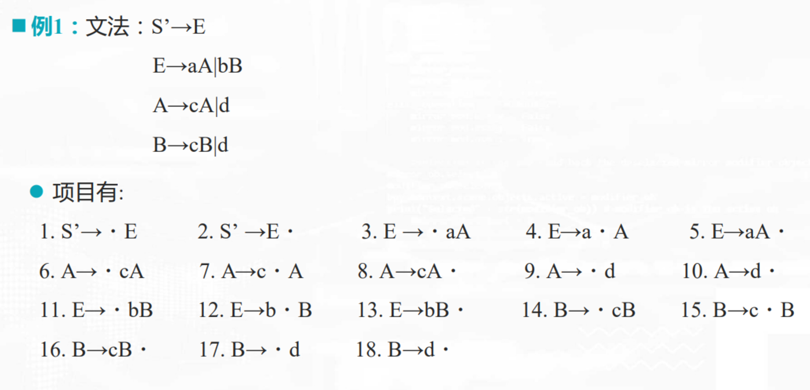
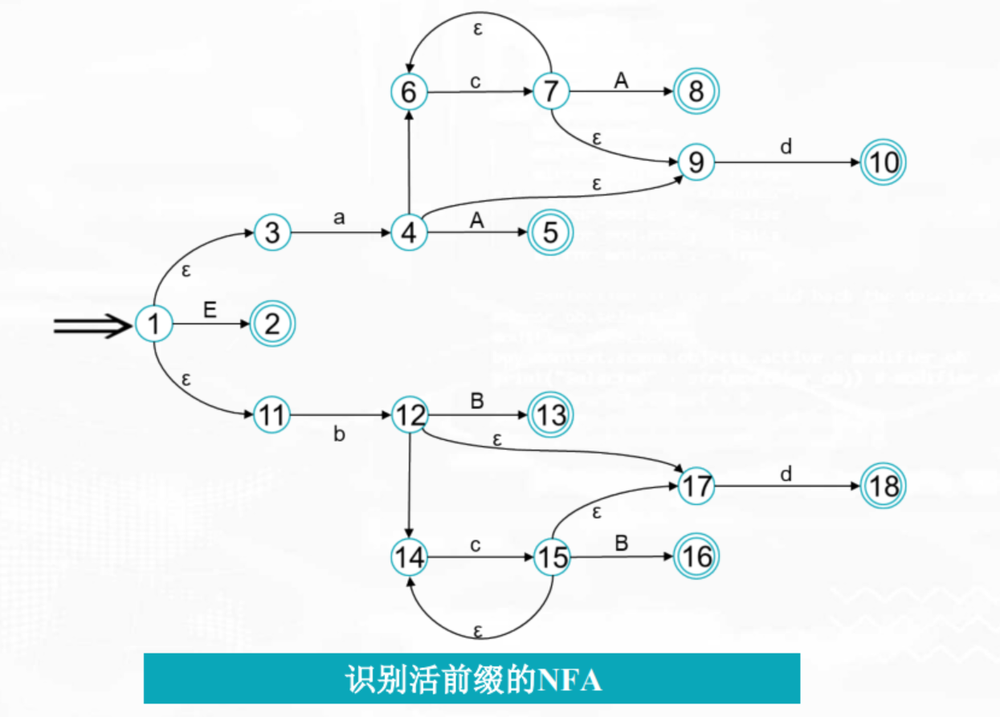
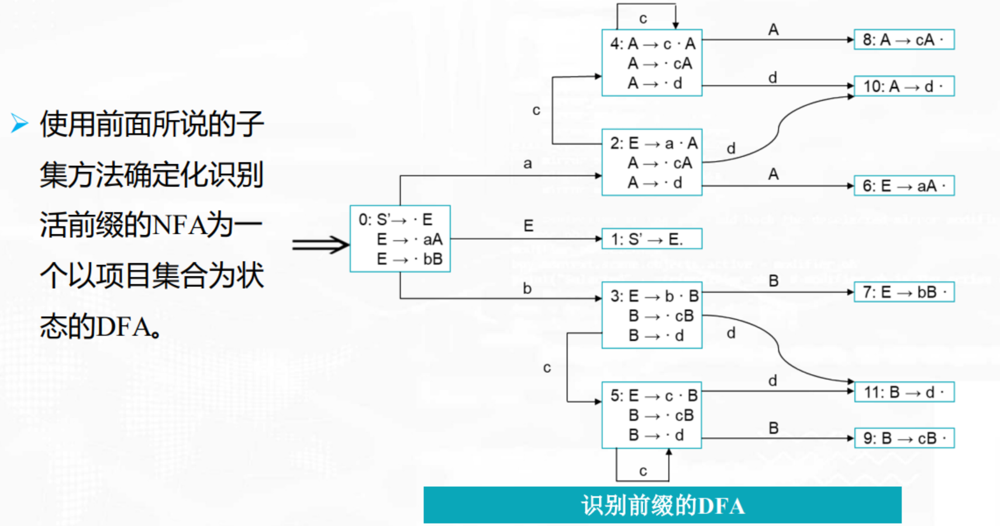

##### (3) 构建分析表
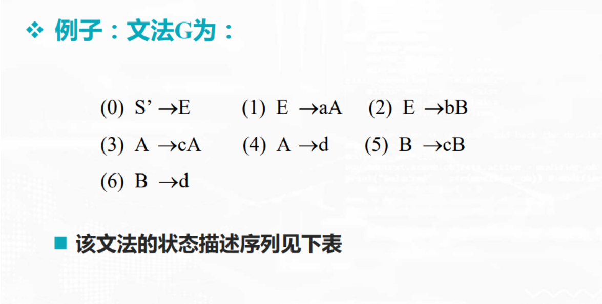
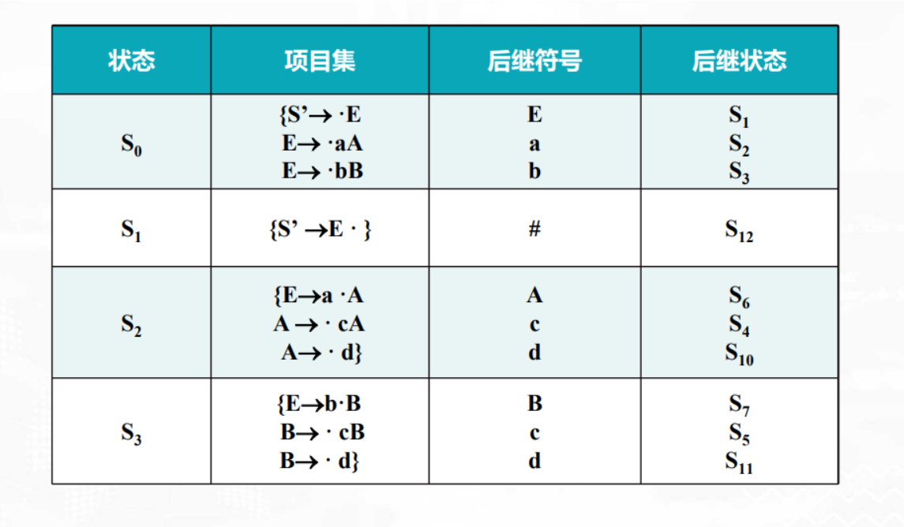
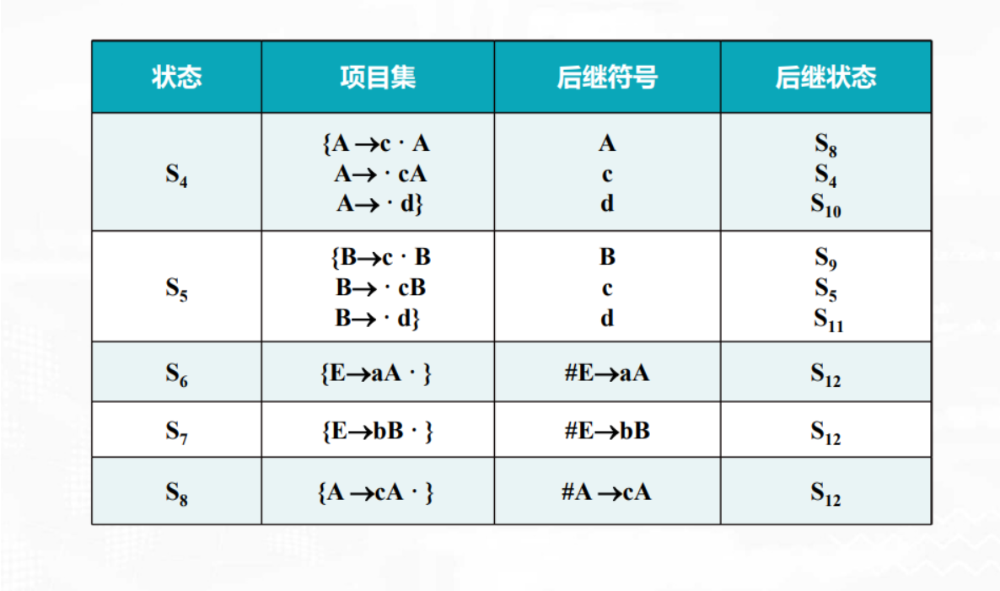
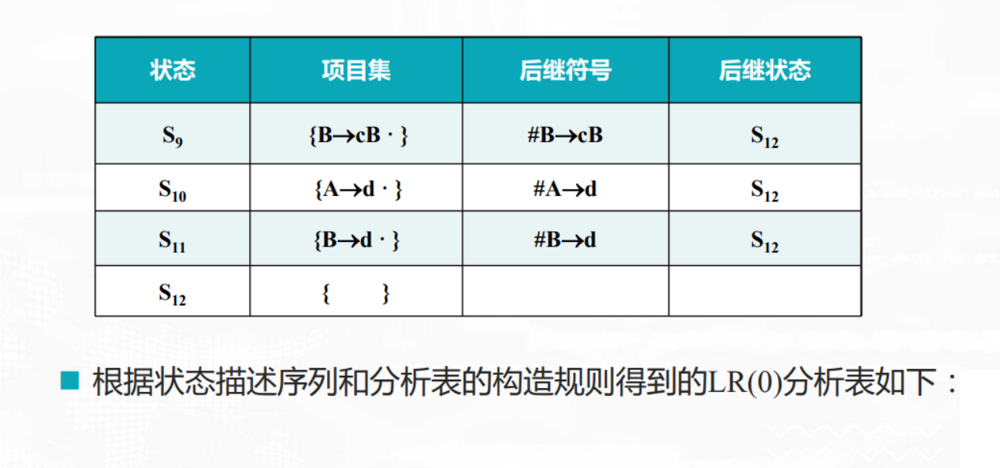
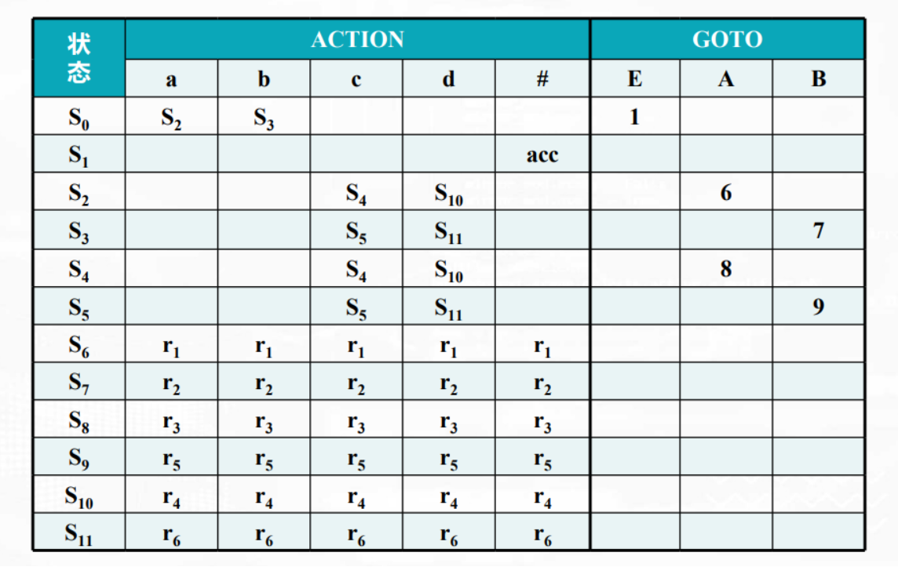
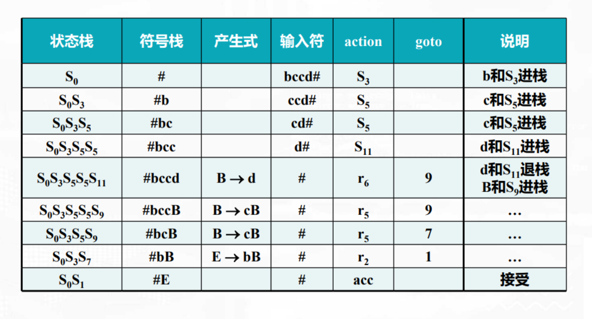

#### 7.SLR(1)
* S: simple
* L: left to right
* R: Rightmost derivation in reverse
* 1: 每次会使用前瞻字符（即当前输入字符的下一个字符）来帮助决策

##### (1) 解决冲突
解决移进-归约冲突和和归约-归约冲突

如果对于一个文法的LR(0)项目集规范族所含有的动作冲突都能用以上方法来解
决，则称该文法为SLR(1)文法

##### (2) 算法概述

* 构建状态描述序列
* 判断是不是SLR(1)文法
    * 移进-归约冲突
        * 如果$FOLLOW(E) \cap \{x\} = \empty $
            * E是归约式
            * x是当前输入符号
    * 归约-归约冲突
        * 如果$FOLLOW(E) \cap FOLLOW(F) = \empty $
            * E是归约式
            * F是另一个规约式
    * 如果所有冲突满足上述条件，则是SLR(1)文法

* 构建SLR(1)分析表
    * 与LR(0)区别：
        * 当动作是归约时，需要判断
            * 若$a \in Follow(A)$，则置$action[Si, a]=r_j$
            * 从而避免了冲突

#### 8.LR无法解决所有二义问题

可通过其他方式解决二义问题：
* 通过相关约定来解决，比如：
    * 约定算符优先级