# semantic analysis


<!-- @import "[TOC]" {cmd="toc" depthFrom=1 depthTo=6 orderedList=false} -->

<!-- code_chunk_output -->

- [semantic analysis](#semantic-analysis)
    - [概述](#概述)
      - [1.属性文法 (attribute grammar)](#1属性文法-attribute-grammar)
        - [(1) 定义](#1-定义)
        - [(2) 分类](#2-分类)
      - [2.语法制导翻译](#2语法制导翻译)
        - [(1) 语法制导定义 (syntax-directed definitions, SDD)](#1-语法制导定义-syntax-directed-definitions-sdd)
        - [(2) 语法制导翻译 (syntax-directed translation, SDT)](#2-语法制导翻译-syntax-directed-translation-sdt)
      - [3.S-属性文法](#3s-属性文法)
        - [(1) 自下而上计算（适用于LR分析器）](#1-自下而上计算适用于lr分析器)
      - [4.L-属性文法](#4l-属性文法)
        - [(1) 翻译模式 (translation schemes)](#1-翻译模式-translation-schemes)
        - [(2) 自上而下计算 (适用于LL(1)分析器)](#2-自上而下计算-适用于ll1分析器)
        - [(3) 自下而上计算 (适用于LR分析器)](#3-自下而上计算-适用于lr分析器)
      - [5.语义分析的任务](#5语义分析的任务)
      - [6.类型和声明 (Types and declarations)](#6类型和声明-types-and-declarations)
      - [7.中间代码生存](#7中间代码生存)
        - [(1) why](#1-why)
        - [(2) 形式](#2-形式)
        - [(3) 语义子程序说明](#3-语义子程序说明)
        - [(4) 简单算术表达式和赋值语句 --翻译--> 四元式](#4-简单算术表达式和赋值语句--翻译--四元式)
        - [(5) 布尔表达式的文法](#5-布尔表达式的文法)
        - [(6) 布尔表达式的SDT](#6-布尔表达式的sdt)
        - [(7) 布尔表达式用作控制的SDT](#7-布尔表达式用作控制的sdt)
        - [(8) 控制语句的SDT](#8-控制语句的sdt)

<!-- /code_chunk_output -->

### 概述

#### 1.属性文法 (attribute grammar)

##### (1) 定义
是在上下文无关文法的基础上为每个文法符号（终结符或非终结符）配备若干个相关的“值”（称为属性）

* A=(G,V,F)
    * G: 是一个上下文无关文法
    * V: 有穷的属性集,每个属性与文法的一个终结符或非终结符相关联
    * F: 语义规则，关于属性的属性断言或一组属性的计算规则

##### (2) 分类

* 综合属性 (就是函数的返回值)
    * 用于 自下而上 传递信息
    * 举例
    
* 继承属性 （就是函数的参数）
    * 用于 自上而下 传递信息
    * 一个节点的属性由父节点或兄弟节点
    * 举例
    

* 综合属性 -消除左递归-> 继承属性
* 继承属性 -改写文法-> 综合属性 

#### 2.语法制导翻译

* 语义翻译: 语义分析 + 中间代码生成
* 语法制导翻译: 语法分析 + 语义分析 + 中间代码生成

##### (1) 语法制导定义 (syntax-directed definitions, SDD)
* 将每个文法符号和一个语义属性集合相关联
* 将每个产生式和一组语义规则相关联
    * 这些规则用于计算该产生式中各文法符号的属性值


##### (2) 语法制导翻译 (syntax-directed translation, SDT)

* 过程
    * 输入符号串 -> 分析树 -> 属性依赖图 -> 语义规则的计算顺序

* 属性依赖图


* 语义规则的计算顺序
    * 树遍历的属性计算方法
        * 以某种次序遍历语法树，直至计算出所有属性
    * 一遍扫描的处理方法
        * 在语法分析的同时计算属性值

#### 3.S-属性文法
S: synthesized 
只含有综合属性

##### (1) 自下而上计算（适用于LR分析器）
* LR分析器可以改造为一个翻译器
    * 在对输入串进行语法分析的同时对属性进行计算

#### 4.L-属性文法
L: left-to-right
既包含综合属性，也包含继承属性
* 且继承属性不能由右边的兄弟节点决定

##### (1) 翻译模式 (translation schemes)
* 语义动作（语义规则）插入到产生式右部的任何地方，以表达动作的执行时刻


* 在L-属性文法，翻译模式需要满足以下条件
    * 继承属性 必须先于属性的动作之前 被计算出来
    * 一个动作 不能引用 右边符号的综合属性
    * 产生式左边非终结符的综合属性 只有在它所引用的所有属性都计算出来后才能计算

##### (2) 自上而下计算 (适用于LL(1)分析器)
在自上而下语法分析的同时实现L属性文法的计算

##### (3) 自下而上计算 (适用于LR分析器)
这种方法可以实现许多（不是所有）基于LR（1）文法的L－属性文法
* 继承属性就可能存在问题，解决方案
    * 通过改写文法，使得所有嵌在产生式中间的动作变换成只在产生式最右端出现
    * 复写规则-分析栈中的继承属性
    * 模拟继承属性的计算-不能预知属性值在栈中所放位置
    * 用综合属性代替继承属性

#### 5.语义分析的任务

* 类型检查
* 控制流检查
* 一致性检查
* 相关名字检查
* 名字的作用域检查

#### 6.类型和声明 (Types and declarations)
* 基本类型: int、float等
* 复合类型: 数组、指针等
* 复杂类型: 链表、栈等
* 对于声明语句，语义分析的主要任务就是收集标识符的类型等属性信息，并为每一个名字分配一个相对地址
    * 在编译时刻，可以使用类型的宽度为每一个名字分配一个相对地址

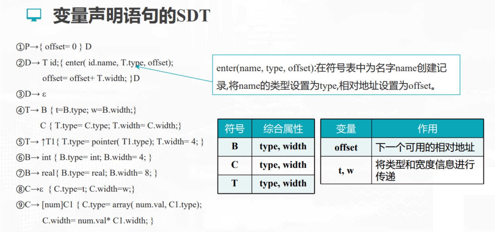

#### 7.中间代码生存

##### (1) why
* 逻辑结构清楚
* 利于不同目标机上实现同一种语言
* 利于进行与机器无关的优化

##### (2) 形式
* 逆波兰式

* 三地址代码（包括三元式、间接三元式、四元式等等）

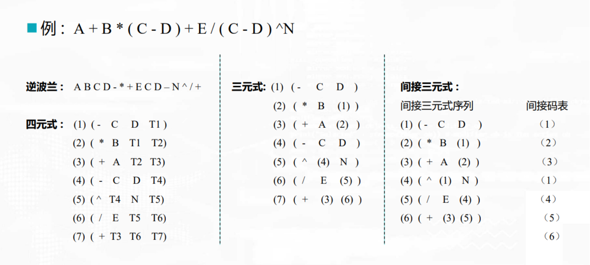

##### (3) 语义子程序说明
* E.place
    * E为非终止符
    * 表示存放E值的变量名在符号表中的入口地址

* newtemp()
    * 返回一个临时变量，临时变量名按产生的顺序可设为T1、T2、……

* Gen(op, arg1, arg2, result)

* ENTRY(i)
    * 返回符号i在符号表中的地址

* lookup(id.name)
    * 审查id.name是否出现在符号表中 （其实就是验证变量有没有声明）
        * 是则返回id.name在符号表的入口指针
        * 否则返回NULL
    * 所有的变量统称为id，id.name则是具体的变量名

##### (4) 简单算术表达式和赋值语句 --翻译--> 四元式
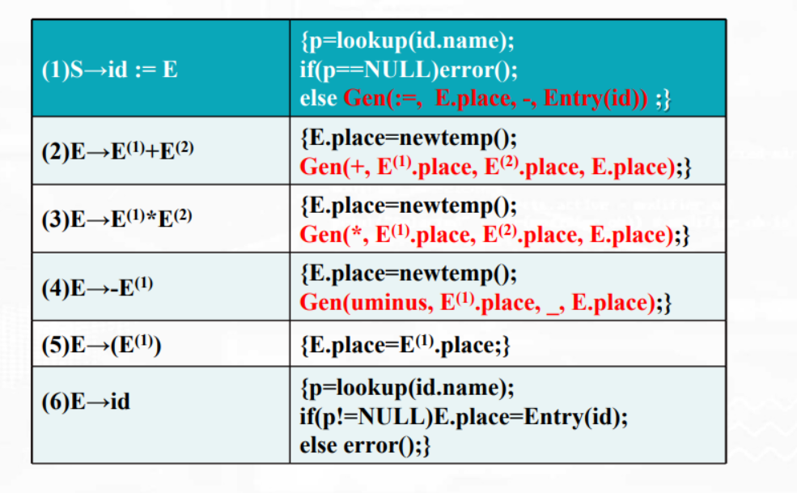

##### (5) 布尔表达式的文法
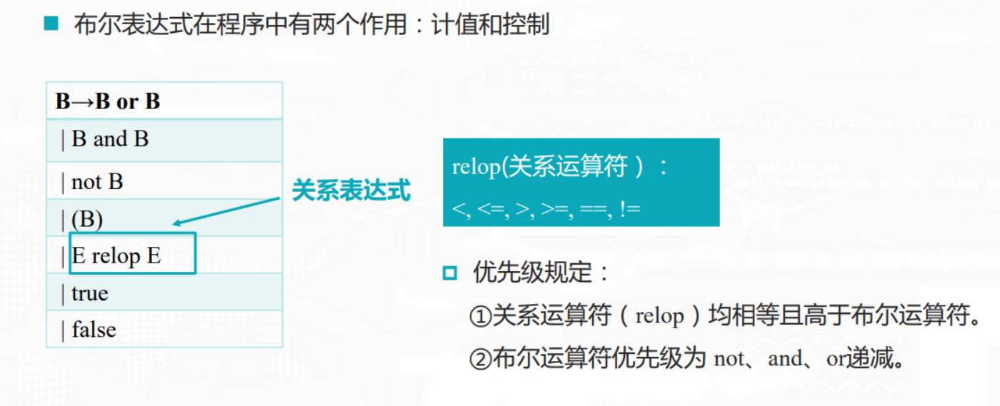

##### (6) 布尔表达式的SDT
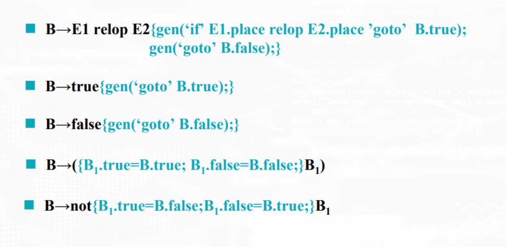

* 举例
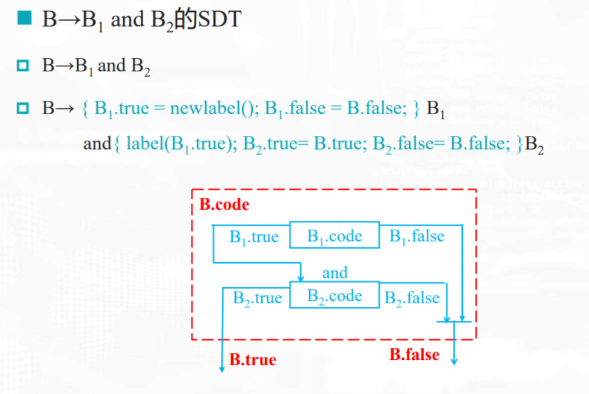

##### (7) 布尔表达式用作控制的SDT
一个布尔表达式的真假出口往往不能在产生四元式的同时就填上，需要回填（backpatching）
* 一个布尔判断，有两个跳转指定列表
    * 生成一个跳转指令时，暂时不指定该跳转指令的目标标号，存入指定列表中
    * 等到能够确定正确的目标标号时，才去填充这些指令的目标标号
    * 比如: 非终结符B的综合属性
        * B.truelist
            * 指向一个包含跳转指令的列表，这些指令最终获得的目标标号就是当B为真时控制流应该转向的指令的标号
        * B.falselist
            * 指向一个包含跳转指令的列表，这些指令最终获得的目标标号就是当B为假时控制流应该转向的指令的标号
* 函数
    * makelist(i)
        * 创建一个只包含i的列表，i是跳转指令的标号
    * merge(p1,p2)
        * 将p1和p2指向的列表进行合并
    * backpatch(p,i)
        * 将i作为目标标号插入到p所指列表中的各指令中
    * nextquad
        * 指向下一条将要产生但尚未形成的四元式的地址（即目标标号）

* 布尔表达式的翻译
    * B -> E1 relop E2
        ```shell
        {
            B.truelist = makelist(nextquad);    #nextquad表示的下面第一个四元式（即为真的跳转指令）
            B.falselist = makelist(nextquad+1); #nextquad+1表示的下面第二个四元式（即为假的跳转指令）
            gen('if' E1.place relop E2.place goto_); #如果为真，执行的跳转指令，跳转的目标标号暂时不填，需要回填
            gen('goto_');  #如果为假，执行的跳转指令，跳转的目标标号暂时不填，需要回填
        }
        ```
    * B -> true
        ```shell
        {
            B.truelist = makelist(nextquad);    #nextquad表示的下面第一个四元式（即为真的跳转指令）
            gen('goto_');  #如果为真，执行的跳转指令，跳转的目标标号暂时不填，需要回填
        }
        ```
    * B -> (B1)
        ```shell
        {
            B.truelist = B1.truelist
            B.falselist = B1.falselist
        }
        ```
    * 其他的以此类推

* 布尔运算符的翻译
    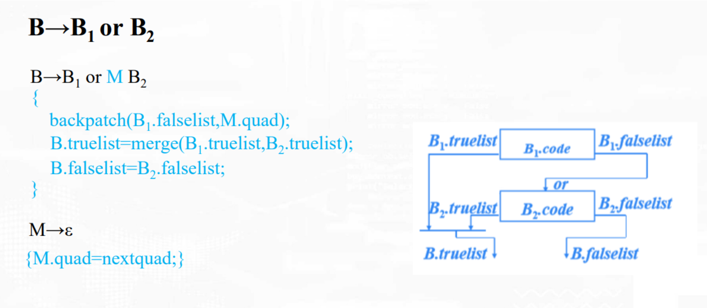
    * B.truelist = merge(B1.truelist, B2.truelist)
        * 当B1为true就不会跳转到B2，所以merge后就是B1.truelist
        * 当B1为false，B2为true，所以merge后就是B2.truelist
    * 如果B1为假，则跳转到B2.code （这时需要回填B1.falselist）
    </br></br>

    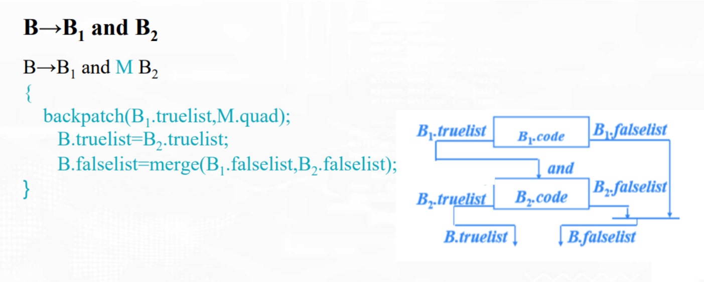

* 举例
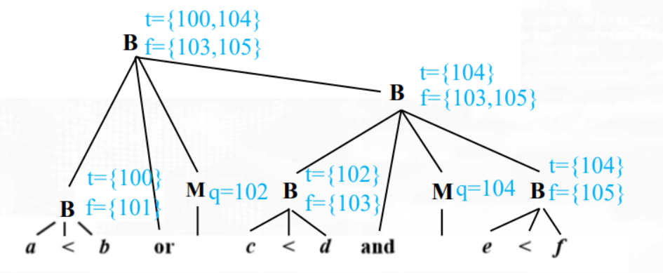
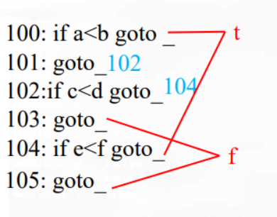
    * 其中{103,105}等表示 merge{103,105}
    * 假设开始的指令编号为100

    * 最后还有四个指定等待回填

##### (8) 控制语句的SDT

* 继承属性
指令就是gen(...)这种形式的三地址指令
    * S.next
        * 该地址中存放了紧跟在S代码之后的指令（S的后继指令）的标号
    * B.true
        * 该地址中存放了当B为真时控制流转向的指令的标号
    * B.false
        * 该地址中存放了当B为假时控制流转向的指令的标号

* 控制流语句的基本语法
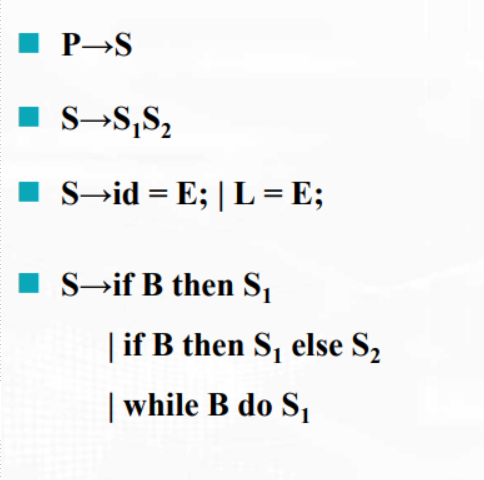

* 控制流语句的SDT
    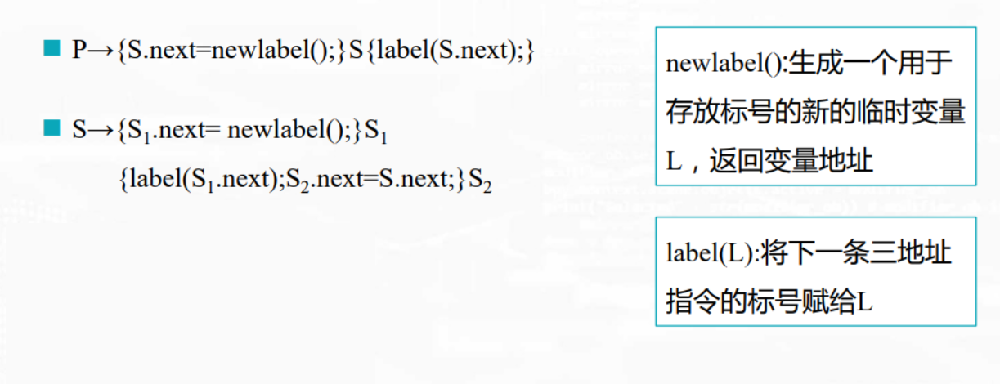
    * newlabel()意思就是创建一个临时变量
    * label(xx)意思就是临时变量赋值
    </br>

    
    * 图中S1.next、S2.next只是指明地址，并不是真正的跳转动作，goto才是真正的跳转指令
    </br>
    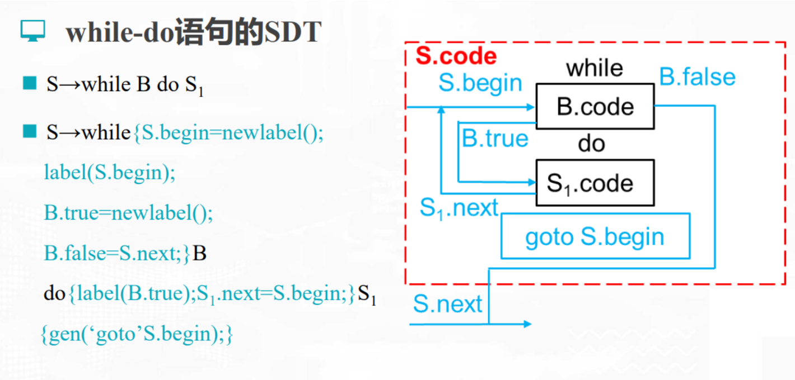

* 控制流语句的SDT（回填）
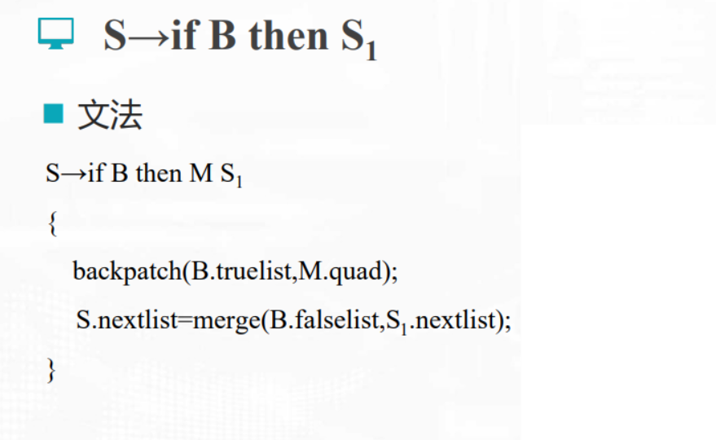
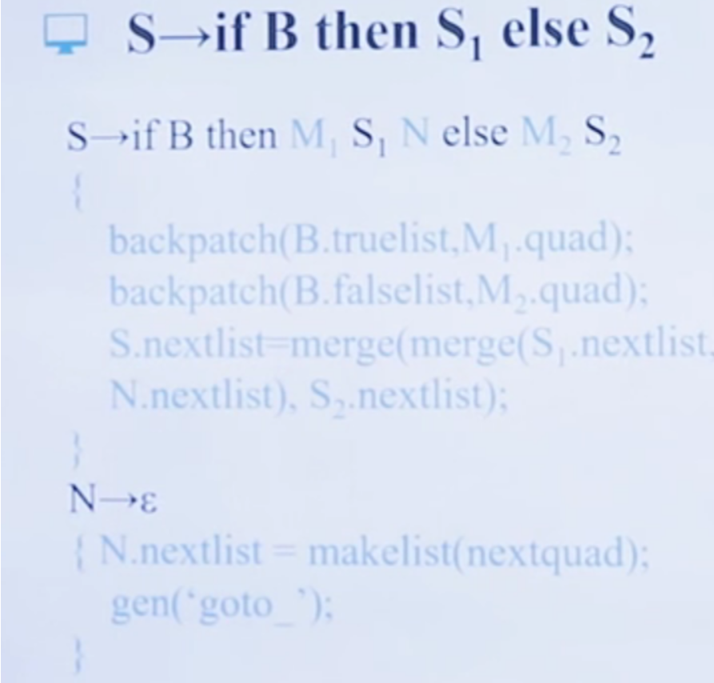

* 举例
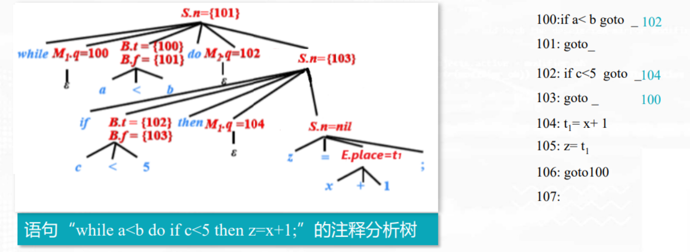