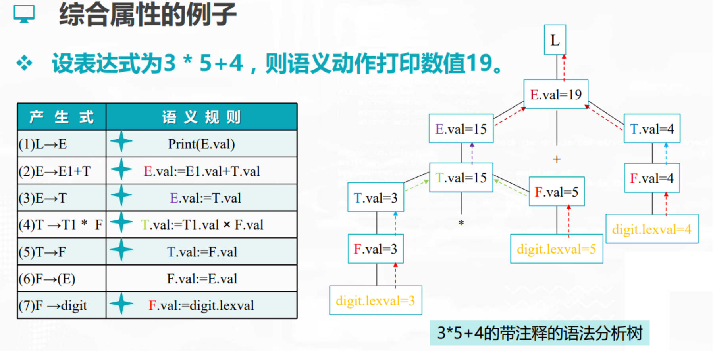
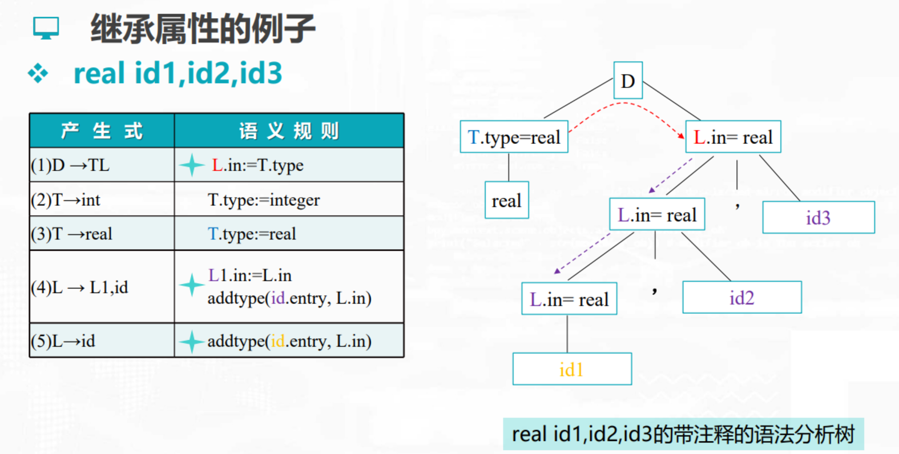
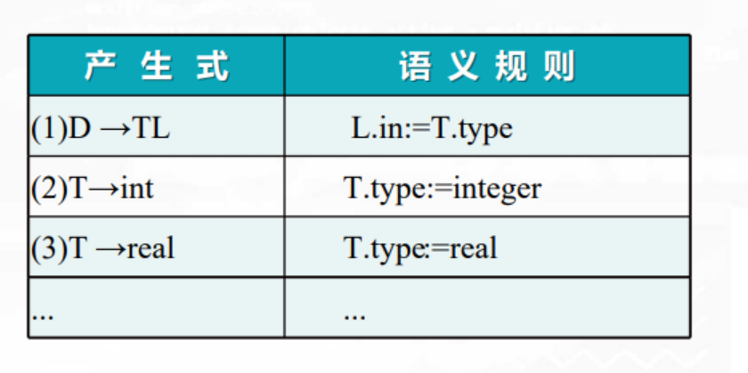
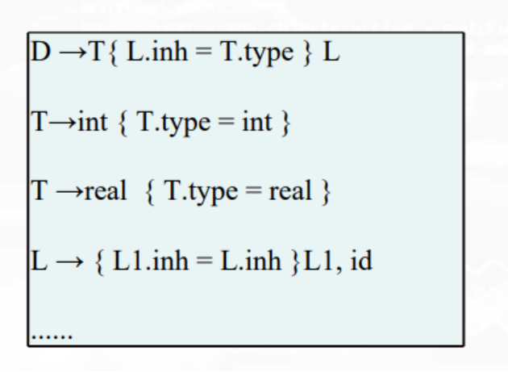
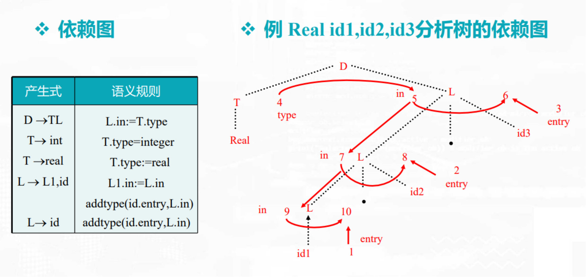

# semantic analysis

<!-- @import "[TOC]" {cmd="toc" depthFrom=1 depthTo=6 orderedList=false} -->

<!-- code_chunk_output -->

- [semantic analysis](#semantic-analysis)
    - [概述](#概述)
      - [1.属性文法 (attribute grammar)](#1属性文法-attribute-grammar)
        - [(1) 定义](#1-定义)
        - [(2) 分类](#2-分类)
      - [2.语法制导翻译](#2语法制导翻译)
        - [(1) 语法制导定义 (syntax-directed definitions, SDD)](#1-语法制导定义-syntax-directed-definitions-sdd)
        - [(2) 语法制导翻译 (syntax-directed translation, SDT)](#2-语法制导翻译-syntax-directed-translation-sdt)
      - [3.S-属性文法](#3s-属性文法)
        - [(1) 自下而上计算](#1-自下而上计算)

<!-- /code_chunk_output -->

### 概述

#### 1.属性文法 (attribute grammar)

##### (1) 定义
是在上下文无关文法的基础上为每个文法符号（终结符或非终结符）配备若干个相关的“值”（称为属性）

* A=(G,V,F)
    * G: 是一个上下文无关文法
    * V: 有穷的属性集,每个属性与文法的一个终结符或非终结符相关联
    * F: 语义规则，关于属性的属性断言或一组属性的计算规则

##### (2) 分类

* 综合属性
    * 用于 自下而上 传递信息
    * 举例
    
* 继承属性
    * 用于 自上而下 传递信息
    * 举例
    

#### 2.语法制导翻译

* 语义翻译: 语义分析 + 中间代码生成
* 语法制导翻译: 语法分析 + 语义分析 + 中间代码生成

##### (1) 语法制导定义 (syntax-directed definitions, SDD)
* 将每个文法符号和一个语义属性集合相关联
* 将每个产生式和一组语义规则相关联
    * 这些规则用于计算该产生式中各文法符号的属性值

##### (2) 语法制导翻译 (syntax-directed translation, SDT)
* 在产生式右部嵌入了程序片段的上下文无关文法

* 过程
    * 输入符号串 -> 分析树 -> 属性依赖图 -> 语义规则的计算顺序

* 属性依赖图

* 语义规则的计算顺序
    * 树遍历的属性计算方法
        * 以某种次序遍历语法树，直至计算出所有属性
    * 一遍扫描的处理方法
        * 在语法分析的同时计算属性值

#### 3.S-属性文法

只含有综合属性

##### (1) 自下而上计算
* LR分析器可以改造为一个翻译器
    * 在对输入串进行语法分析的同时对属性进行计算