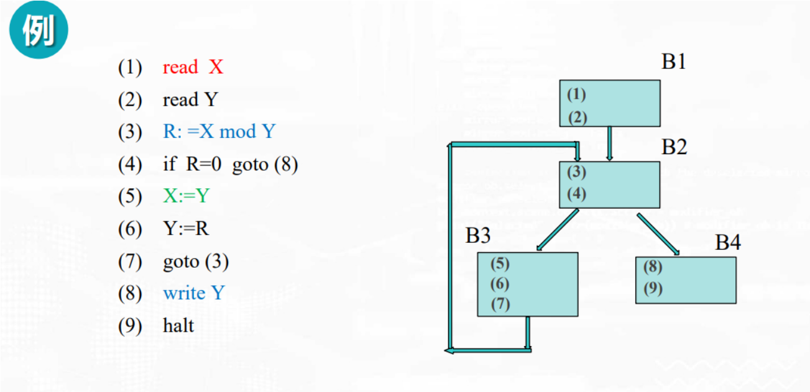
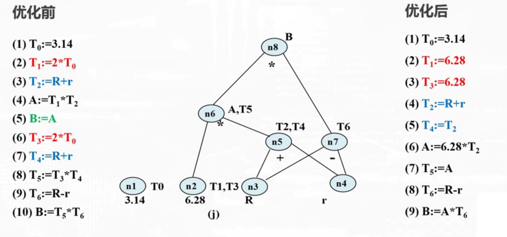

# optimism

<!-- @import "[TOC]" {cmd="toc" depthFrom=1 depthTo=6 orderedList=false} -->

<!-- code_chunk_output -->

- [optimism](#optimism)
    - [概述](#概述)
      - [1.优化](#1优化)
        - [(1) 原则](#1-原则)
        - [(2) 分类](#2-分类)
        - [(3) 常见的优化技术](#3-常见的优化技术)
      - [2.局部优化](#2局部优化)
        - [(1) 基本块的确定](#1-基本块的确定)
        - [(2) 基本块的DAG (directed acyclic graph)](#2-基本块的dag-directed-acyclic-graph)
        - [(3) 基本块优化举例](#3-基本块优化举例)

<!-- /code_chunk_output -->

### 概述

#### 1.优化

##### (1) 原则
* 等价原则
* 有效原则
    * 使优化后所产生的目标代码运行时间较短，占用的存储空间较小
* 合算原则
    * 尽可能以较低的代价取得较好的优化结果

##### (2) 分类

* 按阶段
    * 源代码优化
    * 中间代码优化（与机器无关）
    * 目标代码优化（与机器有关）

* 按程序范围
    * 局部优化
        * 在程序基本块内进行的优化
    * 循环优化
        * 在程序循环体内进行的优化
    * 全局优化

##### (3) 常见的优化技术
* 删除公共子表达式
* 复写传播
* 删除无用代码
* 代码外提
* 强度削弱
    *  加减法运算一般比乘除法快，把乘法变成加法，提高运算效率
* 删除归纳变量
* 合并已知量
* 代数变换

#### 2.局部优化

##### (1) 基本块的确定

##### (2) 基本块的DAG (directed acyclic graph)

##### (3) 基本块优化举例
