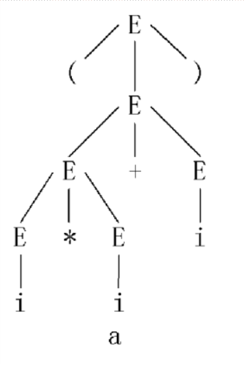
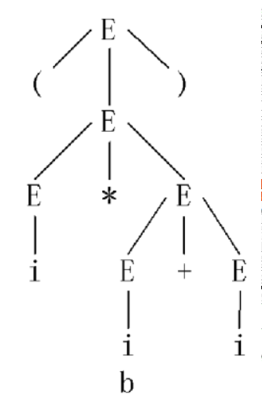

# overview


<!-- @import "[TOC]" {cmd="toc" depthFrom=1 depthTo=6 orderedList=false} -->

<!-- code_chunk_output -->

- [overview](#overview)
    - [概述](#概述)
      - [1.compiler vs interpreter](#1compiler-vs-interpreter)
      - [2.编译过程](#2编译过程)
        - [(1) lexical analysis (词法分析)](#1-lexical-analysis-词法分析)
        - [(2) syntatic analysis (语法分析)](#2-syntatic-analysis-语法分析)
        - [(3) semantic analysis (语义分析，中间代码产生)](#3-semantic-analysis-语义分析中间代码产生)
        - [(4) optimism (优化)](#4-optimism-优化)
        - [(5) code generation (目标代码生存)](#5-code-generation-目标代码生存)
      - [3.语法描述](#3语法描述)
        - [(1) 基本概念](#1-基本概念)
        - [(2) 语法定义](#2-语法定义)
        - [(3) 分类](#3-分类)
        - [(4) 推导和规约](#4-推导和规约)
        - [(5) 句型、句子、语言](#5-句型-句子-语言)
      - [3.语法分析树](#3语法分析树)
        - [(1) 概念](#1-概念)
        - [(2) 举例: (i*i+i)的语法树](#2-举例-iii的语法树)
        - [(3) 二义性](#3-二义性)

<!-- /code_chunk_output -->

### 概述

#### 1.compiler vs interpreter

* compiler


* interpreter


#### 2.编译过程

##### (1) lexical analysis (词法分析)
* 目标: 识别出一个个单词符号 (token)
* 依赖规则: 构词规则

##### (2) syntatic analysis (语法分析)
* 目标: 将单词符号串分解成各类语法单位
* 依赖规则: 语法规则
    * 语法定义了什么符号是合法的

##### (3) semantic analysis (语义分析，中间代码产生)
* 目标: 按语义进行初步翻译
* 依赖规则: 语义规则
    * 语义定了一个话的含义，比如: `A = B +` ，语法是对的（因为四个符号都是合法的），但是语义不对

##### (4) optimism (优化)
* 目标: 对产生的中间代码进行加工变换，从而在最后阶段产生更高效的代码
* 依赖规则: 程序的等价变换

##### (5) code generation (目标代码生存)
* 目标: 生成特定机器上的目标代码
* 三种形式
    * 绝对指令代码
        * 可直接运行
    * 可重新定位指定代码
        * 需要连接装配
    * 汇编指令代码
        * 需要进行汇编

#### 3.语法描述

* **符号用意**:
    * 大写字母一般表示 非终止字符串
    * 希腊字母一般表示 终止字符串

##### (1) 基本概念
* 字母表Σ
    * 字母表中的元素成为符号
    * 字母表中包含了语言中所允许出现的所有符号
* 字符串
    * 由合法符号组成的串

* 字符串运算

|运算|例子|说明|
|-|-|-|
|字符串长度|`x=string`|`|x|=6`|
|字符串连接|`xy`|表示将字符串x和字符串y进行连接|
|字符串集合的乘积|`AB={xy}`，其中x属于A，y属于B||
|字符串集合的幂|`A^0={ε}` (表示是一个空字符集合，但不是空集), `A^2=AA`, `A^n = AA^(n-1)`|本质就是字符串集合的乘积|
|字符串集合的正闭包|`A^+=A^1 ∪ A^2 ∪ ... ∪ A^n`||
|字符串集合的自反闭包|`A^*= {ε} ∪ A^+`||

##### (2) 语法定义

`G=(Vn, Vt, S, P)`
* Vn: 非空有限的 非终结字符集
    * 非终结字符: 能够继续往下推导（可以理解为一个变量）
* Vt: 非空有限的 终结字符集
* S: 开始符号
* P: 产生式集合 
    * 对字符(一般为非终止字符)的描述
    * 形式: `A -> 	α|β , A ∈ Vn , α,β ∈ (Vn ∪ Vt)^*`
        * A定义为α或β

##### (3) 分类

* 0型（无限制文法）
    * α -> β
        * 其中α ∈ (Vn ∪ Vt)^+ 且必须包含一个非终止字符，β ∈ (Vn ∪ Vt)^*
        * 通俗理解: 左边包含一个非终止符就行
* 1型（上下文有关）
    * α -> β
        * 其中α = γ1Aγ2, β = γ1δγ2，其中Aϵ Vn, δ ϵ (Vn ∪ Vt)^+，γ1,γ2 ϵ (Vn ∪ Vt)^*
        * 通俗理解: 需要在一定的上下文条件下，将左边的一个非终止符定义为一个终止符串（所以左边长度小于等于右边长度，所以这种文法是发散的）
* 2型（上下文无关）（最常用）
    * A -> δ
        * 其中A ϵ Vn ，δ ϵ (Vn ∪ Vt)^+
        * 对2型进行扩充: A -> ɛ
            * 允许有空产生式
        * 通俗理解: 左边是一个终止符
* 3型（右线性，也称正规文法）
    * A -> αB 或 A -> α
        * 其中A, B ϵ Vn, α ϵ (Vt)^*
        * 左线性: A -> Bα 或 A -> α，其他都和右线性一样
        * 通俗理解: 左边是一个终止符，右边满足右线性结构
* 总结
    * 从0型到3型，限制越来越严格
    * 后面的型号肯定属于前面的型号
        * 1型一定是0型，2型一定是1型，3型一定是2型

##### (4) 推导和规约

* 设文法G=(Vn，Vt，S，P)

* 直接推导 (direct derivation): `=>`
    * 若A -> α是其中的产生式
    * 若有符号串 γ,δ ∈ (Vn ∪ Vt)^*，使得U=γAδ，w=γαδ
    * 则w是U的直接推导 U => w

* 一步或多步推导: `=+>` 
    * `+`应该在`=`上面
* 0步或一步或多步推导: `=*>`
    * `*`应该在`=`上面

* 最左推导
    * 在xUy => xuy直接推导中，x ∈ Vt^*，U ∈ Vn，即U是符号串xUy中最左非终结符
        * 其实就是替换最左边的非终止字符，从而进行推导
    * 则称此直接推导为最左直接推导

* 最右推导（规范直接推导）
    * 在xUy => xuy直接推导中，y ∈ Vt^*，U ∈ Vn，即U是符号串xUy中最右非终结符
        * 其实就是替换最右边的非终止字符，从而进行推导
    * 则称此直接推导为最右直接推导

* 最左归约
    * 最右推导的逆过程是最左归约

* 最右归约
    * 最左推导的逆过程是最右归约

##### (5) 句型、句子、语言

* 设文法G=(Vn，Vt，S，P)

* 句型
    * 如果S =*> u, 则称符号串u为文法G的句型
        * 表示S经过若干步推导 ，能够得到u

* 句子
    * 如果`S =*> u`， 其中 `u ∈ Vt^*`， 则称符号串u为文法G的句子
        * 表示S经过若干步推导 ，能够得到u（且u是一个由终止字符组成的串）

* 语言
    * L(G)={u}，其中`S =*> u`且`u ∈ Vt^*`
        * 表示语言是文法中 所有句子的集合

* 文法等价
    * 当L(G1) = L(G2)时，则G1和G2文法等价

#### 3.语法分析树

##### (1) 概念
语法树： 用一个**树形结构**描述一个**句子的推导**
* 树根 由 文法的开始符号标记

##### (2) 举例: (i*i+i)的语法树
* 文法 G = (Vn, Vt, S, P)
    * Vn = {E}
    * Vt = {i, +, *, (, )}
    * S = E
    * P: E -> i | E+E | E*E | (E)

* 方式一: 使用最左推导
    * 推导式
    ```shell
    E => (E)
      => (E+E)
      => (E*E+E)
      => (i*E+E)
      => (i*i+E)
      => (i*i+i)
    ```
    * 对应的语法树
    

    * 说明
        * 其中`(i*i+i)`是句子
        * 其他的（`(E)`、`(E+E)`等）都是句型

* 方式二: 使用最左推导
    * 推导式
    ```shell
    E => (E)
      => (E*E)
      => (i*E)
      => (i*E+E)
      => (i*i+E)
      => (i*i+i)
    ```
    * 对应的语法树
    

    * 说明
        * 其中`(i*i+i)`是句子
        * 其他的（`(E)`、`(E*E)`等）都是句型

##### (3) 二义性

* 在一个文法中，如果一个句子有两棵或两棵以上的语法树，则称此句子具有二义性
* 比如上述的`(i*i+i)`这个句子就具有二义性
* 文法的二义性是不可判定的
    * 即只能证明一个句子有二义性，但不能证明没有二义性