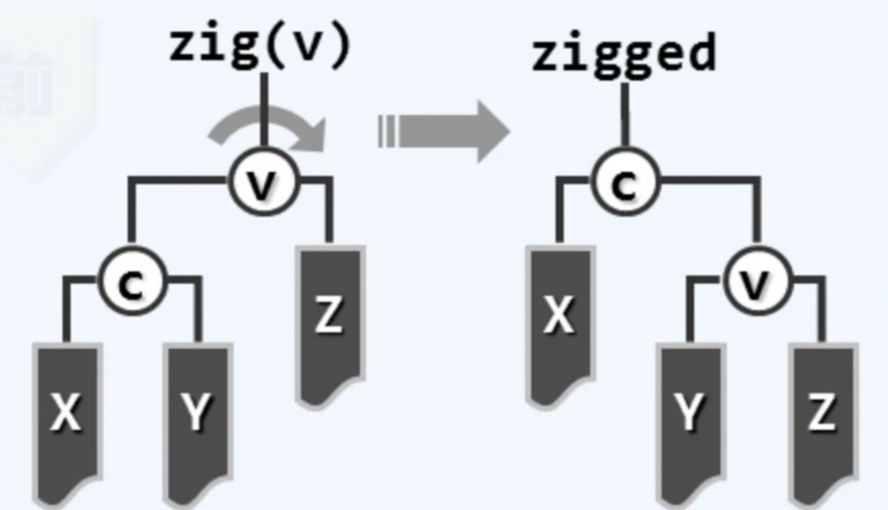
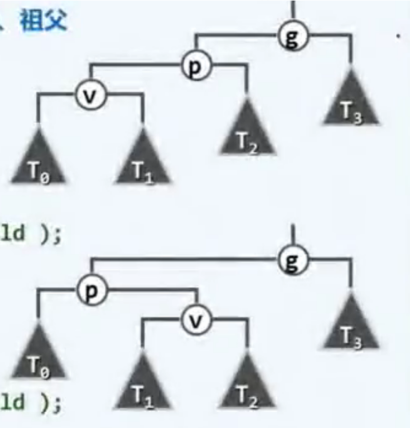
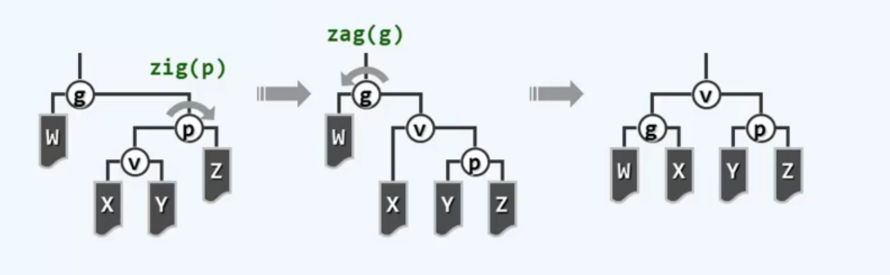
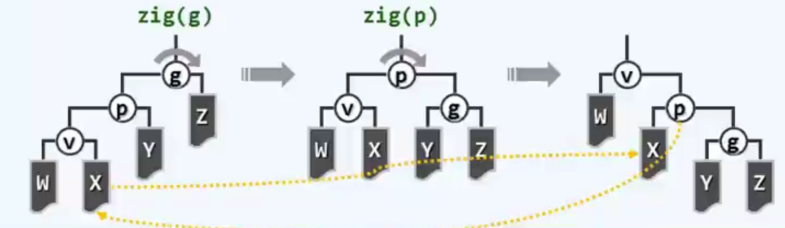

# BST (Binary Search Tree)

<!-- @import "[TOC]" {cmd="toc" depthFrom=1 depthTo=6 orderedList=false} -->

<!-- code_chunk_output -->

- [BST (Binary Search Tree)](#bst-binary-search-tree)
    - [概述](#概述)
      - [1.BST](#1bst)
        - [(1) 定义](#1-定义)
        - [(2) 特性](#2-特性)
      - [2.BBST (balanced BST)](#2bbst-balanced-bst)
        - [(1) 平衡标准](#1-平衡标准)
        - [(2) 重平衡算法 (基于等价变换)](#2-重平衡算法-基于等价变换)
      - [3.AVL Tree (一种BBST)](#3avl-tree-一种bbst)
        - [(1) 平衡标准](#1-平衡标准-1)
        - [(2) 重平衡算法: 3+4重构](#2-重平衡算法-34重构)
      - [4.Splay Tree (一种BBST)](#4splay-tree-一种bbst)
        - [(1) 核心: 双层旋转](#1-核心-双层旋转)
        - [(2) 综合评价](#2-综合评价)

<!-- /code_chunk_output -->

### 概述

#### 1.BST

##### (1) 定义
* 用**key**标识每一个节点
    * 通过key访问节点
    * key需要能够 大小比较 和 相等比较
* 需要满足**顺序性**
    * 任何一节点均 不小于/不大于 其 左/右后代

##### (2) 特性
* 采用中序遍历，则必然单调非降
* 搜索、添加、删除的时间复杂度 = O(h)，即与树的高度有关
    * 所以需要控制树的高度
* 将vector和list优势结合
    * vector 查找效率高，移动（插入、删除等）效率低
    * list 查找效率低，移动（插入、删除等）效率高

#### 2.BBST (balanced BST)

##### (1) 平衡标准
定义平衡的标准

##### (2) 重平衡算法 (基于等价变换)
通过基于等价变换的相关算法，将 失衡的BBST 重新调整成平衡的
* 等价变换

#### 3.AVL Tree (一种BBST)

* 当添加节点，导致失衡时
    * 只需要从下往上遍历，找到失衡的节点，进行调整
    * 则整体会变为平衡
    * 所以复杂度: O(1)
* 当删除节点，导致失衡时
    * 需要从下往上遍历，找到失衡的节点，进行调整
    * 调整后，祖先节点可能也会失衡，则需要继续调整
    * 直到遍历到最上层
    * 所以复杂度: O(logn)

##### (1) 平衡标准
* 对于每个节点: 平衡因子等于左右子树的高度差
* `balFac(v) = height(lc(v)) - heigh(rc(v))`
    * balFac: balance factor
    * lc: left child
    * rc: right child

##### (2) 重平衡算法: 3+4重构
* 三个节点
    * 失衡节点g
    * g的更高的孩子节点p
    * p的更高的孩子节点v
* 四个子节点:
    g、p、v的子节点
* 有四种排列情况，下图为其中两种

* 概述：
    将这个七个节点，按顺序排列，然后组成装层数更低的树

#### 4.Splay Tree (一种BBST)

* locality (局部性): 刚被访问过的数据，极有可能很快的再次被访问

* 将被访问的节点，通过不断的等价变换，移动到树根
    * 即search后，会调整目标节点到树根
        * 当search成功，则目标节点为所要查找的节点
        * 当search失败，则目标节点为最后一个定位到的节点

##### (1) 核心: 双层旋转

* 子孙异侧
    * v是要访问的点
    * p是v的父亲
    * g是v的祖父

* 子孙同侧
    * v是要访问的点
    * p是v的父亲
    * g是v的祖父

##### (2) 综合评价

* 无需记录平衡因子等，编程实现优于AVL树
* 分摊复杂度O(logn), 与AVL树相当
* 当局部性强、缓存命中率极高时，效率更高
* 不能保证单次最坏情况，所以不适用于效率敏感的场合