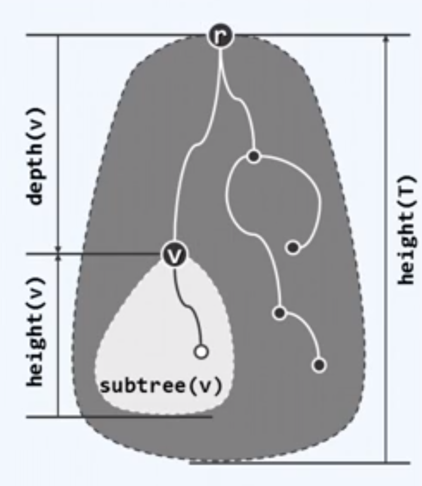
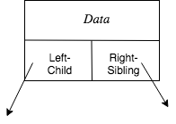
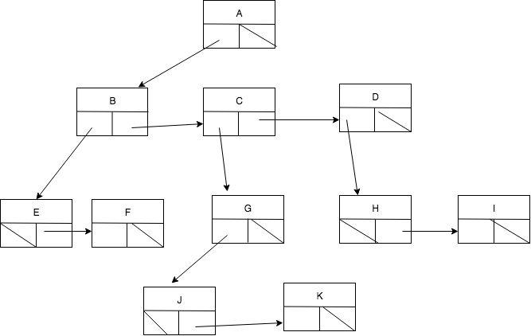
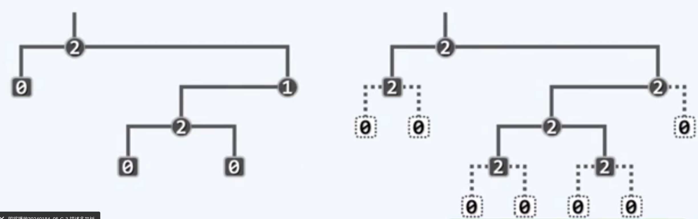
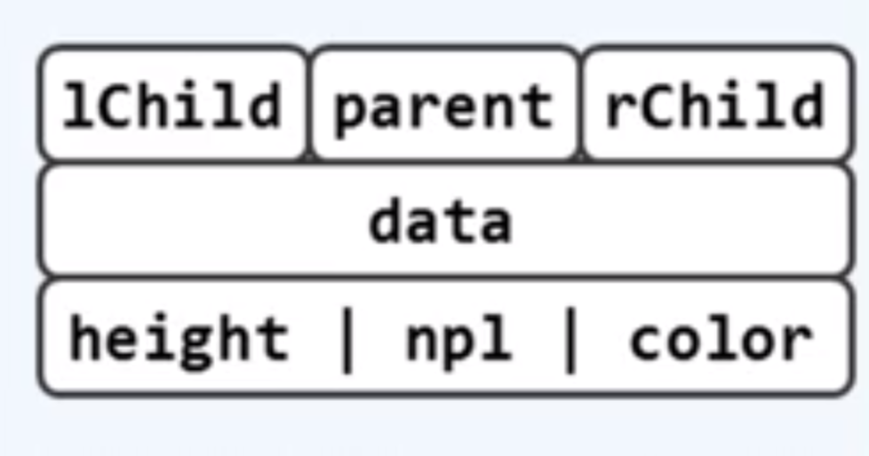

# binary tree

<!-- @import "[TOC]" {cmd="toc" depthFrom=1 depthTo=6 orderedList=false} -->

<!-- code_chunk_output -->

- [binary tree](#binary-tree)
    - [概述](#概述)
      - [1.tree](#1tree)
        - [(1) 特性](#1-特性)
        - [(2) 基本概念](#2-基本概念)
        - [(3) 指标](#3-指标)
      - [2.树的表示 (representation)](#2树的表示-representation)
        - [(1) left-child right-sibling representation](#1-left-child-right-sibling-representation)
      - [3.binary tree (可以描述所有的树)](#3binary-tree-可以描述所有的树)
        - [(1) 真二叉树： 便于后续算法的实现](#1-真二叉树-便于后续算法的实现)
        - [(2) 描述多叉树](#2-描述多叉树)
        - [(3) 节点结构](#3-节点结构)
      - [4.遍历算法 （半线性 -> 线性）](#4遍历算法-半线性---线性)
        - [(1) preorder traversal (先序遍历)](#1-preorder-traversal-先序遍历)
        - [(2) inorder traversal (中序遍历)](#2-inorder-traversal-中序遍历)
        - [(3) postorder traversal (后序遍历)](#3-postorder-traversal-后序遍历)
        - [(4) level order traversal (层次遍历)](#4-level-order-traversal-层次遍历)
      - [5.根据遍历结果 -> 二叉树结构](#5根据遍历结果---二叉树结构)

<!-- /code_chunk_output -->

### 概述

#### 1.tree 

##### (1) 特性 

* 是特殊的图
    * vertex (节点)
    * edge (边)
    * degree (度)
        * in-degree + out-degree
        * in-degree
            * the number edges that comes at the particular node
        * out-degree
            * the number of edges that leaves a particular node
* rooted tree (有根树)
    * 指定任何一个节点v为根的树
    * 任何一个节点v与根之间存在**唯一路径**
    * `e = v - 1`
        * 边数 = 节点数 - 1
* 半线性
    * v的祖先若存在，则必然唯一
    * v的后代若存在，则不一定唯一

##### (2) 基本概念

|术语|说明|
|-|-|
|root|根|
|child|子节点|
|sibling|兄弟节点|
|parent|父节点|
|leaf|叶子节点|

##### (3) 指标

* `depth(v) = |path(v)|`
    * 深度 即v节点到根节点的长度
* height(v)
    * 高度 即以该节点为根的子树 到 最深的叶子节点的 路径长度

#### 2.树的表示 (representation)

##### (1) left-child right-sibling representation

* 表示

* 这样所有树都可以用**二叉树**进行描述

#### 3.binary tree (可以描述所有的树)

* 本质就是二维列表（没有利用向量的特性，二叉搜索树将vector和list的优势结合）
* 节点的out-degree <= 2

##### (1) 真二叉树： 便于后续算法的实现
* 真二叉树节点的out-degree 为 0 或 2
* 不需要显示的转化为真二叉树，比如只需要将叶子的左右孩子都设为空，而不是返回空指针

##### (2) 描述多叉树
* 通过left-child right-sibling representation方式，可以描述所有的树

##### (3) 节点结构

#### 4.遍历算法 （半线性 -> 线性）

##### (1) preorder traversal (先序遍历)
* root
* left
* right

##### (2) inorder traversal (中序遍历)
* left
* root
* right

##### (3) postorder traversal (后序遍历)
* left
* right
* root

##### (4) level order traversal (层次遍历)
* 一层一层遍历（所以优先遍历祖先节点）

#### 5.根据遍历结果 -> 二叉树结构

* [ 先序 | 后序 ] + 中序
  * 需要先序或者后序加上中序结果，才能还原
* [ 先序 + 后序 ] * 真
  * 当是真二叉树时，通过先序和后序结果，能够还原