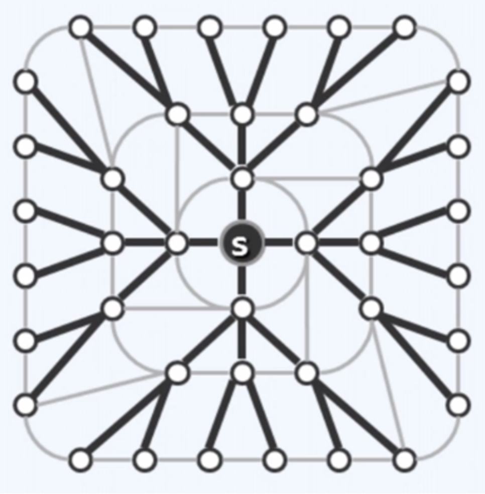

# graph

<!-- @import "[TOC]" {cmd="toc" depthFrom=1 depthTo=6 orderedList=false} -->

<!-- code_chunk_output -->

- [graph](#graph)
    - [概述](#概述)
      - [1.graph](#1graph)
      - [2.图的表示](#2图的表示)
        - [(1) adjacency matrix (邻接矩阵)](#1-adjacency-matrix-邻接矩阵)
        - [(2) incidence matrix (关联矩阵)](#2-incidence-matrix-关联矩阵)
      - [3.图的遍历 (非线性 -> 半线性)](#3图的遍历-非线性---半线性)
        - [(1) breadth-first search](#1-breadth-first-search)
        - [(2) depth-first search (最常用)](#2-depth-first-search-最常用)
    - [图的应用](#图的应用)
      - [1.双连通分量 (BCC: bi-connected components)](#1双连通分量-bcc-bi-connected-components)
        - [(1) 基本概念](#1-基本概念)
        - [(2) 算法概述](#2-算法概述)
      - [2.单源点最短路径 (single-source shortest path)](#2单源点最短路径-single-source-shortest-path)
        - [(1) 重要性质](#1-重要性质)
        - [(2) 算法概述： Dijkstra算法](#2-算法概述-dijkstra算法)
      - [3.最小生成树 (minimum spanning tree)](#3最小生成树-minimum-spanning-tree)
        - [(1) 算法概述: Prim算法](#1-算法概述-prim算法)

<!-- /code_chunk_output -->

### 概述

#### 1.graph

* G = (V; E)
    * v: vertex, 节点
    * E: edge, 边

* adjacency (邻接关系): 形容 两个连接的顶点 的关系
* incidence (关联关系): 形容 顶点与边 的关系

* undirected edge (无向边): 没有方向的边
* undigraph (无向图): 所有边均为 无向边
* digraph (有向图): 所有边均为 有向边
* mixed graph (混合图): 既有无向边，又有有向边

* 路径 `path = <V0,V1,..., Vk>`
    * 由顶点构成的一个序列
    * 简单路径: 不含重复的顶点

* DAG (directed acyclic graph): 有向无环图

#### 2.图的表示

##### (1) adjacency matrix (邻接矩阵)

* 横轴和纵轴都是相应的节点
* 对于有向图
    * `(i,j)` 表示 i到j是否邻接, 值为 边对象的地址
* 对于无向图
    * `(i,j) = (j,i)`

* 缺点:
    * `S(n) = O(n^2)`
    * 对于平面图 (planar graph)来说，空间利用率太低
        * 平面图: 任何不相邻的边 不能 相交

##### (2) incidence matrix (关联矩阵)
* 横轴是边，纵轴是节点

* `(v,e)` 表示 顶点v和边e是否关联

#### 3.图的遍历 (非线性 -> 半线性)

##### (1) breadth-first search

* BFS(s)过程
    * 访问顶点s
    * 依次访问s 所有尚未访问的邻接顶点
    * 依次访问它们尚未访问的邻接顶点
    * 如此返回

* 图说明
    * 黑色的就是遍历到的边
    * 浅色的就是没有遍历到的边
    * 最终遍历结果是一棵树

* 特性
    * 遍历出来的路径是**最短路径**

##### (2) depth-first search (最常用)

* DFS(s)过程
    * 访问顶点s
    * 选择其中一个尚未访问的邻接顶点u，递归执行DFS(u)
    * 否则返回 (即**回溯**)

***

### 图的应用

#### 1.双连通分量 (BCC: bi-connected components)

##### (1) 基本概念
* 关节点 (articulation point、cut point)
    * 用于连接多个连通域
    * 当删除这个节点，连通域变多
* 双连通图 (bi-connectivity)
    * 无关节点的图
* 双连通分量 (bi-connected components)
    * 一个图中，每一个极大的双连通子图

##### (2) 算法概述
* 使用DFS进行遍历
    * 标记dtime (发现节点的时间)
    * 计算hca (highest connected ancestor)
        * hca越小越祖先
        * 如果没有连接到祖先节点，则hca就是自己
        * 如果连接到多个祖先节点，则hca就是最祖先的节点 (即最先发现的节点)
        * 回溯时
            * 当该节点的hca < 该节点父亲的dtime 
                * 则更新父亲的hac = 该节点的hac
            * 否则 (该节点的父亲就是关节点)
                * 从栈中弹出节点，一直到该节点
                * 不弹出父节点
                * 弹出的节点和父节点构成有一个双连通分量

#### 2.单源点最短路径 (single-source shortest path)
给定顶点s，计算s到其余各个顶点的**最短路径**

##### (1) 重要性质
* 一个最短路径上的点，其中这个点到起点的路径，也必然是这个点的最短路径

##### (2) 算法概述： Dijkstra算法
* 前提: 权重不能为负数
* 使用优先级搜索 (Priority First Search)
* 以一个点为起点，找出优先级最高的一个点 (即路径最短的一个点)
* 找到后，更新其余节点的优先级
    * 找到的这个点的相邻节点的优先级
* 重复上述步骤

#### 3.最小生成树 (minimum spanning tree)
找出最小的连通图    (即需要覆盖所有的点)
* 目的: 使总成本最低

##### (1) 算法概述: Prim算法
* 使用优先级搜索 (Priority First Search)
* 以一个点作为集合U，剩余的点作为集合V
* 找到集合U到集合V的最短路径 (即跨边)
* 将该跨边连接的点加入到集合U，剩余的点作为集合V
* 重复上述步骤

