# hash table (hash map)

<!-- @import "[TOC]" {cmd="toc" depthFrom=1 depthTo=6 orderedList=false} -->

<!-- code_chunk_output -->

- [hash table (hash map)](#hash-table-hash-map)
    - [概述](#概述)
      - [1.hash](#1hash)
        - [(1) hash table (hash map)](#1-hash-table-hash-map)
        - [(2) hash function](#2-hash-function)
      - [2.基础的hash function](#2基础的hash-function)
        - [(1) 除余法 (divice)](#1-除余法-divice)
        - [(2) 对除余法的改进: MAD (multiply - add - divide)](#2-对除余法的改进-mad-multiply---add---divide)
      - [3.排解散列冲突: Separate Chaining (Closed Addressing)](#3排解散列冲突-separate-chaining-closed-addressing)
        - [(1) 说明](#1-说明)
        - [(2) 缺点](#2-缺点)
      - [4.排解散列冲突: Open Addressing](#4排解散列冲突-open-addressing)
        - [(1) 说明](#1-说明-1)
        - [(2) probing chain](#2-probing-chain)
        - [(3) lazy removal](#3-lazy-removal)
        - [(4) 优点和缺点](#4-优点和缺点)
      - [5.排解散列冲突: dynamic hashing](#5排解散列冲突-dynamic-hashing)
        - [(1) extendable hashing](#1-extendable-hashing)
        - [(2) linear hashing (解决桶利用率问题)](#2-linear-hashing-解决桶利用率问题)
      - [6.应用](#6应用)
        - [(1) bucket sort](#1-bucket-sort)
        - [(2) counting sort (计算排序)](#2-counting-sort-计算排序)
      - [7.consistent hashing (一致性哈希)](#7consistent-hashing-一致性哈希)
        - [(1) 目标](#1-目标)
        - [(2) 算法概述](#2-算法概述)
        - [(3) 举例](#3-举例)

<!-- /code_chunk_output -->

### 概述

#### 1.hash

无法杜绝冲突，所以需要设置合理的散列表和散列函数，尽可能降低冲突概率

##### (1) hash table (hash map)
hash table中的元素 就是 bucket的地址，一个bucket能够存储一定数量的key

##### (2) hash function
* 要求
    * determinism (确定性)
        * 同一key总是被映射到同一bucket中
    * efficiency (高效性)
    * surjection (满射性)
        * 所有的key都能在映射到hash table
    * uniformity (均匀性)
        * key映射到hash table中各位置的概率尽量均衡，避免聚集现象

* 返回值:  称为hash code、digests等

#### 2.基础的hash function

##### (1) 除余法 (divice)
* `hash(key) = key % M`
* M为素数
    * 能使分布尽可能均匀
        * 因为数据的局部性，比如for语句都有一个步长，当M为素数时，不论步长为多少，只要数足够多，都能均匀分布，因为步长和M的最大公约数为1
* 缺陷:
    * 不动点
        * 无论M取值如何, hash(0)永远等于0
    * 零阶均匀
        * 相邻key的散列地址也必相邻

##### (2) 对除余法的改进: MAD (multiply - add - divide)
* `hash(key) = (a * key + b) % M`
* a > 0, b > 0, a % M != 0
* 一阶均匀
    * 相邻key的散列地址不再相邻

#### 3.排解散列冲突: Separate Chaining (Closed Addressing)

##### (1) 说明
* 本质: hash table + list
    * 一个bucket存储一个list，list用于链接冲突的key

##### (2) 缺点
空间未必连续分布，系统缓存几乎失效

#### 4.排解散列冲突: Open Addressing

##### (1) 说明
key存入的bucket不总是确定
* 根据hash(key)计算出hash code
* 根据hash code在hash table中寻找bucket
* 判断当前bucket是否存入了当前的key
    * 如果有，则直接返回成功
    * 如果没有，则判断当前bucket是否full
        * 如果没有full，则存入到当前bucket中
        * 如果full (即发生**冲突**)，则根据**probing chain** (**查找链**) 寻找下一个bucket

##### (2) probing chain

* linear probing (线性探测)
    * 每次查找后一个相邻的桶
    * 缺点
        * 数据聚集现象严重 (通过平方查找可以优化)

* quadratic probing (平方探测)
    * 以平方数为距离，确定下一次探测的位置
    * M取值: 素数 且  当双向平方时M=4k+3
    * 缺点
        * 极端情况下，会破坏数据的局部性，导致I/O增加
        * 装填因子最最糟糕情况下只有50% (可通过双向平方试探提高装填因子)

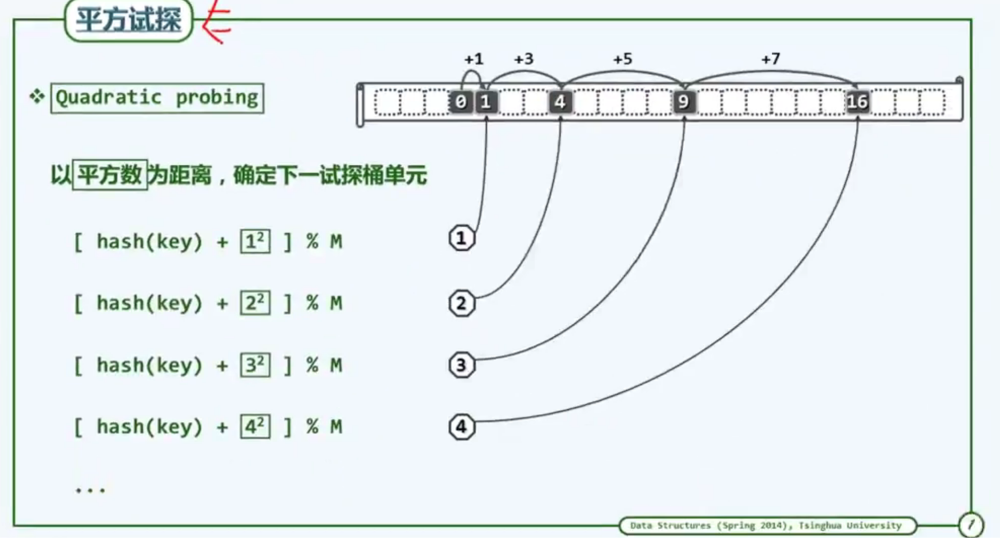
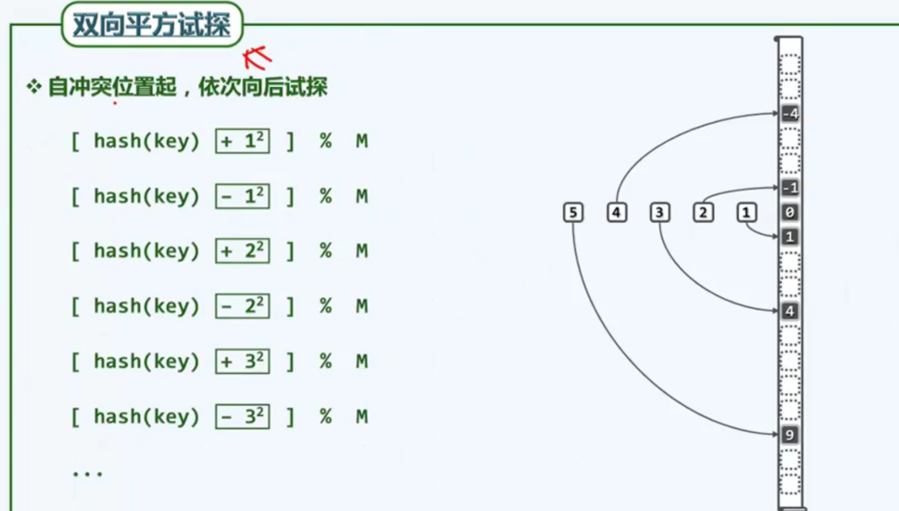

##### (3) lazy removal
* 当删除一个bucket中的key，不是立即删除这个key，而是做一个标记
    * 这样查找链到这个并不会终止
    * 当插入时，查找链会用新的key替换删除掉的key

##### (4) 优点和缺点
* 优点
    * 查找链具有局部性，可充分利用系统缓存

* 缺点
    * 冲突增多
    * hash table可能变满，这时就需要扩展hash table，不然新的key无法存入hash table中

#### 5.排解散列冲突: dynamic hashing

##### (1) extendable hashing
* 增加一个中间数组（数组的长度能够增长）
    * 数组中存储的是指针，指针指向bucket（指针可能指向同一个bucket）
* hash函数为每一个键计算出一个K位的二进制序列（比如32位）
    * i表示使用二进制序列的前i位进行散列
        * 数组的大小n=2^i
        * i最初为1
* 当一个bucket满了
    * 判断该bucket使用多少位进行hash的
    * 如果使用了i位
        * 则i会加1（即数组的大小会加倍），然后对满的bucket进行重新散列
    * 如果未使用到i位
        * 则增加bucket

* 举例
    * 刚开始使用二进制的1位进行散列
        * bucket右上角的数字表示该bucket是取第几位进行的散列
        * 当bucket满时，使用1位进行hash且i=1，则i+1（即数组扩容）
    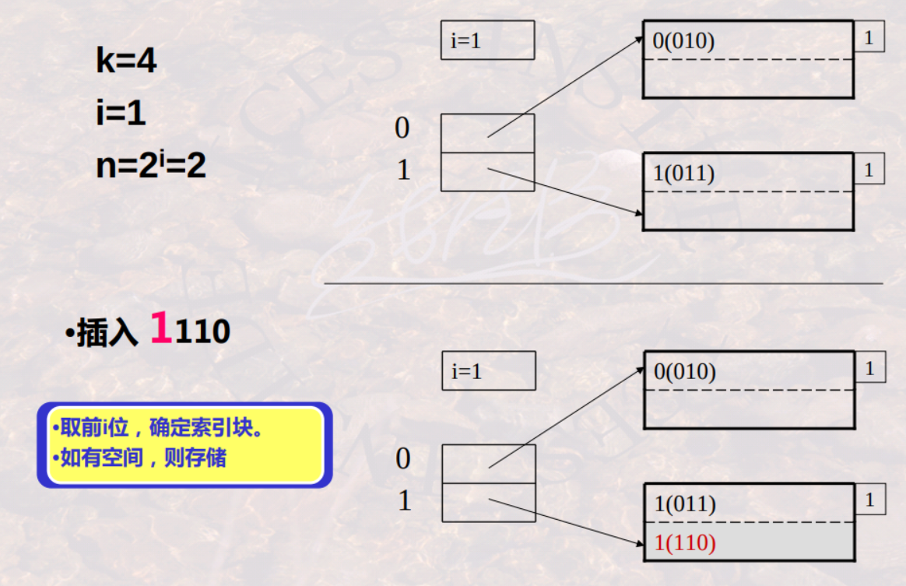
    * 当bucket满了，i+1（即数组加倍），并重新散列该bucket中的数据
        * 当bucket满了，使用了1位进行hash且i=2，则i无需要增加，只需要增加一个bucket
    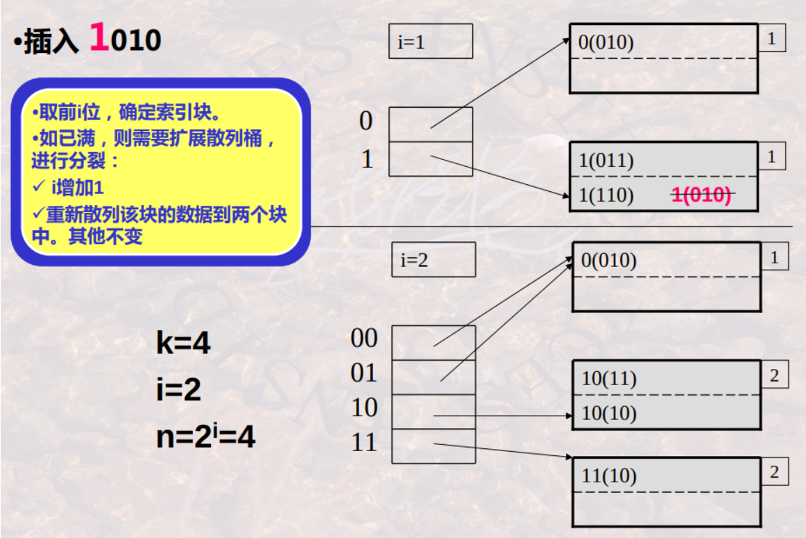

* 存在问题
    * 数组翻倍，需要做大量工作
    * 桶利用率可能很低（即数组大量增长，但是利用率不足）

##### (2) linear hashing (解决桶利用率问题)
* n 表示当前的桶数
* r 表示散列表中的记录总数
* hash函数为每一个键计算出一个K位的二进制序列（比如32位）
    * 使用二进制序列的前$log_2{n}$位进行散列（从右开始取）
* 当bucket满了单r/n < 1.7时，则增加溢出桶
* 当 r/n > 1.7时，需要散列表要增加1（即bucket加1）
    * 该桶为1a2a3…ai，则该桶由0a2a3..ai对应的块分裂

* 举例

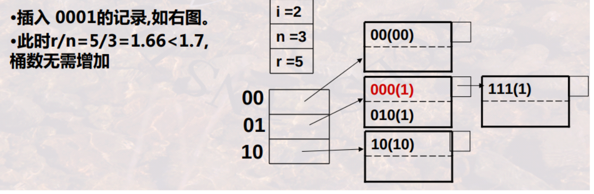
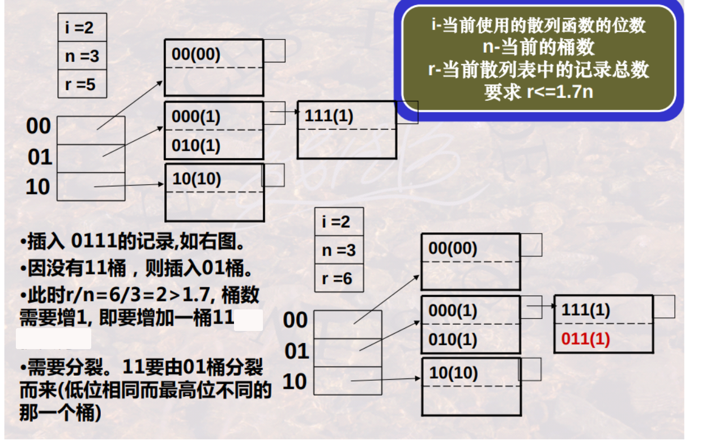
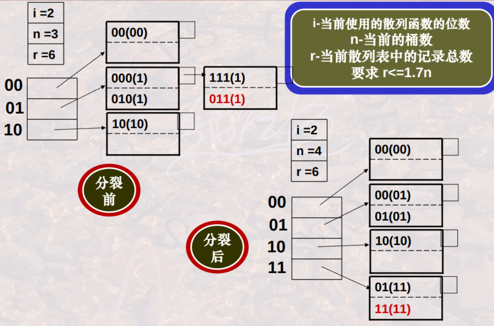

#### 6.应用

##### (1) bucket sort
* 说明
    * 对每个桶进行排序

* 时间复杂度: O(n+M)
    * n为key的数量
    * M为桶的数量

* demo
    * 将key放入桶中
    

    * 进行桶排序
    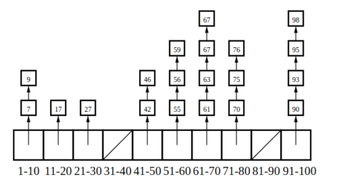

##### (2) counting sort (计算排序)

* 说明
    * 遍历输入集，进行计数
        * 每个不同的key就是一个桶，桶的值就是key的数量
    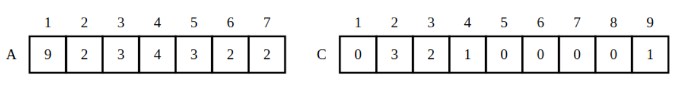
    * 按照key的顺序进行输出
    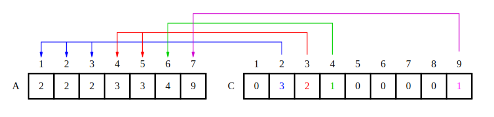

#### 7.consistent hashing (一致性哈希)

##### (1) 目标
* 用于在**分布式**系统上，对数据进行分区
* 当节点增加或移除时，使数据尽可能**少的移动**

##### (2) 算法概述

* hash ring (哈希环)
    * 有几个节点，哈希环就被分为几段
    * 每一段对应一个节点
    
* node mapping
    * 每个节点使用hash函数，映射到环上的一个位置
    * 节点在哈希环上按顺序排列，最小的位于哈希环的起点

* data mapping
    * 每个数据对象根据hash函数，计算出一个值
    * 根据该值确定在哈希环上的位置，从而能够找到存储该数据的节点

##### (3) 举例
    * 比如：有四个节点，根据计算出的hash值，得到如下哈希环
    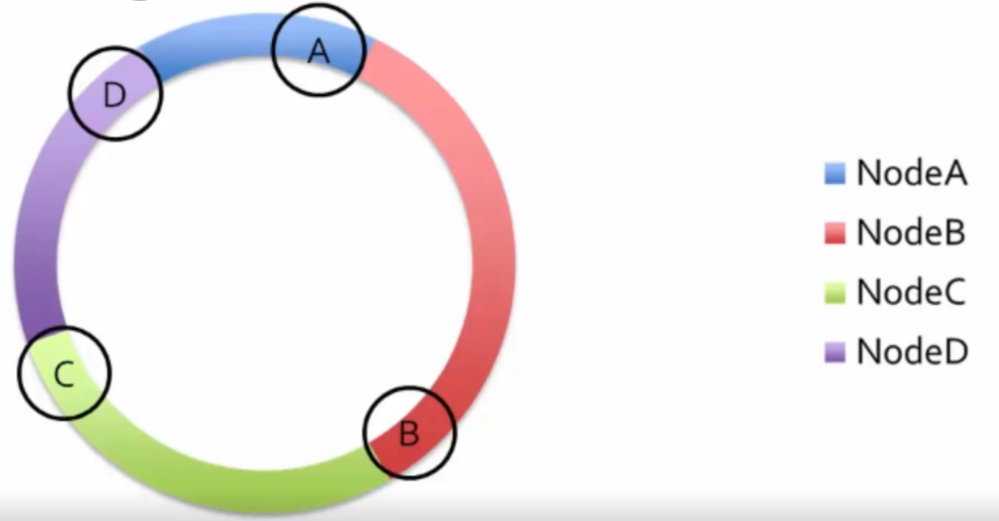
    * 若 hash(A) < hash(数据对象) < hash(B)
        * 则能够确定该数据在哈希环中的红色段，即存储在B中
    * 若删除节点B，则哈希环如下
    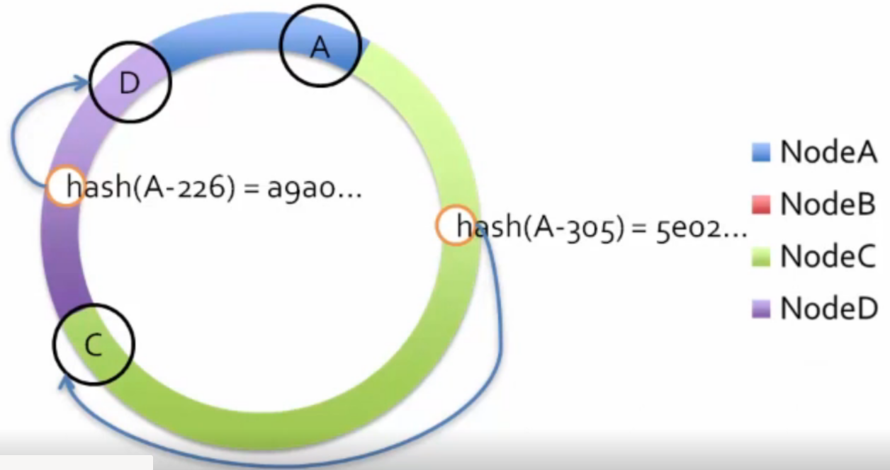
    * 之前节点B上的对象，在哈希环中的绿色段，即C节点
        * 则需要将原来B上的对象（虽然次时B不在了，但是存在副本），移动到C中
    * 增加节点同理