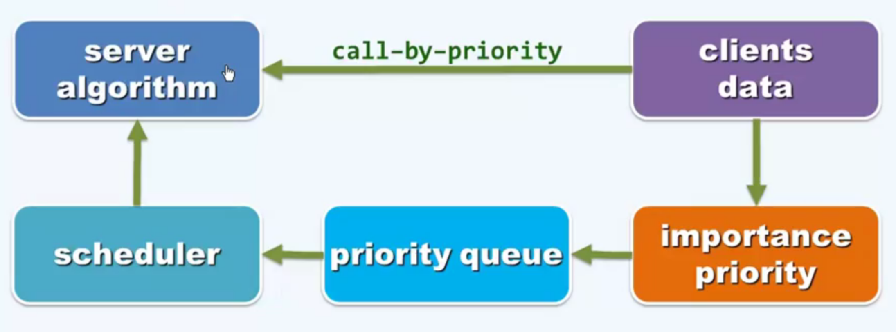
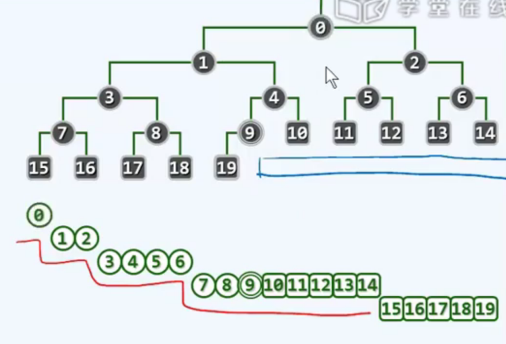
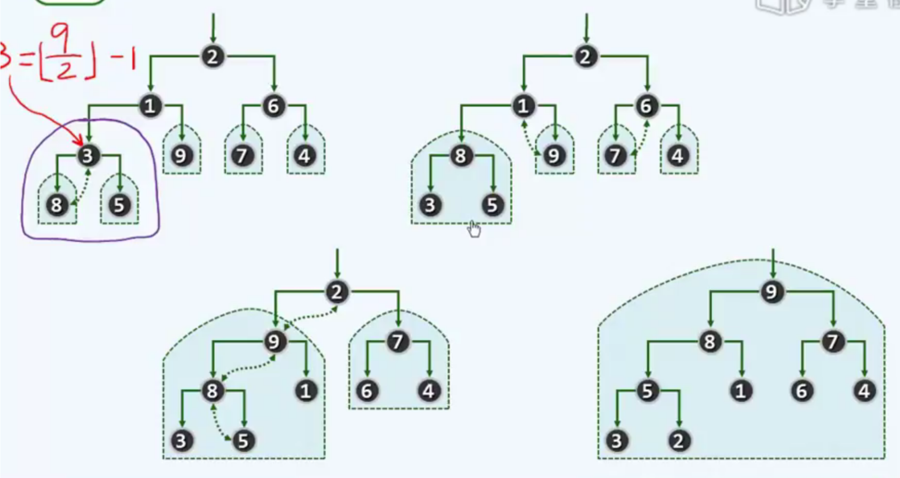
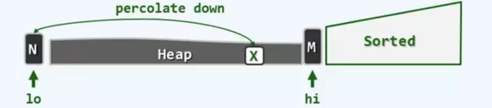
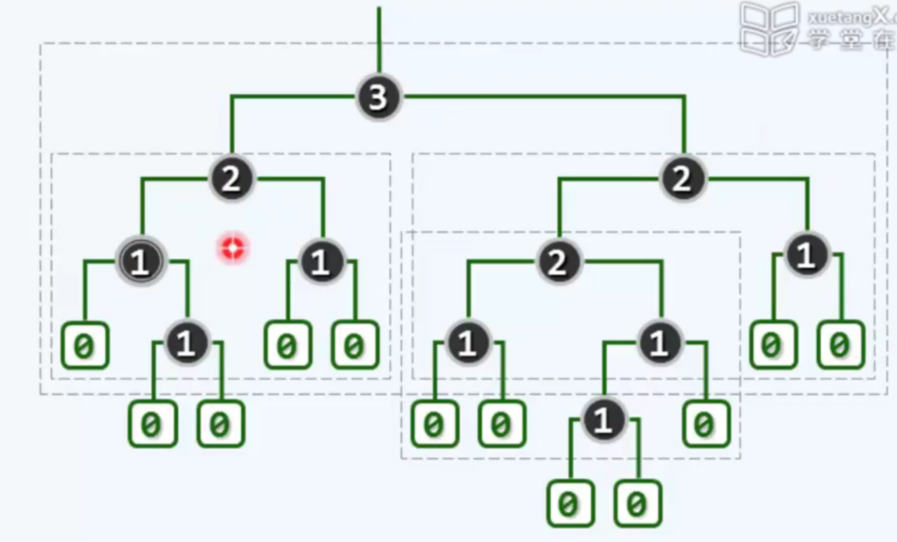
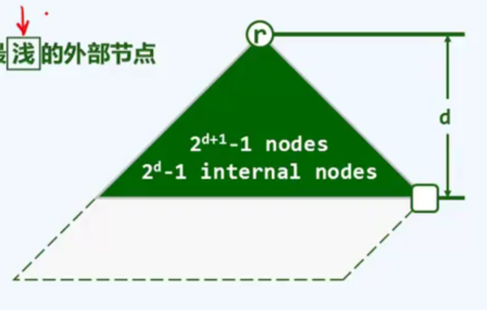

# heap (priority queue)

<!-- @import "[TOC]" {cmd="toc" depthFrom=1 depthTo=6 orderedList=false} -->

<!-- code_chunk_output -->

- [heap (priority queue)](#heap-priority-queue)
    - [概述](#概述)
      - [1.heap (priority queue)](#1heap-priority-queue)
      - [2.binary heap (二叉堆)](#2binary-heap-二叉堆)
        - [(1) 计算模式](#1-计算模式)
        - [(2) 实现](#2-实现)
      - [3.二叉堆 heapification (建堆)](#3二叉堆-heapification-建堆)
        - [(1) 算法](#1-算法)
        - [(2) 复杂度](#2-复杂度)
      - [4.堆排序](#4堆排序)
        - [(1) 算法](#1-算法-1)
        - [(2) 就地](#2-就地)
      - [5.leftist heap (左式堆)](#5leftist-heap-左式堆)
        - [(1) NPL (null path length)](#1-npl-null-path-length)
        - [(2) 定义](#2-定义)
        - [(3) 特点](#3-特点)
        - [(4) 实现](#4-实现)
      - [6.左式堆合并](#6左式堆合并)
        - [(1) 算法](#1-算法-2)
        - [(2) 时间复杂度](#2-时间复杂度)
        - [(3) 插入和删除都是基于合并](#3-插入和删除都是基于合并)

<!-- /code_chunk_output -->

### 概述

**注意**: 数据结构中的heap和heap memory、heap file都不一样
* 数据结构中的heap是有偏序的
* heap memory和heap file都是无序的

#### 1.heap (priority queue)
* 堆序性 (本质要求)
    * `H[i] <= H[parent(i)]`
        * **任何一节点** 小于等于 父节点
        * 所以根节点就是优先级最高的
        * 是一种**偏序**，不是全排序

* 结构性 (不是本质要求，可以有多种结构)
    * 二叉堆 (完全二叉树结构)
    * 左式堆

#### 2.binary heap (二叉堆)
* 满足堆序性
* 完全二叉树结构

##### (1) 计算模式

##### (2) 实现
* 逻辑上是有序完全二叉树， 物理上是vector

* 时间复杂度
    * 添加和删除: T(n) = O(logn)
        * 添加:
            * 在vector的最后添加
            * 上滤:
                * 如果破坏堆序性，则与父节点进行交换
                * 然后继续上述操作，直到满足堆序性
        * 删除:
            * 删除vector[0]元素，并且将最后一个元素移动到vector[0]
            * 下滤:
                * 比较该节点与它孩子的大小，找出最大的孩子，与之交换位置
                * 然后继续上述操作，直至满足堆序性
    * 查找: T(n) = O(1)

#### 3.二叉堆 heapification (建堆)

##### (1) 算法
* 从低层往上，从右往左 (不包括叶子节点)，将节点进行下滤操作

##### (2) 复杂度
T(n) = O(n) 
* 各个节点的高度求和，所以趋势复杂度为O(n)

#### 4.堆排序

##### (1) 算法
* 算法
    * 建堆
    * 将根元素删除 (即拿出最大元素)
    * 重复删除操作，直到为空
* 复杂度
    * 建堆: O(n)
    * 删除: O(logn)

##### (2) 就地
不另外开辟空间，而是直接在vector上操作
* 建堆后，将vector[0]与vector[-1] 交换位置
* 则前半部分为堆，后半部分为已排序部分
* 然后继续操作类似步骤，直至堆缩减为0

#### 5.leftist heap (左式堆)

为了有效完成堆合并

##### (1) NPL (null path length)
* `npl(NULL) = 0`
* `npl(x) = 1 + min( npl(lc(x)) , npl(rc(x)))`
    * 即孩子树高最小值 + 1
* 引入所有外部节点 (外部节点实际就是NULL)

    * 黑色是真实的节点
    * 绿色是外部节点

##### (2) 定义
* 满足堆序性
* 每个节点均满足左倾性的二叉树
    * `npl(lc(x)) >= npl(rc(x))`
        * 即`npl(x) = 1 + npl(rc(x))`

##### (3) 特点
* 右侧链 rChain(x)
    * 从根r出发，一直沿着右分支前进，必为全堆中最浅的外部节点
    * `d = npl(r) = |rChain(x)| <= logn`
        * d为设置的变量
        * `|rChain(x)|` 取模表示取长度 
        * n为节点数
* 存在一个以r为根、高度为d的完美子树 (也就是完全二叉堆)

##### (4) 实现
* 使用二叉树结构
    * 不再采用vector，因为结构性不再紧凑

#### 6.左式堆合并

##### (1) 算法

* 比较两个堆的大小，将 数根较大的堆 放在左边 (需要满足堆序性)
* 将 左边堆的右子树 和 右边堆进行合并
* 按照上面两步进行迭代，直到返回一个元素
* 返回后，需要保证满足左倾性，如果不满足，则交换左右子树

##### (2) 时间复杂度
* `T(n) = O(logn)`

##### (3) 插入和删除都是基于合并
* 插入
    * 看作是 一个左式堆 和 仅含一个元素的左式堆 的合并
* 删除
    * 删除根后，就是左子堆和右子堆的合并