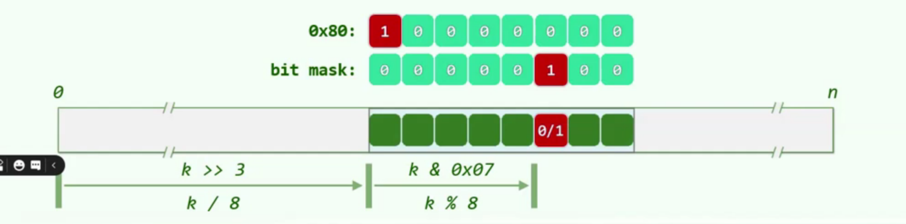
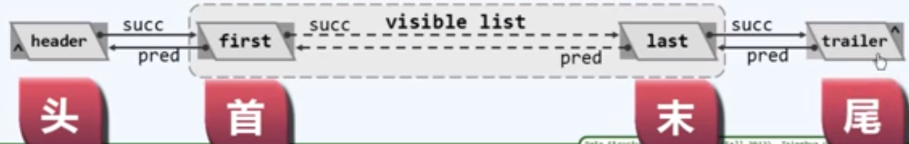
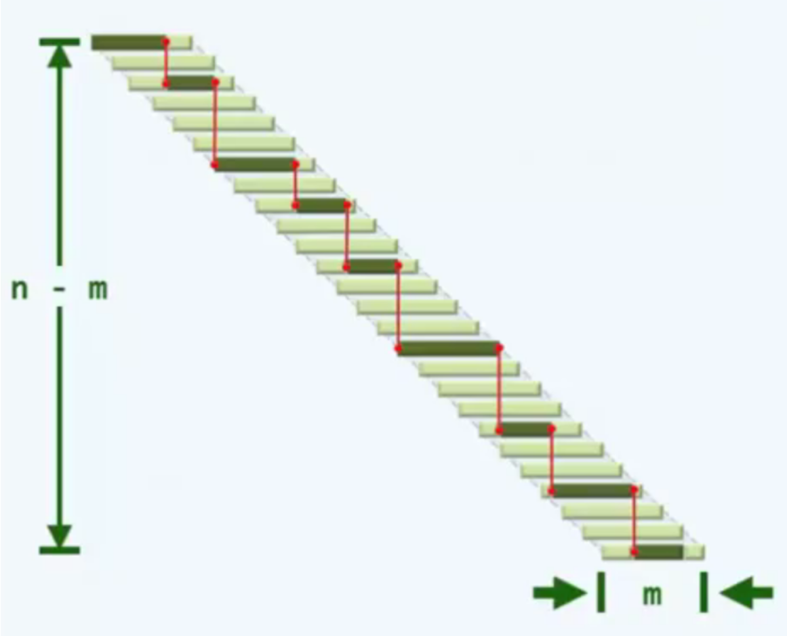
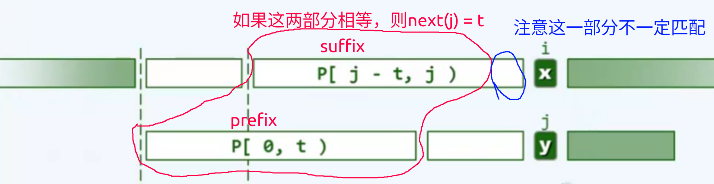

# linear data structure


<!-- @import "[TOC]" {cmd="toc" depthFrom=1 depthTo=6 orderedList=false} -->

<!-- code_chunk_output -->

- [linear data structure](#linear-data-structure)
    - [概述](#概述)
      - [1.linear data structure](#1linear-data-structure)
      - [2.vector](#2vector)
        - [(1) ordered vector vs unordered vector](#1-ordered-vector-vs-unordered-vector)
      - [3.bitmap (位图, 用于描述有限整数集)](#3bitmap-位图-用于描述有限整数集)
        - [(1) 实现 (基于vector实现)](#1-实现-基于vector实现)
        - [(2) 应用: 大数据去重](#2-应用-大数据去重)
      - [4.list (列表、链表)](#4list-列表-链表)
        - [(1) 与vector比较](#1-与vector比较)
      - [5.stack and queue](#5stack-and-queue)
        - [(1) stack permutation (栈混洗)](#1-stack-permutation-栈混洗)
      - [6.排序算法 (无序 -> 有序)](#6排序算法-无序---有序)
        - [(1) bubble sort (冒泡排序)](#1-bubble-sort-冒泡排序)
        - [(2) merge sort (合并排序)](#2-merge-sort-合并排序)
        - [(3) selection sort (选择排序)](#3-selection-sort-选择排序)
        - [(4) insertion sort (插入排序)](#4-insertion-sort-插入排序)
    - [string (串)](#string-串)
      - [1.pattern matching](#1pattern-matching)
        - [(1) brute-force matching](#1-brute-force-matching)
      - [2.KMP算法 (解决pattern matching问题)](#2kmp算法-解决pattern-matching问题)
        - [(1) 算法](#1-算法)
        - [(2) next表](#2-next表)
        - [(3) 改进: 构建next表](#3-改进-构建next表)
        - [(4) 与brute-force比较](#4-与brute-force比较)
      - [3.BM算法](#3bm算法)
        - [(1) bc表 (bad-character)](#1-bc表-bad-character)
        - [(2) gs表(good-suffix)](#2-gs表good-suffix)
        - [(3) 将bc和gs结合](#3-将bc和gs结合)
      - [4.karp-rabin算法](#4karp-rabin算法)
        - [(1) 算法](#1-算法-1)

<!-- /code_chunk_output -->

### 概述

#### 1.linear data structure
* 一个元素的 前一个元素 和 后一个元素 是 唯一确定的

#### 2.vector

* 对array的封装，从而提供更丰富的接口
    * 扩容: 创建新的arrary，将旧的array的数据复制到新的array（array长度是固定的，不能改变）
    * 得益于封装，尽管扩容之后数据区的物理地址有所改变，却不会出现野指针

##### (1) ordered vector vs unordered vector
* ordered vector
    * 其中的元素，可以进行比较操作(`>`、`<`等)
    * 且满足有序性: 任意一对相邻元素顺序
* unordered vector
    * 其中的元素，只能进行判等的操作(`==`、`!=`)
    * 或满足无序性: 总有一对相邻元素逆序
* 对有序向量的处理，很多算法有优势
    * 所以处理前，通过排序算法将 无序向量 -> 有序向量

#### 3.bitmap (位图, 用于描述有限整数集)

##### (1) 实现 (基于vector实现)
rank对应整数，值是一个bit，0表示不存在，1表示存在
由于在高级语言中，没法直接操作bit位，最小操作单元是byte，所以
根据需要操作的整数k, k/8确定一个byte的位置，k%8确定 需要比对的bit的位置，然后做位与操作，判断指定的位置是否存在


##### (2) 应用: 大数据去重

* 大数据时代数据特点: 小集合 + 大数据

#### 4.list (列表、链表)

* list节点空间不连续，通过指针连接起来
* 一个list节点，包含以下信息:
    * predecessor, 前驱节点
    * successor, 后驱节点
    * data,数据




##### (1) 与vector比较

||vector|list|
|-|-|-|
|访问方式|rank（效率高）|rank（效率低）、position（一个list节点存储了数据的地址）|
|查找操作|效率高 (可以使用二分法)|效率低|
|移动操作（插入、删除等）|效率低|效率高|

备注:
* 循位置访问（call by position）的意思是，给定位置（在示例代码实现里是指向 ListNode 的指针）访问该位置。因为指针已经给定，所以不用遍历。
* 循秩访问（call by rank，即下标）的意思是，给定一个数字 i，要求访问第 i 个元素。只好从 header 往后找，或者从 trailer 往前找。

#### 5.stack and queue

* stack 
    * LIFO (last in first out)
* queue
    * FIFI (first in first out)

##### (1) stack permutation (栈混洗)
通过一个临时栈对现有栈进行重新排列
* 比如: A为现有栈，S为临时栈，B为重新排列后的栈
    * 将A中的元素pop出来，push到S中
    * S可以选择在指定情况下将元素pop出来，push到B中

#### 6.排序算法 (无序 -> 有序)

##### (1) bubble sort (冒泡排序)

* 说明
    * 依次遍历，找到逆序对则交换
    * 则每一次，能够找出最大的一个元素
* 改进
    * 记录最右侧逆序对位置，从而缩短要排序的向量长度，从而减少无效的处理
* 最坏情况: `T(n) = O(n^2)`
* 适合数据结构:
    * vector (因为多次移动操作对于list效率低)

* 实现
```go
func bubble[T constraints.Ordered](list []T, lo int, hi int) int {
	last := lo
	for lo < hi {
		lo++
		if list[lo-1] > list[lo] {
			list[lo-1], list[lo] = list[lo], list[lo-1]
			last = lo
		}
	}
	return last
}

func bubbleSort[T constraints.Ordered](list []T, lo int, hi int) {
	for lo < hi {
		hi = bubble(list, lo, hi)
	}
}
```

##### (2) merge sort (合并排序)
* 说明
    * 将序列等分，一直递归
    * 然后合并序列，比较两个序列的头元素，从而按顺序合并
* 最坏情况: `T(n) = O(nlogn)`
* 缺点
    * 是non-in-place的，所以额外的需要O(n)的空间复杂度，这样会增加内存的使用

##### (3) selection sort (选择排序)
* 说明
    * 每次选择最大的值移动到最后
    * 与bubble sort的区别
        * bubble sort是一步一步移动，移动消耗比较多
        * select sort是一下子移动到最后
        * 虽然select sort一般情况的时间复杂度 和 bubble sort最坏情况的时间复杂度一样
            * 但是select sort的时间复杂度主要来自于比较
            * 而bubble sort的时间复杂度，主要来自于比较和移动
* 一般情况: `T(n) = Θ(n^2)`
* 适合数据结构:
    * list (因为移动操作效率高)

##### (4) insertion sort (插入排序)
* 说明
    * 遍历每一个元素
    * 然后与已经有序的序列从后往前进行比较
    * 找到位置后进行插入
    * 输入敏感性: 复杂度与序列的无序程度有关
* 最坏情况: `T(n) = O(n^2)`
* 适合数据结构:
    * list (因为移动操作效率高)

***

### string (串)

#### 1.pattern matching

##### (1) brute-force matching
* 算法
    * 将 模式串 与 文本 对齐，并进行比较，以字符为单位依次移动模式串

* 时间复杂度
    * T(n) = O(m * (n + m -1)) = O(m * n)
        * n是文本的长度, m是模式串的长度 (n >> m)

#### 2.KMP算法 (解决pattern matching问题)

##### (1) 算法
* 表示
    * 模式串P，下标j
    * 文本T，下标i

* 说明
    * 本质就是前面已经比较过的部分，不再重复比较
    * 这个已经比较过的部分其实存在P中
    * 直接从P的某个位置开始，从T中刚刚失败的字符开始，继续进行匹配
* 伪代码
```shell
i=0, j=0
while j < len(P) && i < len(T)
    if P[j] == T[i] || j<0 :
        i++
        j++
    else:
        j=next(j)
```

* 时间复杂度: `T(n) = O(n)`

* 最坏情况


##### (2) next表
* `next(j)` 表示在`P[0, j)`中，最大 自匹配的真前缀和真后缀 长度
    * 所以`P[0, next(j))`就是自匹配的部分
    

    * 特殊的: `next(0) = -1`

* 构建next表
```shell
j = 0
t = next(0) = -1
while j < len(P) - 1
    if t < 0 || P[j] == P[t]
        j++
        t++
        next(j) = t
    else
        #如果一直匹配不到，则t会变为-1
        t = next(t)
```

##### (3) 改进: 构建next表
* 如果P[j]和P[t]相等，则P[t]肯定也不会匹配当前不匹配的字符
```shell
j = 0
t = next(0) = -1
while j < len(P) - 1
    if t < 0 || P[j] == P[t]
        j++
        t++
        if P[j] != P[t]:
            next(j) = t
        else:
            next(j) = next(t)
    else
        #如果一直匹配不到，则t会变为-1
        t = next(t)
```

##### (4) 与brute-force比较

* 当字符集较小时，比如二进制字符集（即字符串由0和1组成）
    * KMP算法 较 brute-force才有较大的优势

#### 3.BM算法

##### (1) bc表 (bad-character)

* 概述
    * 遇到文本串中不匹配字符时，在模式串中查找是否还有这样的字符，
        * 如果有，则将模式串中最后一个该字符，与上述位置对齐
        * 如果没有，则将模式串-1位置，与上述位置对齐
* 表示
    * 模式串P, 长度m
    * 文本T, 长度n
    * 字符集S

* 伪代码
```shell
bc = [-1] * lenth(S)
for i in range(P):
    bc[p[i]] = i
```

* 时间复杂度
    * 最好情况: Ω(n/m) 
    * 最坏情况: O(n*m)
    * 当字符集越大，效果越好

##### (2) gs表(good-suffix)

* 概述
    * 寻找匹配最大后缀的子串
* 从后往前寻找，时间复杂度: O(m)

##### (3) 将bc和gs结合

* 时间复杂度
    * 最好情况: O(n/m)
    * 最坏情况: O(n + m)

#### 4.karp-rabin算法

本质: 转换为数字，然后进行比较

##### (1) 算法

* 转化为数字
    * 任何一个长度为d的字符集都可以看作是 d进制的数字 
        * 比如C就相当于26进制中的2
    * 当字符集过大，导致数字变大，这样比较时间不再是O(1)
        * 通过hash将数字范围控制
    * 每一个子串都需要进行hash，怎么使得所有子串的hash只需要O(1)的时间
        * 由于子串是相邻的，即前一个子串和后一个子串，只有开头和末尾的字符不同，所以后一个子串的hash可以通过前一个子串的hash快速的得到
* 解决hash冲突
    * 第一次比较相当于筛选
    * 第二次比较严格比较